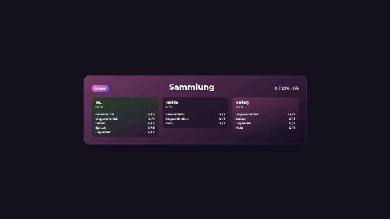
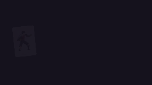
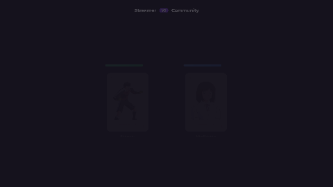
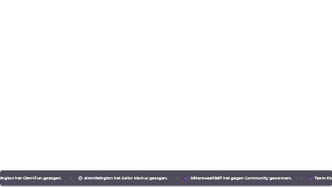
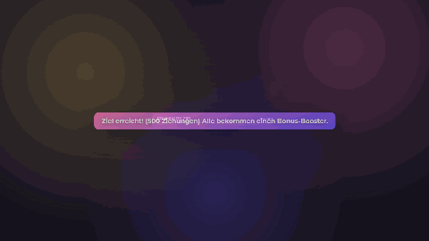

<p align="center">
  
</p>

# 🃏 Streamer Card Widget

🌐 **Sprache / Language:** **Deutsch** (diese Seite) · [English](#-english) · [Français](#-français) · [Español](#-español) · [ไทย](#-ไทย)

Lokale Windows-App für Twitch-Sammelkarten – mit animiertem **OBS-** oder **Meld-Studio-Overlay**.
Deine Zuschauer ziehen über **Kanalpunkte** oder **Chat-Befehle** Karten aus Booster-Packs,
die live im Overlay aufgehen, bauen ihre eigene **Sammlung** auf, können Karten untereinander
**tauschen**, **verschenken** und sogar gegeneinander in **Kartenduellen, Turnieren und
Team-Kämpfen** antreten.

### Wie es funktioniert (in Kürze)

1. Du legst **Booster** (Karten-Packs) und **Karten** an – ein paar Beispiele sind schon dabei,
   du kannst also sofort loslegen.
2. Du verbindest **Twitch** (für Kanalpunkte/Chat) und **OBS oder Meld Studio** (für das Overlay).
3. Ein Zuschauer löst eine Belohnung ein oder tippt z. B. `!pack` in den Chat → die App zieht
   zufällig eine Karte und spielt die Animation im Overlay ab.
4. Jede gezogene Karte landet in der **Sammlung** des Zuschauers. Über `!collection` kann er sie
   zeigen, über `!trade` mit anderen tauschen oder über `!gift` verschenken.

> **Du brauchst:** Windows 10/11 sowie **OBS Studio oder Meld Studio** (eines von beiden reicht).
> Die WebView2-Runtime (für die Bedienoberfläche) ist auf aktuellen Windows-Versionen
> vorinstalliert. Eine eigene Twitch-Entwickler-App ist **nicht** nötig.

---

## Inhalt

- [Schnellstart](#schnellstart)
- [Twitch verbinden](#twitch-verbinden)
- [Bot-Account für Chat](#bot-account-für-chat)
- [OBS einrichten](#obs-einrichten)
- [Meld Studio einrichten](#meld-studio-einrichten)
- [Booster anlegen](#booster-anlegen)
- [Sub-exklusive Booster](#sub-exklusive-booster)
- [Karten anlegen](#karten-anlegen)
- [Seltenheiten & Gewichtung](#seltenheiten--gewichtung)
- [Kanalpunkte-Belohnungen](#kanalpunkte-belohnungen)
- [Sammlungs-Showcase](#sammlungs-showcase)
- [Chat-Befehle](#chat-befehle)
- [Eigenes Pack wählen](#eigenes-pack-wählen)
- [Pack anzeigen (!show)](#pack-anzeigen-show)
- [Verschenken (Gift)](#verschenken-gift)
- [Sammlungsvergleich](#sammlungsvergleich)
- [Tauschsystem](#tauschsystem)
- [Tausch-Animation](#tausch-animation)
- [Kartenduell (Kampf)](#kartenduell-kampf)
- [Turnier-Modus](#turnier-modus)
- [Team-Kampf](#team-kampf)
- [Ranking](#ranking)
- [Live-Ticker](#live-ticker)
- [Community-Ziel](#community-ziel)
- [Booster-Treue-Bonus](#booster-treue-bonus)
- [Nutzung Befehle](#nutzung-befehle)
- [Queue](#queue)
- [Karten-Themes](#karten-themes)
- [Darstellung & Sounds](#darstellung--sounds)
- [Nutzer verwalten](#nutzer-verwalten)
- [Daten & Updates](#daten--updates)
- [Aus dem Quellcode bauen](#aus-dem-quellcode-bauen)
- [Lizenz](#lizenz)

---

## Schnellstart

1. Aktuelle Version von der [Releases-Seite](https://github.com/Bittersweet1987/StreamerCardWidget/releases/latest) herunterladen.
2. Das ZIP **komplett entpacken** (nicht direkt im ZIP starten) und `CardPackWidget.exe` ausführen.
   Es öffnet sich ein Fenster mit der kompletten Verwaltung – links die Navigation.
3. Empfohlene Reihenfolge fürs erste Einrichten:
   **Verbindung → Booster → Karten → Kanalpunkte / Chat Befehle**.
4. Zum Ausprobieren: Im Tab **Übersicht** auf **Demo zufällig ausführen** klicken – das spielt eine
   Pack-Animation ab (die Overlay-Quelle in OBS/Meld Studio oder die Datei `overlay.html` muss
   dafür geöffnet sein).

> **Tipp:** Beispiel-Booster und -Karten sind bereits enthalten – du kannst die Animation also
> testen, bevor du eigene Inhalte anlegst.
>
> Falls du Fragen hast, gibt es in der App unter **Übersicht** einen Button, der direkt zu dieser
> Anleitung führt.

> Der Ordner `data\` enthält deine Karten, Booster und Sammlungen. Bei einem manuellen Update
> immer behalten – nur `public\`, die DLLs und die exe überschreiben (siehe [Daten & Updates](#daten--updates)).

---

## Twitch verbinden

1. In **Verbindung** auf **Mit Twitch anmelden** klicken – der Login öffnet sich im Standardbrowser.
2. Nach der Freigabe aktualisiert sich der Status automatisch (grün = verbunden).

Es muss **keine eigene Twitch-Developer-App** angelegt werden. Die nötigen Berechtigungen
(`channel:read:redemptions`, `channel:manage:redemptions` sowie `user:read:chat`,
`user:write:chat` für die Chat-Befehle) werden automatisch angefragt.
Mit **Abmelden** wird das lokal gespeicherte Token gelöscht.

> **Wenn du die App von einer älteren Version aktualisierst:** Melde den Hauptaccount einmal
> **neu an**, damit er die zusätzlichen Chat-Rechte erhält – sonst funktionieren die Chat-Befehle
> nicht (das Log weist darauf hin).

---

## Bot-Account für Chat

Die Chat-Befehle (`!pack`, `!collection`, `!trade` …) liest und beantwortet die App über einen
Twitch-Account. Standardmäßig wird dafür der **Hauptaccount** verwendet.

Optional kannst du unter **Verbindung → Bot-Verbindung (Chat)** einen **separaten Bot-Account**
anmelden, der dann statt des Hauptaccounts im Chat liest und schreibt. Ist kein Bot verbunden,
greift automatisch der Hauptaccount als Fallback.

> Der lesende Account (Haupt oder Bot) muss im Kanal mitlesen dürfen – ist es nicht der
> Broadcaster selbst, sollte der Bot-Account **Moderator** im Kanal sein.

---

## OBS einrichten

> Nutzt du stattdessen **Meld Studio**? Dann direkt weiter zu [Meld Studio einrichten](#meld-studio-einrichten).

Die App spricht direkt mit dem **OBS WebSocket** (Standard-Port `4455`).

1. In OBS: **Werkzeuge → WebSocket-Servereinstellungen** → *WebSocket-Server aktivieren*.
   Port und Passwort findest du dort unter *Verbindungsinformationen anzeigen*.
   (In der App gibt es bei **Verbindung → OBS** denselben Hinweis per „Hilfe anzeigen".)
2. Host (meist `127.0.0.1`), Port und Passwort in **Verbindung → OBS → WebSocket** eintragen.
3. Szenen- und Quellennamen im Abschnitt **Verbindung → OBS → Szene & Quellen** festlegen und auf
   **OBS Szene / Quellen erstellen / aktualisieren** klicken – die App legt Szene und
   Browserquellen automatisch an bzw. aktualisiert sie.

---

## Meld Studio einrichten

Alternativ zu OBS lässt sich die App auch mit **Meld Studio** verbinden (Standard-Port `13376`).
Meld Studios API kann Szenen und Quellen anders als OBS **nicht automatisch erstellen** – sie
müssen einmalig manuell in Meld Studio angelegt werden; die App aktualisiert danach nur noch
deren Browser-URL und wechselt zur passenden Szene.

1. In Meld Studio: **Einstellungen → Erweitert** → WebSocket-Server aktivieren (Standard-Port `13376`).
2. In Meld Studio manuell eine Szene sowie je eine Browser-Quelle pro Animation anlegen – mit
   genau den Namen, die auch im Abschnitt **Verbindung → OBS → Szene & Quellen** eingetragen sind
   (diese Namen gelten für OBS *und* Meld Studio gemeinsam).
3. Host und Port in **Verbindung → Meld Studio** eintragen, mit **Meld testen** die Verbindung prüfen.
4. Auf **Meld Szene / Quellen aktualisieren** klicken – die App trägt bei den vorhandenen
   Meld-Quellen die richtige Browser-URL ein und wechselt zur konfigurierten Szene.

> **Hinweis:** In den folgenden Abschnitten ist der Kürze halber meist nur von „OBS-Quelle"/
> „OBS Szene aktualisieren" die Rede – gemeint ist damit immer **OBS oder Meld Studio**
> gleichermaßen (je nachdem, was du eingerichtet hast). Beide laufen über dieselbe Szenen-/
> Quellenkonfiguration und werden von der App parallel aktuell gehalten.

---

## Booster anlegen

Ein **Booster** ist ein Karten-Pack mit einer eigenen Kanalpunkte-Belohnung.

1. Tab **Booster** öffnen → **Booster hinzufügen**.
2. Felder ausfüllen:
   - **Titel** & **Untertitel** – stehen auf dem Pack im Overlay.
   - **Bild** – optionales Pack-Motiv.
   - **Akzentfarbe** – Farbe des Packs.
   - **Score (Gewichtung)** – jede Ziehung (Kanalpunkte, `!pack`, Turnier-/Team-Kampf-Bonus …)
     wählt zufällig unter **allen aktivierten Boostern** einen aus, gewichtet nach diesem Wert
     (höher = häufiger). Gilt unabhängig davon, welche Belohnung oder welcher Befehl die Ziehung
     ausgelöst hat.
3. **Karten zuordnen**: In der Booster-Ansicht die gewünschten Karten anhaken (max. **100** pro Booster).
   Bereits einem anderen Booster zugeordnete Karten werden ausgeblendet – jede Karte gehört zu genau einem Booster.
4. Speichern nicht vergessen (Button **Speichern** oben rechts).

### Booster exportieren & importieren

Über **Booster exportieren** (in der Booster-Ansicht) wird der ausgewählte Booster als
JSON-Datei gespeichert – **inklusive aller zugeordneten Karten samt Bildern**. Die Datei kann
auf einem anderen PC über **Booster importieren** eingelesen werden: Booster und Karten werden
dort neu angelegt und die **Zuordnung der Karten zum Booster bleibt erhalten**.
Twitch-spezifische Verknüpfungen (Belohnungs-IDs) werden beim Import bewusst nicht übernommen,
da sie nur im Kanal des Exportierenden gültig sind.

---

## Sub-exklusive Booster

Ein Booster lässt sich als **„Sub-exklusiv"** markieren (Booster-Ansicht) – solche Booster sind
über Kanalpunkte und `!pack` **nicht** erreichbar. Stattdessen vergibt die App bei jedem neuen
**Sub, Resub oder verschenkten Sub** automatisch eine Karte aus einem zufälligen sub-exklusiven
Booster, einstellbar unter **Einstellungen → Sub-Belohnungen**. So lassen sich exklusive Karten
als Abo-Bonus reservieren, ohne dass sie im normalen Ziehungspool auftauchen.

---

## Karten anlegen

1. Tab **Karten** öffnen → **Karte hinzufügen**.
2. Felder ausfüllen:
   - **Titel** – Name der Karte (z. B. ein Spielername).
   - **Seltenheit** – siehe [unten](#seltenheiten--gewichtung). Bestimmt Sternzahl, Rahmenfarbe und Effekt.
   - **Akzentfarbe** – Grundfarbe der Karte.
   - **Bild** – das Kartenmotiv (wird passend zugeschnitten).
   - **Aktiviert** – nur aktive Karten können gezogen werden.
3. **Wichtig:** Neue oder duplizierte Karten haben **keine** Booster-Zuordnung.
   Ordne sie anschließend im Tab **Booster** einem Pack zu, sonst werden sie nie gezogen.

> Die **Sternzahl ergibt sich automatisch aus der Seltenheit** – sie wird nicht pro Karte gesetzt.

### Karten exportieren & importieren

Jede Karte hat einen **Exportieren**-Button: die Karte wird als JSON-Datei gespeichert –
**inklusive Bild**, sodass sie z. B. auf einem anderen PC von einem anderen Nutzer über
**Karte importieren** (oben im Tab) eingelesen werden kann. Eine Booster-Zuordnung wird dabei
bewusst **nicht** übernommen – die importierte Karte muss wie eine neue Karte einem Booster
zugeordnet werden.

---

## Seltenheiten & Gewichtung

Es gibt **6 Stufen** mit fester Sternzahl:

| Seltenheit   | Sterne | Standard-Effekt |
|--------------|:------:|-----------------|
| Gewöhnlich   | 1      | weißer Rahmen |
| Ungewöhnlich | 2      | türkis |
| Selten       | 3      | blau |
| Episch       | 4      | dunkles Lila |
| Legendär     | 5      | goldener Glow (folgt der Rahmenfarbe) |
| **Holo**     | 1 ✨   | Regenbogen-Glitzer über der ganzen Karte, schillernder Perlmutt-Stern |

Bei einer **Holo-Ziehung** ersetzt der **Holo-Alarm** (an-/abschaltbar unter Einstellungen →
Pack-Animation) die normale sofortige Aufdeckung durch eine deutlich dramatischere, mehrstufige
Enthüllung: die Karte startet komplett schwarz, der Rahmen färbt sich zuerst in die echte
Rarity-Farbe, dann löst sich der Umriss der Karte sichtbar auf, und erst zuletzt werden Bild, Name,
Sterne und Zahl vollständig sichtbar.

Unter **Einstellungen** lassen sich pro Seltenheit anpassen:

- **Rahmenfarbe je Seltenheit** (der Legendär-Glow passt sich automatisch an).
- **Gewichtung je Seltenheit** – höhere Werte werden häufiger gezogen.

---

## Kanalpunkte-Belohnungen

Pro Booster wird eine Twitch-Kanalpunkte-Belohnung verwaltet (Tab **Verbindung**, Bereich *Channel Points*):

- **Channelpoints laden** zeigt vorhandene Belohnungen; **Neu** legt eine neue an.
- Einstellbar: **Titel, Kosten, Beschreibung, Hintergrundfarbe, Max pro Stream,
  Max pro Nutzer/Stream, globaler Cooldown, Pausiert, Aktiviert**.
- **Speichern / aktualisieren** erstellt bzw. aktualisiert die Belohnung direkt auf Twitch und
  ordnet sie dem aktuell gewählten Booster zu.

Löst ein Zuschauer die Belohnung ein, zieht die App serverseitig genau **einen** zufälligen
Booster (gewichtet nach Score) und **eine** Karte (gewichtet nach Seltenheit) und spielt die
Pack-Animation im Overlay ab.

<p align="center"></p>

Optional kannst du (unter der Beschreibung) per Checkbox eine **Chat-Nachricht nach dem Ziehen**
aktivieren – sie wird gesendet, sobald die Animation fertig ist, und kann die gezogene Karte
benennen. Standard: `@userName hat [Kartenname] aus [Boostername] gezogen.` Die Variablen
`@userName`, `[Kartenname]` und `[Boostername]` fügst du per Klick ein. Hat ein Booster einen
**Untertitel** gesetzt (Booster-Ansicht), wird er automatisch mit angezeigt (z. B. „Anime Staffel 2").

---

## Sammlungs-Showcase

Zeigt einem Zuschauer seine komplette Sammlung als Overlay – ebenfalls über Kanalpunkte.

1. **Einstellungen → Sammlungs-Showcase** → *aktivieren*.
2. **Belohnung** „Sammlung zeigen" speichern (Titel, Kosten, Cooldown, Farbe).
3. **Sekunden pro Booster** festlegen (gilt für alle Booster gleich).
4. **OBS-Quellenname** wählen und **Sammlungs-Quelle in OBS einrichten** klicken –
   es entsteht eine zweite Browserquelle in derselben Szene.

Beim Einlösen sliden nacheinander alle aktiven Booster mit den Karten dieses Zuschauers durch:
**gezogene Karten sichtbar, noch nicht gezogene bleiben unbekannt**. Zwei **Anzeigestile** stehen
zur Wahl (Einstellungen → Sammlung-Animation → Anzeigestil): **Detailliert** zeigt jede einzelne
Karte, **Kompakt** zeigt pro Booster nur die Anzahl je Seltenheit – dadurch geht das Umblättern
bei großen Sammlungen deutlich schneller.

<p align="center">
  
  
</p>
<p align="center"><sub>Detailliert · Kompakt</sub></p>

---

## Chat-Befehle

Zusätzlich zu den Kanalpunkten können Zuschauer Aktionen per **Chat-Befehl** auslösen
(Tab **Chat Befehle**). Jeder Befehl hat ein eigenes **Präfix** und **Befehlswort** und einen
eigenen **Aktiviert**-Schalter – es gibt keinen globalen Hauptschalter mehr.

- **Pack-Befehl** (Standard `!pack`) – entspricht der Kartenpack-Belohnung. Einstellbar:
  - **Max. Nutzungen pro Viewer** und ein **Auto-Reset** des Kontingents (Minuten / Stunden / Tage;
    bei „Tage" immer um lokal 00:01, sommerzeit-korrekt).
  - **Cooldown pro Viewer** (Sekunden, gilt strikt pro Nutzer).
  - Anpassbare Chat-Nachrichten für **Einlösung**, **erreichtes Limit** und **aktiven Cooldown**.
    Die Einlösungs-Nachricht kommt **nach der Animation** und kann die Karte benennen
    (Standard `@userName hat [Kartenname] aus [Boostername] gezogen.`).
- **Sammlung-Befehl** (Standard `!collection`) – entspricht dem Sammlungs-Showcase.
  Ohne Limit, ohne Cooldown, ohne Zählung. Zusätzlich (per Schalter „Kartennamen zusätzlich im
  Chat auflisten", standardmäßig an) listet der Befehl alle eigenen Kartennamen direkt im Chat
  auf (mit Anzahl bei Mehrfachbesitz, z. B. „Card A x3"). Die **Sortierung** der Liste ist
  **3-stufig frei einstellbar** – jede Stufe unabhängig nach **Pack**, **Seltenheit** oder
  **Alphabet**, in beliebiger Reihenfolge (z. B. erst nach Pack, dann nach Seltenheit, dann A–Z).
  Wird die Liste zu lang für eine einzelne Twitch-Chat-Nachricht, teilt die App sie automatisch auf
  mehrere Nachrichten auf (nummeriert „(1/2)" usw.). Die Chat-Ausgabe kann auch **per Flüster-
  Nachricht** statt öffentlich erfolgen.

Alle Nachrichten lassen sich frei bearbeiten. Die verfügbaren **Variablen** (z. B. `@userName`,
`[Kartenname]`, `[Boostername]`, `[Uhrzeit]`, `[Restzeit]`) stehen als anklickbare Chips über dem
jeweiligen Textfeld und werden per Klick eingefügt.

---

## Eigenes Pack wählen

Zusätzlich zur zufälligen Pack-Ziehung können Zuschauer **gezielt aus einem bestimmten,
selbst genannten Pack** ziehen – über eine eigene Kanalpunkte-Belohnung mit **Nutzereingabe**
oder per Chat-Befehl.

- **Kanalpunkte:** Der Zuschauer gibt bei Einlösung den **genauen Packnamen** ein. Passt der Name
  zu keinem Pack, werden die Punkte **automatisch erstattet** und eine Hinweis-Nachricht erscheint
  im Chat.
- **Chat-Befehl** `!command <Packname>` (Befehlswort, Präfix, Cooldown, Farbe und alle Texte frei
  einstellbar, genau wie bei jedem anderen Befehl) – funktioniert identisch, ohne Kanalpunkte.

In beiden Fällen wird genau **eine Karte** aus dem genannten Pack gezogen – die
**Seltenheitswahrscheinlichkeit bleibt wie im Pack konfiguriert**, und eine aktive **Garantie**
(siehe Dust-Befehle) wird ganz normal berücksichtigt und verbraucht.

> **Sub-exklusive Booster** (siehe [oben](#sub-exklusive-booster)) sind über diesen Weg
> **grundsätzlich nicht erreichbar** – auch nicht, wenn der Zuschauer den genauen Namen kennt.
> Ein Treffer auf einen Sub-only-Booster wird wie „Pack nicht gefunden" behandelt.

---

## Pack anzeigen (!show)

**`!show <Packtitel>`** zeigt den **Inhalt eines bestimmten Packs** an – wie die detaillierte
Sammlungs-Anzeige, aber auf **ein einzelnes Pack** beschränkt: Nur Karten, die der Zuschauer
bereits besitzt, sind sichtbar, alle anderen bleiben als **„?"** verdeckt.

- Läuft als **eigenes Overlay** in OBS/Meld (5×5 = 25 Karten pro Seite, blättert bei größeren
  Packs automatisch weiter) – Position/Größe wie gewohnt unter **Animationen → !show-Animation**
  einstellbar.
- Eine **zusätzliche, unabhängig konfigurierbare Chat-Ausgabe** listet die eigenen Karten aus
  genau diesem Pack auf (öffentlich oder als Flüster-Nachricht) und zeigt dabei auch, **wie viele
  von wie vielen Karten** des Packs man besitzt (z. B. „7/20").
- Befehlswort, Präfix, Cooldown und alle Texte (Nutzungshinweis, unbekanntes Pack, Cooldown,
  Einleitung, „keine Karten besessen") sind frei einstellbar – im Tab **Chat Befehle** unter
  **Pack-Anzeige-Befehl**.

> Auch hier gilt: **Sub-exklusive Booster** lassen sich über `!show` nicht anzeigen.

---

## Verschenken (Gift)

Mit **`!gift @Empfänger Kartenname`** (Präfix/Befehlswort einstellbar) verschenkt ein Zuschauer
eine Karte **einseitig** an einen anderen – ohne Bestätigung durch den Empfänger. Die Karte wird
direkt aus der eigenen Sammlung des Schenkenden entfernt und dem Empfänger gutgeschrieben.

Geprüft wird: Empfänger existiert, Kartenname stimmt (bei Tippfehlern kommt ein
**„Meintest du …?"**-Vorschlag), die Karte wird tatsächlich besessen, und man sich nicht selbst
beschenkt. Alle Chat-Nachrichten (Erfolg, unbekannter Empfänger, unbekannte Karte, nicht besessen,
Selbst-Geschenk, falsche Nutzung) sind frei anpassbar.

Optional läuft dazu eine eigene **Geschenk-Animation** in OBS (Einstellungen → Geschenk-Animation,
eigene Browserquelle) – über dieselbe Queue wie alle anderen Animationen, damit sich nichts
überlagert. Drei wählbare Stile: **Übergabe** (Karte wandert vom Schenkenden zum Empfänger),
**Dreh-Reveal** (Karte dreht sich schnell ein und wird langsamer) und **Pixel-Auflösung** (Karte
löst sich aus einem Pixelraster).

<p align="center">
  
  
  
</p>
<p align="center"><sub>Übergabe · Dreh-Reveal · Pixel-Auflösung</sub></p>

---

## Sammlungsvergleich

Mit **`!vergleich @Name`** (Präfix/Befehlswort einstellbar) vergleicht ein Zuschauer seine eigene
Sammlung mit der eines anderen – der Bot postet im Chat, wie viele Kartenarten beide gemeinsam
besitzen und welche jeweils nur bei einem von beiden vorkommen. Alle Chat-Nachrichten (Ergebnis,
unbekannter Nutzer, Selbst-Vergleich, falsche Nutzung) sind frei anpassbar.

---

## Tauschsystem

Zuschauer können untereinander Karten tauschen (drei Befehle im Tab **Chat Befehle**, jeweils
einzeln aktivierbar mit eigenem Präfix/Befehlswort):

1. **`!trade [Username] [Kartenname]`** – User A bietet User B eine Karte an (über den
   **Kartennamen**, nicht die ID). Geprüft wird, ob der Partner existiert, ob der Kartenname
   stimmt (bei Tippfehlern kommt ein **„Meintest du …?"**-Vorschlag) und ob der Anbieter die
   Karte besitzt. Eigene Einstellungen: **Cooldown** pro Viewer, **Limit** pro Reset
   (Minuten/Stunden/Tage) und wie lange eine Anfrage **offen bleibt** (Standard 120 s).
2. **`!tradeyes [Kartenname]`** – User B nimmt an und nennt die Karte, die er im Gegenzug gibt.
   Nach Prüfung des Besitzes wird der Tausch vollzogen: die Kartenbestände beider werden
   angepasst, beiden wird eine Tauschanfrage abgezogen und der Cooldown gesetzt.
3. **`!tradeno`** – User B lehnt ab. Dem Anfragenden wird eine Anfrage abgezogen und der
   Cooldown gesetzt; B bleibt unbelastet.

Antwortet B nicht rechtzeitig, läuft die Anfrage ab (kein Kontingent verbraucht, aber Cooldown).
Es ist immer nur **ein Tausch gleichzeitig** möglich – weitere `!trade` erhalten einen Hinweis.
Sämtliche Chat-Ausgaben (Angebot, Erfolg, Ablehnung, Timeout, Cooldown, Limit, „läuft bereits",
Karte/Nutzer nicht gefunden …) sind anpassbar, Variablen wieder per Klick einfügbar.

---

## Tausch-Animation

Kommt ein Tausch erfolgreich zustande, kann eine eigene **Tausch-Animation** in OBS abgespielt
werden – in einer **separaten Browserquelle** (neben Pack und Sammlung).

1. **Einstellungen → Tausch-Animation** → *aktivieren*.
2. **Stil** wählen: *Karten-Swap* (Karten kreuzen), *Übergabe-Bogen* oder *Versus-Flip*.
3. **Dauer** wählen (kurz / mittel / lang) und optional einen eigenen **Tausch-Sound** hochladen
   (Tab Einstellungen → Sounds).
4. **Verbindung → Quellenname Tausch-Animation** vergeben und auf **OBS Szene aktualisieren**
   klicken – die Quelle wird automatisch angelegt.

In der Animation werden beide getauschten Karten gezeigt; unter jeder Karte steht zuerst der
bisherige, nach dem Tausch der neue Besitzer. Mit der Option **„Erfolgsmeldung im Chat senden"**
legst du fest, ob zusätzlich die Chat-Nachricht kommt oder nur die Animation laufen soll.

<p align="center">
  
  
  
</p>
<p align="center"><sub>Karten-Swap · Übergabe-Bogen · Versus-Flip</sub></p>

Über **„Test starten"** spielst du die Animation einmal in OBS ab – mit zwei zufälligen Namen und
Karten. Das funktioniert auch, wenn die Animation noch nicht aktiviert ist, ideal zum Ausprobieren
von Stil und Timing.

---

## Kartenduell (Kampf)

Zuschauer können ihre Karten gegeneinander antreten lassen (drei Befehle im Tab **Chat Befehle**,
jeweils einzeln aktivierbar mit eigenem Präfix/Befehlswort):

1. **`!battle [Username]`** – fordert einen anderen Zuschauer heraus. Geprüft wird, ob der Gegner
   existiert, man sich nicht selbst herausfordert und **beide** mindestens **N verschiedene
   Kartentypen** besitzen (N ist einstellbar, Standard 3). Eigene Einstellungen: **Karten pro
   Seite**, **Cooldown**, **Limit** pro Reset (Minuten/Stunden/Tage) und wie lange die Anfrage
   **offen bleibt** (Standard 120 s).
2. **`!battleyes`** – der Gegner nimmt an. Beide Seiten bekommen automatisch **N zufällige,
   verschiedene Karten** aus ihrer Sammlung als Aufstellung. Der Gesamtsieger erhält **eine
   zufällige Karte aus der Aufstellung des Verlierers** (nur diese eine Karte wechselt den
   Besitzer). Beiden Spielern wird danach eine Nutzung abgezogen und der Cooldown gesetzt.
3. **`!battleno`** – der Gegner lehnt ab, keine Karten wechseln den Besitzer.

Antwortet der Gegner nicht rechtzeitig, läuft die Anfrage ab. Es ist immer nur **ein Duell
gleichzeitig** möglich. Kartenstärke ergibt sich aus der **Seltenheit** (eigene, anpassbare Tabelle
unter Einstellungen – unabhängig von den Ziehungs-Gewichten, da hier stärkere Karten auch stärker
im Kampf sein sollen) plus einem Zufallsfaktor pro Runde.

Die **Kampf-Animation** läuft wie die Tausch-Animation in einer eigenen OBS-Browserquelle, mit drei
wählbaren Kampfstilen:

- **Nahkampf-Clash** – beide Karten stürmen zur Mitte und prallen aufeinander.
- **Fernkampf-Projektile** – die Karten bleiben stehen und schießen Energie-Geschosse aufeinander.
- **HP-Leisten-Duell** – jede Karte hat eine eigene Lebensenergie-Leiste und kämpft nacheinander
  gegen die Aufstellung der Gegenseite (Pokémon-artig): die Rest-HP einer siegreichen Karte bleibt
  für die nächste Begegnung erhalten, bis eine Seite komplett besiegt ist.

Dauer, eigener Kampf-Sound und die Option „Ergebnis-Nachricht zusätzlich im Chat senden" sind wie
bei der Tausch-Animation einstellbar, inklusive **„Test starten"**-Button für eine Vorschau.
Die Ergebnis-Nachricht im Chat kommt bewusst **erst, nachdem die Animation durchgelaufen ist** –
so verrät der Chat nicht vorab, wer gewinnt.

<p align="center">
  
  
  
</p>
<p align="center"><sub>Nahkampf-Clash · Fernkampf-Projektile · HP-Leisten-Duell</sub></p>

---

## Turnier-Modus

Ein **Ausscheidungsturnier** für Kartenduelle – Zuschauer treten während einer Anmeldephase per
Chat-Befehl bei (Befehlswort unter **Chat-Befehle → Turnier-Beitritt** einstellbar), danach
werden alle Runden **automatisch nacheinander** über die normale Kampf-Animation ausgetragen,
**ohne Risiko** für die eigenen Karten (anders als beim normalen `!battle`-Duell wechselt hier
keine Karte den Besitzer). Der Turniersieger bekommt stattdessen eine konfigurierbare Anzahl
**Kartenpack-Ziehungen**.

Startbar über **Kanalpunkte-Belohnung** (Tab Verbindung → Channel Points), per **Chat-Befehl**
(„Turnier-Start", Standard `!turnierstart`) oder per Knopf direkt unter **Einstellungen →
Turnier-Modus**. Dort auch einstellbar: Mindest-Teilnehmerzahl, Anmeldezeit, Kartenanzahl pro
Aufstellung, sowie ob **auch Runden-Gewinner** (nicht nur der Champion) eine Bonus-Ziehung
bekommen. Bei ungerader Teilnehmerzahl bekommt einer pro Runde ein **Freilos**.

---

## Team-Kampf

Die **Community gegen den Streamer**: eine konfigurierbare **Mindest-Kartenanzahl** (die
tatsächliche Aufstellungsgröße wird pro Kampf leicht zufällig variiert) tritt gegen alle
Zuschauer an, die sich während einer Anmeldephase per Chat-Befehl (Standard `!teamkampf`)
angemeldet haben – jeder Teilnehmer wird automatisch mit einer zufälligen eigenen Karte
vertreten.

Während der Anmeldephase läuft im Overlay ein **Countdown mit Live-Teilnehmerliste**
(Profilbild + Name, aktualisiert sich bei jedem neuen Beitritt) sowie die Anzahl der Karten, die
es zu besiegen gilt – die Karten selbst bleiben bewusst **verdeckt** (keine Vorschau auf Motiv
oder Seltenheit), damit die Community nicht taktisch vorplanen kann.

Der eigentliche Kampf läuft als **HP-Leisten-Duell** (siehe Kartenduell-Kampfstile). Gewinnt die
Community, bekommt jeder Teilnehmer eine konfigurierbare Anzahl Kartenpack-Ziehungen, und wer den
**entscheidenden letzten Schlag** gelandet hat, bekommt zusätzlich einen einstellbaren
Finisher-Bonus (eigene Chat-Nachricht dafür). Optional (Schalter „Bei Niederlage verliert jeder
Teilnehmer die eingesetzte Karte") verlieren bei einer Niederlage alle Teilnehmer ihre
eingesetzte Karte – dafür gibt es eine eigene, ein-/ausschaltbare Chat-Nachricht pro verlorener
Karte.

Zusätzlich (unabhängig vom Gesamtsieg) lässt sich eine **Zusatz-Ziehung pro persönlich besiegter
gegnerischer Karte** aktivieren, mit frei einstellbarer Anzahl und eigener Ankündigungs-Nachricht –
diese Karten werden erst **am Ende des gesamten Kampfes** vergeben, unabhängig davon, ob die
Community am Ende gewinnt oder verliert.

Startbar über **Kanalpunkte-Belohnung** oder per Knopf unter **Einstellungen → Team-Kampf**.

<p align="center"></p>

---

## Ranking

Über den **Ranking-Befehl** (Standard `!ranking`, Präfix/Befehlswort im Tab **Chat Befehle**
anpassbar) können Zuschauer Bestenlisten in einer **eigenen OBS-Browserquelle** anzeigen lassen
(Verbindung → *Quellenname Ranking*, wird über **OBS Szene aktualisieren** automatisch angelegt).
Es erfolgt **bewusst keine Chat-Ausgabe** – das Ergebnis erscheint nur im Overlay.

- **`!ranking [Kartenname]`** – zeigt links die Karte und rechts die **Top 5 Besitzer** dieser
  Karte (absteigend nach Anzahl, mit Platzierungssymbolen 🥇🥈🥉).
- **`!ranking battle`** – zeigt nacheinander vier Bestenlisten aus den Kartenduellen:
  **meiste Kämpfe → meiste Siege → meiste Niederlagen → beste Siegquote** (je Top 5).
  Die Kampf-Statistik wird ab dem ersten Duell dauerhaft mitgeführt (`data/battle-stats.json`)
  und ist unabhängig von den zurücksetzbaren Nutzungszählern.
- **`!ranking tausch`** – zeigt die **Top 5 Nutzer mit den meisten abgeschlossenen Tauschen**.
  Ebenfalls dauerhaft mitgeführt (`data/trade-stats.json`), unabhängig vom zurücksetzbaren
  Tausch-Kontingent.

Die **Anzeigedauer** pro Ansicht ist beim Befehl einstellbar (Standard 8 Sekunden). Unbekannte
Kartennamen werden stillschweigend ignoriert.

<p align="center"></p>

---

## Live-Ticker

Ein durchlaufendes **Laufschrift-Banner** (wie ein Newsticker) in einer eigenen OBS-Quelle, das
die letzten Ereignisse aller Zuschauer in einer Endlosschleife von rechts nach links zeigt –
unabhängig von der Kartenpack-Animation, läuft also nicht gedrosselt durch deren Warteschlange.
Gezeigt werden **Kartenziehungen, Kartenduelle, Turniersiege und Team-Kampf-Ergebnisse**; die
Texte für alle vier Ereignis-Arten sind unter **Einstellungen → Live-Ticker → Texte** frei
anpassbar (Variablen wie `@userName`, `[Kartenname]` etc. per Klick einfügbar).

Die letzten **8 Ereignisse** werden dauerhaft gespeichert, damit der Ticker beim nächsten
App-Start sofort wieder Inhalt zeigt statt leer zu starten. Einstellbar sind außerdem
Umlauf-Anzahl und Scroll-Geschwindigkeit.

<p align="center"></p>

---

## Community-Ziel

Ein **gemeinsamer Fortschrittsbalken** über alle Zuschauer hinweg – jede Ziehung (egal ob per
Kanalpunkte oder Chat-Befehl) zählt +1. Wird das Ziel erreicht, postet der Bot eine
**Feier-Nachricht** im Chat, die OBS-Quelle zeigt eine **Feier-Animation**, und jeder, der
mitgezogen hat, bekommt automatisch einen **Bonus-Booster**. Einstellbar unter **Einstellungen →
Community-Ziel**, inklusive manuellem Zurücksetzen des Fortschritts.

<p align="center"></p>

---

## Booster-Treue-Bonus

Belohnt Zuschauer, die an **mehreren Tagen in Folge** Kartenpacks öffnen. Sobald ein Zuschauer an
einem Tag eine einstellbare **Mindestanzahl Ziehungen** erreicht, zählt das als **Serientag**. Frei
konfigurierbare **Stufen** (z. B. jeden Tag, jeden 5. Tag, jeden 10. Tag) vergeben dann zusätzliche
**Bonus-Ziehungen** mit garantierter **Mindest-Seltenheit** – mehrere passende Stufen greifen am
selben Tag gleichzeitig. Einstellbar unter **Einstellungen → Treue-Bonus**, inklusive einer
anpassbaren Ankündigungs-Nachricht im Chat.

---

## Nutzung Befehle

Der Tab **Nutzung Befehle** listet pro Zuschauer, wie oft er **`!pack`**, **`!trade`** und
**`!battle`** genutzt hat, samt **verbleibender Nutzungen** bis zum nächsten Reset. Oben stehen die
nächsten Reset-Zeiten. Du kannst nach Nutzern suchen, einzelne Nutzer oder **alle** zurücksetzen.

---

## Queue

Alle ausgelösten Aktionen laufen über eine gemeinsame **Warteschlange** (Tab **Queue**) und werden
streng nacheinander abgearbeitet – egal ob Kartenziehung, Sammlungs-Showcase, Tausch, Geschenk,
Kartenduell, Turnier-Ergebnis, Team-Kampf-Ergebnis, Ranking-Anzeige oder Community-Ziel-Feier.
mit kurzer Pause zwischen den Einträgen. So überlagern sich auch bei vielen gleichzeitigen
Auslösern keine Animationen. Der Tab zeigt live alle offenen Einträge (wer, was, wann) und das gerade
laufende. Du kannst die **Queue pausieren** (sammelt dann nur), **einzelne Einträge entfernen**
oder **alle löschen**.

---

## Karten-Themes

Im Tab **Themes** wählst du per Klick das **Aussehen aller Karten** – die Auswahl gilt sofort für
Overlay, Sammlung, Tausch-Animation und alle Vorschauen. Mitgeliefert sind mehrere Presets
(*Klassik*, *Onyx*, *Carbon*, *Mitternacht*, *Schiefer*, *Prisma*, *Gold*, *Sunset*, *Mint*,
*Ozean*, *Rosé*, *Wald*). *Klassik* ist der Standard.

Oben lässt sich per Dropdown die **Vorschaukarte** wählen, damit du siehst, wie ein Theme mit einer
bestimmten Karte wirkt.

Darunter gibt es einen **Theme-Editor** für ein **eigenes** Design: Hintergrund (2–3 Farben +
Verlaufswinkel), Glanz und Bildrahmen (Farbe + Deckkraft) frei einstellbar, mit Live-Vorschau.
Diese Einstellungen wirken **nur auf die Karte** – nichts anderes in App oder Overlay ändert sich.

---

## Darstellung & Sounds

Im Tab **Einstellungen**:

- **Schriftart** & **Akzentfarbe** (Schrift wirkt nur auf das Widget, nicht auf die App-UI).
- **Vorschau** mit Karten-Auswahl.
- **Sammlungsleiste** und **Kartenrahmen** ein-/ausblenden.
- **Position Einlöser-Name** im Overlay: Unten / Oben.
- **Sounds** für Öffnen, Reveal, Tausch und Kampf + **Lautstärke**.
- **Timing**: Karte sichtbar (Sek.), Cooldown, verdeckte Karten vor dem Reveal.

Sprache (**DE / EN / FR / ES / TH**) und Modus (**Hell ☀ / Dunkel 🌙**) schaltest du jederzeit über
die beiden Schalter unten links in der Navigation um.

---

## Nutzer verwalten

Im Tab **User** siehst du jede Sammlung pro Zuschauer – nach Booster gruppiert und nach Karte
sortiert. Kartenanzahl lässt sich direkt bearbeiten, Nutzer löschen, und verwaiste
Sammlungen einem Booster neu zuordnen.

---

## Daten & Updates

Alles liegt updatesicher im Ordner `data\`:

- `settings.json` – Einstellungen (Look, Timing, Showcase, Chat-Befehle)
- `cards.json` – deine Karten
- `boosters.json` – deine Booster
- `collections.json` – Sammlungen je Zuschauer
- `command-usage.json` – Nutzungszähler & Cooldowns der Chat-Befehle (Pack, Tausch & Kampf)
- `battle-stats.json` – dauerhafte Kampf-Statistik (Kämpfe/Siege/Niederlagen) fürs Ranking
- `trade-stats.json` – dauerhafte Tausch-Statistik (Anzahl abgeschlossener Tausche) fürs Ranking
- `tournament-stats.json` – dauerhafte Turnier-Statistik (Turniersiege)
- `community-goal.json` – Fortschritt des aktuellen Community-Ziels
- `liveticker-history.json` – die letzten 8 Live-Ticker-Einträge, damit der Ticker beim App-Start
  sofort wieder Inhalt zeigt
- `stats-install-id.txt` – zufällige, stabile ID für die anonyme Community-Statistik (nur zum
  Zählen „wie viele Karten/Booster gibt es insgesamt über alle Installationen" – keinerlei
  Bezug zu deinem Twitch-Account)
- `twitch.json` / `twitch-bot.json` / `obs.json` – Zugangsdaten (getrennt gespeichert)

> Der Ereignis-Log (Tab **Log**) ist nur eine Live-Diagnose und wird bei **jedem App-Start
> geleert**.

Updates ersetzen nur `public\` und die exe – `data\` bleibt unberührt, neue Seltenheiten oder
Funktionen überschreiben angelegte Karten/Booster also nie. Updates lassen sich im Tab **Update**
direkt aus der App installieren.

---

## Aus dem Quellcode bauen

Es gibt kein `.csproj`/`.sln` – `src/CardPackWidgetApp.cs` wird direkt mit `csc.exe`
(.NET Framework) kompiliert. Zusätzlich werden die WebView2-Redistributable-DLLs benötigt
(`Microsoft.Web.WebView2.Core.dll`, `Microsoft.Web.WebView2.WinForms.dll`,
`Microsoft.Web.WebView2.Wpf.dll`, `WebView2Loader.dll`, z. B. aus dem
[Microsoft.Web.WebView2 NuGet-Paket](https://www.nuget.org/packages/Microsoft.Web.WebView2/)).
`public/`, `data/` und `defaults/` müssen neben der exe liegen.

---

## Lizenz

Dieses Projekt steht unter der **GNU General Public License v3.0** – siehe [LICENSE](LICENSE).

```
Streamer Card Widget – Twitch-Sammelkarten-Overlay
Copyright (C) 2026 Bittersweet1987

Dieses Programm ist freie Software: Sie können es unter den Bedingungen der
GNU General Public License, wie von der Free Software Foundation veröffentlicht,
weitergeben und/oder modifizieren – entweder Version 3 der Lizenz oder (nach Ihrer
Wahl) jeder späteren Version.

Dieses Programm wird in der Hoffnung verteilt, dass es nützlich sein wird, jedoch
OHNE JEDE GEWÄHRLEISTUNG. Siehe die GNU General Public License für weitere Details.
```

---

<a id="-english"></a>
<details>
<summary><h2>🇬🇧 English</h2></summary>

Local Windows app for Twitch collectible cards – with an animated **OBS** or **Meld Studio
overlay**. Your viewers pull cards from booster packs via **channel points** or **chat commands**,
watch the pack open live in the overlay, build their own **collection**, can **trade** and **gift**
cards to each other, and even face off in **card duels, tournaments and team battles**.

### How it works (in short)

1. You create **boosters** (card packs) and **cards** – a few examples are already included, so
   you can start right away.
2. You connect **Twitch** (for channel points/chat) and **OBS or Meld Studio** (for the overlay).
3. A viewer redeems a reward or types e.g. `!pack` in chat → the app draws a random card and plays
   the animation in the overlay.
4. Every drawn card lands in the viewer's **collection**. They can show it with `!collection`,
   trade it with `!trade`, or gift it with `!gift`.

> **You need:** Windows 10/11 and **OBS Studio or Meld Studio** (either one is enough). The
> WebView2 runtime (for the admin UI) comes preinstalled on current Windows versions. You do
> **not** need your own Twitch developer app.

#### Contents

- [Quick start](#en-quick-start)
- [Connect Twitch](#en-connect-twitch)
- [Bot account for chat](#en-bot-account-for-chat)
- [Set up OBS](#en-set-up-obs)
- [Set up Meld Studio](#en-set-up-meld-studio)
- [Create boosters](#en-create-boosters)
- [Sub-exclusive boosters](#en-sub-exclusive-boosters)
- [Create cards](#en-create-cards)
- [Rarities & weighting](#en-rarities--weighting)
- [Channel-point rewards](#en-channel-point-rewards)
- [Collection showcase](#en-collection-showcase)
- [Chat commands](#en-chat-commands)
- [Pick your own pack](#en-pick-your-own-pack)
- [Show a pack (!show)](#en-show-a-pack-show)
- [Gifting](#en-gifting)
- [Collection comparison](#en-collection-comparison)
- [Trading system](#en-trading-system)
- [Trade animation](#en-trade-animation)
- [Card duel (battle)](#en-card-duel-battle)
- [Tournament mode](#en-tournament-mode)
- [Team battle](#en-team-battle)
- [Ranking](#en-ranking)
- [Live ticker](#en-live-ticker)
- [Community goal](#en-community-goal)
- [Booster loyalty bonus](#en-booster-loyalty-bonus)
- [Command usage](#en-command-usage)
- [Queue](#en-queue)
- [Card themes](#en-card-themes)
- [Appearance & sounds](#en-appearance--sounds)
- [Manage users](#en-manage-users)
- [Data & updates](#en-data--updates)
- [Building from source](#en-building-from-source)
- [License](#en-license)

<a id="en-quick-start"></a>
### Quick start

1. Download the latest version from the [releases page](https://github.com/Bittersweet1987/StreamerCardWidget/releases/latest).
2. **Fully extract** the ZIP (don't run it straight from the archive) and run `CardPackWidget.exe`.
   A window opens with the full admin UI – navigation on the left.
3. Recommended setup order: **Connection → Boosters → Cards → Channel Points / Chat Commands**.
4. To try it out: in the **Overview** tab, click **Run random demo** – this plays a pack animation
   (the overlay source in OBS/Meld Studio, or the `overlay.html` file, must be open for this).

> **Tip:** Example boosters and cards are already included, so you can test the animation before
> creating your own content.
>
> If you have questions, there's a button under **Overview** in the app that jumps straight to
> this guide.

> The `data\` folder holds your cards, boosters and collections. Always keep it during a manual
> update – only overwrite `public\`, the DLLs and the exe (see [Data & updates](#en-data--updates)).

<a id="en-connect-twitch"></a>
### Connect Twitch

1. In **Connection**, click **Log in with Twitch** – the login opens in your default browser.
2. Once authorized, the status updates automatically (green = connected).

You do **not** need to create your own Twitch developer app. The required permissions
(`channel:read:redemptions`, `channel:manage:redemptions`, plus `user:read:chat`,
`user:write:chat` for chat commands) are requested automatically. **Log out** deletes the
locally stored token.

> **If you're updating from an older version:** log the main account back in once so it picks up
> the additional chat permissions - otherwise chat commands won't work (the log points this out).

<a id="en-bot-account-for-chat"></a>
### Bot account for chat

Chat commands (`!pack`, `!collection`, `!trade` …) are read and answered by the app through a
Twitch account. By default this is the **main account**.

Optionally, under **Connection → Bot connection (chat)**, you can log in a **separate bot
account** that then reads/writes chat instead of the main account. If no bot is connected, the
main account is used as a fallback automatically.

> The reading account (main or bot) must be allowed to read the channel's chat - if it isn't the
> broadcaster themselves, the bot account should be a **moderator** in the channel.

<a id="en-set-up-obs"></a>
### Set up OBS

> Using **Meld Studio** instead? Skip ahead to [Set up Meld Studio](#en-set-up-meld-studio).

The app talks directly to the **OBS WebSocket** (default port `4455`).

1. In OBS: **Tools → WebSocket Server Settings** → *Enable WebSocket server*. Port and password
   are under *Show Connect Info*. (The app has the same hint under **Connection → OBS** via
   "Show help".)
2. Enter host (usually `127.0.0.1`), port and password under **Connection → OBS → WebSocket**.
3. Set scene and source names under **Connection → OBS → Scene & Sources** and click **Create /
   update OBS scene / sources** - the app creates the scene and browser sources automatically (or
   updates them).

<a id="en-set-up-meld-studio"></a>
### Set up Meld Studio

As an alternative to OBS, the app can also connect to **Meld Studio** (default port `13376`).
Meld Studio's API - unlike OBS - **cannot create** scenes and sources automatically; they need to
be created once manually in Meld Studio, after which the app only updates their browser URL and
switches to the right scene.

1. In Meld Studio: **Settings → Advanced** → enable WebSocket server (default port `13376`).
2. In Meld Studio, manually create one scene plus one browser source per animation - using
   exactly the names entered under **Connection → OBS → Scene & Sources** (these names apply to
   both OBS *and* Meld Studio).
3. Enter host and port under **Connection → Meld Studio**, test the connection with **Test Meld**.
4. Click **Update Meld scene / sources** - the app sets the correct browser URL on the existing
   Meld sources and switches to the configured scene.

> **Note:** For brevity, the sections below mostly just say "OBS source"/"update OBS scene" -
> this always means **either OBS or Meld Studio**, whichever you've set up. Both use the same
> scene/source configuration and are kept in sync by the app in parallel.

<a id="en-create-boosters"></a>
### Create boosters

A **booster** is a card pack with its own channel-points reward.

1. Open the **Boosters** tab → **Add booster**.
2. Fill in the fields:
   - **Title** & **subtitle** - shown on the pack in the overlay.
   - **Image** - optional pack artwork.
   - **Accent color** - the pack's color.
   - **Score (weighting)** - every draw (channel points, `!pack`, tournament/team-battle bonus …)
     picks a random booster among **all enabled boosters**, weighted by this value (higher = more
     frequent). Applies regardless of which reward or command triggered the draw.
3. **Assign cards**: in the booster view, check the desired cards (max **100** per booster).
   Cards already assigned to another booster are hidden - each card belongs to exactly one
   booster.
4. Don't forget to save (the **Save** button, top right).

#### Export & import boosters

**Export booster** (in the booster view) saves the selected booster as a JSON file - **including
all assigned cards and their images**. The file can be loaded on another PC via **Import
booster**: booster and cards are recreated there, and the **card-to-booster assignment is kept**.
Twitch-specific links (reward IDs) are deliberately not carried over on import, since they're
only valid in the exporting channel.

<a id="en-sub-exclusive-boosters"></a>
### Sub-exclusive boosters

A booster can be marked **"Sub-exclusive"** (booster view) - such boosters are **not** reachable
via channel points or `!pack`. Instead, on every new **sub, resub or gifted sub** the app
automatically grants a card from a random sub-exclusive booster, configurable under **Settings →
Sub rewards**. This lets you reserve exclusive cards as a subscriber bonus without them ever
showing up in the normal draw pool - including via "pick your own pack"/`!show` (see below),
which can never resolve to a sub-exclusive booster either, even if a viewer knows its exact name.

<a id="en-create-cards"></a>
### Create cards

1. Open the **Cards** tab → **Add card**.
2. Fill in the fields:
   - **Title** - the card's name (e.g. a player name).
   - **Rarity** - see [below](#en-rarities--weighting). Determines star count, border color and effect.
   - **Accent color** - the card's base color.
   - **Image** - the card artwork (cropped to fit).
   - **Enabled** - only active cards can be drawn.
3. **Important:** new or duplicated cards have **no** booster assignment. Assign them to a pack in
   the **Boosters** tab afterward, or they'll never be drawn.

> The **star count follows automatically from the rarity** - it isn't set per card.

#### Export & import cards

Every card has an **Export** button: the card is saved as a JSON file - **including its image** -
so it can be loaded e.g. on another PC by another user via **Import card** (top of the tab). A
booster assignment is deliberately **not** carried over - the imported card needs to be assigned
to a booster like any new card.

<a id="en-rarities--weighting"></a>
### Rarities & weighting

There are **6 tiers** with a fixed star count:

| Rarity      | Stars | Default effect |
|-------------|:-----:|-----------------|
| Common      | 1     | white border |
| Uncommon    | 2     | teal |
| Rare        | 3     | blue |
| Epic        | 4     | dark purple |
| Legendary   | 5     | golden glow (follows the border color) |
| **Holo**    | 1 ✨  | rainbow shimmer across the whole card, iridescent pearl star |

When a **Holo card** is drawn, **Holo Alarm** (toggle under Settings → Pack animation) replaces the
normal instant flip with a much more dramatic, multi-stage reveal: the card starts completely
black, the border colors in with the card's real rarity color first, then the card's outline
visibly dissolves into view, and only at the very end do the artwork, name, stars and number fully
appear.

Under **Settings**, per rarity you can adjust:

- **Border color per rarity** (the legendary glow adapts automatically).
- **Weighting per rarity** - higher values are drawn more often.

<a id="en-channel-point-rewards"></a>
### Channel-point rewards

One Twitch channel-points reward is managed per booster (**Connection** tab, *Channel Points*
section):

- **Load channel points** shows existing rewards; **New** creates one.
- Configurable: **title, cost, description, background color, max per stream, max per user/
  stream, global cooldown, paused, enabled**.
- **Save / update** creates or updates the reward directly on Twitch and assigns it to the
  currently selected booster.

When a viewer redeems the reward, the app draws exactly **one** random booster (weighted by
score) and **one** card (weighted by rarity) server-side, and plays the pack animation in the
overlay.

<p align="center"></p>

Optionally (under the description) you can enable a **chat message after drawing** via a
checkbox - it's sent once the animation is finished and can name the drawn card. Default:
`@userName hat [Kartenname] aus [Boostername] gezogen.` (the bracketed tokens stay in German and
are replaced literally). Insert `@userName`, `[Kartenname]` and `[Boostername]` with a click. If a
booster has a **subtitle** set (booster view), it's shown automatically too (e.g. "Anime Season 2").

<a id="en-collection-showcase"></a>
### Collection showcase

Shows a viewer their entire collection as an overlay - also via channel points.

1. **Settings → Collection showcase** → *enable*.
2. Save the **"Show collection"** reward (title, cost, cooldown, color).
3. Set **seconds per booster** (applies equally to every booster).
4. Pick an **OBS source name** and click **Set up collection source in OBS** - a second browser
   source is created in the same scene.

On redemption, every active booster slides through one after another with that viewer's cards:
**drawn cards visible, undrawn ones stay unknown**. Two **display styles** are available
(Settings → Collection animation → Display style): **Detailed** shows every single card,
**Compact** shows only the count per rarity per booster - much faster to page through for large
collections.

<p align="center">
  
  
</p>
<p align="center"><sub>Detailed · Compact</sub></p>

<a id="en-chat-commands"></a>
### Chat commands

Besides channel points, viewers can trigger actions via **chat command** (**Chat Commands** tab).
Every command has its own **prefix** and **command word** plus its own **enabled** toggle - there
is no global master switch anymore.

- **Pack command** (default `!pack`) - matches the pack reward. Configurable:
  - **Max uses per viewer** and an **auto-reset** of the quota (minutes/hours/days; for "days"
    always at local 00:01, DST-aware).
  - **Cooldown per viewer** (seconds, strictly per user).
  - Customizable chat messages for **redemption**, **limit reached** and **active cooldown**. The
    redemption message is sent **after the animation** and can name the card (default `@userName
    hat [Kartenname] aus [Boostername] gezogen.`).
- **Collection command** (default `!collection`) - matches the collection showcase. No limit, no
  cooldown, no tracking. Additionally (toggle "also list card names in chat", on by default) the
  command lists all of the caller's own card names directly in chat (with a count for duplicates,
  e.g. "Card A x3"). The list's **sort order is freely configurable in 3 levels** - each level
  independently by **pack**, **rarity** or **alphabet**, in any order (e.g. pack first, then
  rarity, then A-Z). If the list is too long for a single Twitch chat message, the app
  automatically splits it across multiple messages (numbered "(1/2)" etc). Chat output can also go
  out as a **whisper** instead of publicly.

All messages can be freely edited. The available **variables** (e.g. `@userName`, `[Kartenname]`,
`[Boostername]`, `[Uhrzeit]`, `[Restzeit]`) appear as clickable chips above each text field and
get inserted with a click.

<a id="en-pick-your-own-pack"></a>
### Pick your own pack

Besides the random pack draw, viewers can also draw **from a specific, named pack** of their
choosing - via a dedicated channel-points reward with **text input**, or via a chat command.

- **Channel points:** the viewer types the **exact pack name** upon redemption. If the name
  doesn't match any pack, the points are **automatically refunded** and a hint message appears in
  chat.
- **Chat command** `!command <pack name>` (command word, prefix, cooldown, color and every text
  freely configurable, exactly like any other command) - works identically, without channel
  points.

In both cases, exactly **one card** is drawn from the named pack - the **rarity odds stay exactly
as configured** for that pack, and an active **guarantee** (see dust commands) is honored and
consumed normally.

> **Sub-exclusive boosters** (see [above](#en-sub-exclusive-boosters)) are **never reachable**
> this way - not even if the viewer knows the exact name. A match against a sub-only booster is
> treated as "pack not found".

<a id="en-show-a-pack-show"></a>
### Show a pack (!show)

**`!show <pack title>`** shows the **contents of one specific pack** - like the detailed
collection view, but scoped to **a single pack**: only cards the viewer already owns are visible,
everything else stays hidden as **"?"**.

- Runs as its **own overlay** in OBS/Meld (5×5 = 25 cards per page, auto-paging for larger packs)
  - position/size configurable under **Animations → !show animation**, as usual.
- An **additional, independently configurable chat output** lists the viewer's own cards from
  exactly that pack (public or as a whisper), also showing **how many of how many** cards in the
  pack they own (e.g. "7/20").
- Command word, prefix, cooldown and every text (usage hint, unknown pack, cooldown, intro, "no
  cards owned") are freely configurable - in the **Chat Commands** tab under **Show-pack
  command**.

> Same rule here: **sub-exclusive boosters** can never be shown via `!show`.

<a id="en-gifting"></a>
### Gifting

With **`!gift @recipient card name`** (prefix/command word configurable), a viewer gifts a card
**one-sidedly** to another - no confirmation needed from the recipient. The card is removed
directly from the gifter's own collection and credited to the recipient.

Checks performed: recipient exists, card name matches (typos get a **"did you mean …?"**
suggestion), the card is actually owned, and the gifter isn't gifting to themselves. All chat
messages (success, unknown recipient, unknown card, not owned, self-gift, wrong usage) are freely
customizable.

Optionally, a dedicated **gift animation** plays in OBS (Settings → Gift animation, its own
browser source) - through the same queue as every other animation, so nothing overlaps. Three
selectable styles: **Handover** (card travels from gifter to recipient), **Spin reveal** (card
spins in fast and slows down) and **Pixel dissolve** (card resolves out of a pixel grid).

<p align="center">
  
  
  
</p>
<p align="center"><sub>Handover · Spin reveal · Pixel dissolve</sub></p>

<a id="en-collection-comparison"></a>
### Collection comparison

With **`!vergleich @name`** (prefix/command word configurable), a viewer compares their own
collection with another viewer's - the bot posts in chat how many card types both own in common,
and which ones only one of them owns. All chat messages (result, unknown user, self-comparison,
wrong usage) are freely customizable.

<a id="en-trading-system"></a>
### Trading system

Viewers can trade cards with each other (three commands in the **Chat Commands** tab, each
individually enabled with its own prefix/command word):

1. **`!trade [username] [card name]`** - user A offers user B a card (by **card name**, not ID).
   Checks: the partner exists, the card name matches (typos get a **"did you mean …?"**
   suggestion), and the offerer owns the card. Own settings: **cooldown** per viewer, **limit**
   per reset (minutes/hours/days), and how long a request **stays open** (default 120s).
2. **`!tradeyes [card name]`** - user B accepts and names the card they're giving in return. After
   an ownership check, the trade is executed: both card counts are adjusted, both get a trade
   request deducted, and the cooldown is set.
3. **`!tradeno`** - user B declines. The requester loses a request and the cooldown is set; B is
   unaffected.

If B doesn't respond in time, the request expires (no quota used, but cooldown applies). Only
**one trade at a time** is possible - further `!trade` calls get a hint. All chat outputs (offer,
success, decline, timeout, cooldown, limit, "already in progress", card/user not found …) are
customizable, variables insertable with a click again.

<a id="en-trade-animation"></a>
### Trade animation

Once a trade succeeds, a dedicated **trade animation** can play in OBS - in a **separate browser
source** (alongside pack and collection).

1. **Settings → Trade animation** → *enable*.
2. Pick a **style**: *Card swap* (cards cross over), *Handover arc*, or *Versus flip*.
3. Pick a **duration** (short/medium/long) and optionally upload a custom **trade sound**
   (Settings tab → Sounds).
4. Set **Connection → Trade animation source name** and click **Update OBS scene** - the source
   is created automatically.

The animation shows both traded cards; under each card, the previous owner is shown first, then
the new owner after the trade. The **"send success message in chat"** option decides whether the
chat message goes out too, or only the animation plays.

<p align="center">
  
  
  
</p>
<p align="center"><sub>Card swap · Handover arc · Versus flip</sub></p>

**"Start test"** plays the animation once in OBS with two random names and cards - works even if
the animation isn't enabled yet, ideal for trying out style and timing.

<a id="en-card-duel-battle"></a>
### Card duel (battle)

Viewers can pit their cards against each other (three commands in the **Chat Commands** tab, each
individually enabled with its own prefix/command word):

1. **`!battle [username]`** - challenges another viewer. Checks: the opponent exists, you're not
   challenging yourself, and **both** own at least **N different card types** (N configurable,
   default 3). Own settings: **cards per side**, **cooldown**, **limit** per reset (minutes/hours/
   days), and how long the request **stays open** (default 120s).
2. **`!battleyes`** - the opponent accepts. Both sides automatically get **N random, different
   cards** from their collection as a lineup. The overall winner gets **one random card from the
   loser's lineup** (only that one card changes hands). Both players then lose a use and get the
   cooldown set.
3. **`!battleno`** - the opponent declines, no cards change hands.

If the opponent doesn't respond in time, the request expires. Only **one duel at a time** is
possible. Card strength comes from **rarity** (its own customizable table under Settings -
independent of the draw weights, since stronger cards should also be stronger in battle) plus a
random factor per round.

The **battle animation** runs like the trade animation in its own OBS browser source, with three
selectable battle styles:

- **Melee clash** - both cards rush to the middle and collide.
- **Ranged projectiles** - the cards stay in place and fire energy projectiles at each other.
- **HP bar duel** - each card has its own health bar and fights one after another against the
  opposing lineup (Pokémon-style): a victorious card's remaining HP carries over to its next
  fight, until one side is completely defeated.

Duration, a custom battle sound, and the "also send result message in chat" option are
configurable just like the trade animation, including a **"start test"** button for a preview.
The result message in chat deliberately comes **only after the animation has finished playing** -
so chat never spoils the winner in advance.

<p align="center">
  
  
  
</p>
<p align="center"><sub>Melee clash · Ranged projectiles · HP bar duel</sub></p>

<a id="en-tournament-mode"></a>
### Tournament mode

A **knockout tournament** for card duels - viewers join via chat command during a signup window
(command word configurable under **Chat Commands → Tournament join**), after which every round
plays out **automatically, one after another** through the normal battle animation, with **no
risk** to the viewers' own cards (unlike a normal `!battle` duel, no card changes hands here). The
tournament winner instead gets a configurable number of **pack draws**.

Can be started via a **channel-points reward** (Connection tab → Channel Points), a **chat
command** ("Tournament start", default `!turnierstart`), or a button directly under **Settings →
Tournament mode**. Also configurable there: minimum participant count, signup time, cards per
lineup, and whether **round winners too** (not just the champion) get a bonus draw. With an odd
number of participants, one gets a **bye** per round.

<a id="en-team-battle"></a>
### Team battle

**The community vs. the streamer**: a configurable **minimum card count** (the actual lineup size
varies slightly at random per battle) faces off against every viewer who signed up via chat
command during a signup window (default `!teamkampf`) - each participant is automatically
represented by one of their own random cards.

During the signup window, the overlay shows a **countdown with a live participant list** (avatar +
name, updates on every new join) plus the number of cards to defeat - the cards themselves stay
deliberately **hidden** (no preview of artwork or rarity), so the community can't plan tactically
ahead of time.

The actual battle runs as an **HP bar duel** (see card duel battle styles). If the community wins,
every participant gets a configurable number of pack draws, and whoever landed the **decisive
final blow** additionally gets a configurable finisher bonus (its own chat message). Optionally
(toggle "on defeat every participant loses their entered card") everyone loses their entered card
on a loss - with its own togglable chat message per lost card.

Additionally (independent of the overall win), you can enable an **extra draw per opposing card a
participant personally defeated**, with a freely configurable count and its own announcement
message - these cards are only granted **once the whole battle has finished**, regardless of
whether the community wins or loses overall.

Can be started via a **channel-points reward** or a button under **Settings → Team battle**.

<p align="center"></p>

<a id="en-ranking"></a>
### Ranking

Via the **ranking command** (default `!ranking`, prefix/command word customizable in **Chat
Commands**), viewers can display leaderboards in their **own OBS browser source** (Connection →
*Ranking source name*, auto-created via **Update OBS scene**). There's **deliberately no chat
output** - the result only appears in the overlay.

- **`!ranking [card name]`** - shows the card on the left and the **top 5 owners** of that card on
  the right (descending by count, with 🥇🥈🥉 rank icons).
- **`!ranking battle`** - shows four leaderboards from card duels in sequence: **most fights → most
  wins → most losses → best win rate** (top 5 each). Battle stats are tracked permanently from the
  first duel onward (`data/battle-stats.json`), independent of the resettable usage counters.
- **`!ranking tausch`** - shows the **top 5 users with the most completed trades**. Also tracked
  permanently (`data/trade-stats.json`), independent of the resettable trade quota.

The **display duration** per view is configurable on the command (default 8 seconds). Unknown
card names are silently ignored.

<p align="center"></p>

<a id="en-live-ticker"></a>
### Live ticker

A scrolling **news-ticker banner** in its own OBS source that shows the most recent events from
all viewers in an endless right-to-left loop - independent of the pack animation, so it isn't
throttled by that queue. Shown: **card draws, card duels, tournament wins and team-battle
results**; the texts for all four event types are freely customizable under **Settings → Live
ticker → Texts** (variables like `@userName`, `[Kartenname]` etc. insertable with a click).

The last **8 events** are kept permanently, so the ticker shows content immediately on the next
app start instead of starting empty. Loop count and scroll speed are also configurable.

<p align="center"></p>

<a id="en-community-goal"></a>
### Community goal

A **shared progress bar** across all viewers - every draw (whether via channel points or chat
command) counts +1. Once the goal is reached, the bot posts a **celebration message** in chat,
the OBS source shows a **celebration animation**, and everyone who contributed automatically gets
a **bonus booster**. Configurable under **Settings → Community goal**, including manually
resetting progress.

<p align="center"></p>

<a id="en-booster-loyalty-bonus"></a>
### Booster loyalty bonus

Rewards viewers who open card packs on **multiple consecutive days**. Once a viewer hits a
configurable **minimum number of draws** on a given day, that day counts as a **streak day**.
Freely configurable **tiers** (e.g. every day, every 5th day, every 10th day) then grant extra
**bonus draws** with a guaranteed **minimum rarity** - several matching tiers can fire on the same
day at once. Configurable under **Settings → Loyalty bonus**, including a customizable
announcement message in chat.

<a id="en-command-usage"></a>
### Command usage

The **Command usage** tab lists, per viewer, how often they've used **`!pack`**, **`!trade`** and
**`!battle`**, plus **remaining uses** until the next reset. The next reset times are shown at the
top. You can search for viewers and reset individual users or **all** of them.

<a id="en-queue"></a>
### Queue

Every triggered action runs through a shared **queue** (**Queue** tab) and is processed strictly
one after another - whether it's a card draw, collection showcase, trade, gift, card duel,
tournament result, team-battle result, ranking display, or community-goal celebration - with a
short pause between entries. This means no animations overlap even with many simultaneous
triggers. The tab shows every pending entry live (who, what, when) plus what's currently running.
You can **pause the queue** (it then just collects), **remove individual entries**, or **clear
everything**.

<a id="en-card-themes"></a>
### Card themes

In the **Themes** tab you pick the **look of every card** with a click - the choice applies
immediately to the overlay, collection, trade animation and every preview. Several presets are
included (*Classic*, *Onyx*, *Carbon*, *Midnight*, *Slate*, *Prism*, *Gold*, *Sunset*, *Mint*,
*Ocean*, *Rosé*, *Forest*). *Classic* is the default.

At the top, a dropdown lets you pick the **preview card**, so you can see how a theme looks with a
specific card.

Below that is a **theme editor** for your **own** design: background (2-3 colors + gradient
angle), sheen and image frame (color + opacity) freely adjustable, with a live preview. These
settings affect **only the card** - nothing else in the app or overlay changes.

<a id="en-appearance--sounds"></a>
### Appearance & sounds

In the **Settings** tab:

- **Font** & **accent color** (font only affects the widget, not the app UI).
- **Preview** with card selection.
- Toggle **collection bar** and **card border** on/off.
- **Redeemer name position** in the overlay: bottom/top.
- **Sounds** for open, reveal, trade and battle + **volume**.
- **Timing**: card visible (sec.), cooldown, face-down cards before the reveal.

Language (**DE/EN/FR/ES/TH**) and mode (**light ☀/dark 🌙**) can be switched anytime via the two
toggles at the bottom left of the navigation.

<a id="en-manage-users"></a>
### Manage users

The **User** tab shows every viewer's collection - grouped by booster and sorted by card. Card
counts can be edited directly, users can be deleted, and orphaned collections reassigned to a
booster.

<a id="en-data--updates"></a>
### Data & updates

Everything lives update-safe in the `data\` folder:

- `settings.json` - settings (look, timing, showcase, chat commands)
- `cards.json` - your cards
- `boosters.json` - your boosters
- `collections.json` - collections per viewer
- `command-usage.json` - usage counters & cooldowns for chat commands (pack, trade & battle)
- `battle-stats.json` - permanent battle stats (fights/wins/losses) for ranking
- `trade-stats.json` - permanent trade stats (completed trades) for ranking
- `tournament-stats.json` - permanent tournament stats (tournament wins)
- `community-goal.json` - progress of the current community goal
- `liveticker-history.json` - the last 8 live-ticker entries, so the ticker shows content
  immediately on app start
- `stats-install-id.txt` - random, stable ID for the anonymous community stats (only used to
  count "how many cards/boosters exist in total across all installs" - no connection to your
  Twitch account whatsoever)
- `twitch.json` / `twitch-bot.json` / `obs.json` - credentials (stored separately)

> The event log (**Log** tab) is only a live diagnostic and is **cleared on every app start**.

Updates only replace `public\` and the exe - `data\` stays untouched, so new rarities or features
never overwrite cards/boosters you've created. Updates can be installed directly from the app in
the **Update** tab.

<a id="en-building-from-source"></a>
### Building from source

There's no `.csproj`/`.sln` - `src/CardPackWidgetApp.cs` is compiled directly with `csc.exe`
(.NET Framework). The WebView2 redistributable DLLs are also needed
(`Microsoft.Web.WebView2.Core.dll`, `Microsoft.Web.WebView2.WinForms.dll`,
`Microsoft.Web.WebView2.Wpf.dll`, `WebView2Loader.dll`, e.g. from the
[Microsoft.Web.WebView2 NuGet package](https://www.nuget.org/packages/Microsoft.Web.WebView2/)).
`public/`, `data/` and `defaults/` must sit next to the exe.

<a id="en-license"></a>
### License

This project is licensed under the **GNU General Public License v3.0** - see [LICENSE](LICENSE).

</details>

---

<a id="-français"></a>
<details>
<summary><h2>🇫🇷 Français</h2></summary>

Application Windows locale pour cartes à collectionner Twitch – avec un **overlay animé OBS** ou
**Meld Studio**. Vos spectateurs tirent des cartes de boosters via des **points de chaîne** ou des
**commandes de chat**, regardent le pack s'ouvrir en direct dans l'overlay, constituent leur propre
**collection**, peuvent **échanger** et **offrir** des cartes entre eux, et même s'affronter en
**duels de cartes, tournois et combats d'équipe**.

### Comment ça marche (en bref)

1. Vous créez des **boosters** (packs de cartes) et des **cartes** – quelques exemples sont déjà
   inclus, vous pouvez donc commencer tout de suite.
2. Vous connectez **Twitch** (points de chaîne/chat) et **OBS ou Meld Studio** (pour l'overlay).
3. Un spectateur échange une récompense ou tape par ex. `!pack` dans le chat → l'app tire une carte
   aléatoire et joue l'animation dans l'overlay.
4. Chaque carte tirée atterrit dans la **collection** du spectateur. Il peut la montrer avec
   `!collection`, l'échanger avec `!trade` ou l'offrir avec `!gift`.

> **Prérequis :** Windows 10/11 et **OBS Studio ou Meld Studio** (l'un des deux suffit). Le runtime
> WebView2 (pour l'interface d'administration) est préinstallé sur les versions actuelles de
> Windows. Vous n'avez **pas** besoin de votre propre application développeur Twitch.

#### Sommaire

- [Démarrage rapide](#fr-démarrage-rapide)
- [Connecter Twitch](#fr-connecter-twitch)
- [Compte bot pour le chat](#fr-compte-bot-pour-le-chat)
- [Configurer OBS](#fr-configurer-obs)
- [Configurer Meld Studio](#fr-configurer-meld-studio)
- [Créer des boosters](#fr-créer-des-boosters)
- [Boosters réservés aux abonnés](#fr-boosters-réservés-aux-abonnés)
- [Créer des cartes](#fr-créer-des-cartes)
- [Raretés et pondération](#fr-raretés-et-pondération)
- [Récompenses à points de chaîne](#fr-récompenses-à-points-de-chaîne)
- [Vitrine de collection](#fr-vitrine-de-collection)
- [Commandes de chat](#fr-commandes-de-chat)
- [Choisir son propre pack](#fr-choisir-son-propre-pack)
- [Afficher un pack (!show)](#fr-afficher-un-pack-show)
- [Cadeaux](#fr-cadeaux)
- [Comparaison de collection](#fr-comparaison-de-collection)
- [Système d'échange](#fr-système-déchange)
- [Animation d'échange](#fr-animation-déchange)
- [Duel de cartes (combat)](#fr-duel-de-cartes-combat)
- [Mode tournoi](#fr-mode-tournoi)
- [Combat d'équipe](#fr-combat-déquipe)
- [Classement](#fr-classement)
- [Bandeau défilant](#fr-bandeau-défilant)
- [Objectif communautaire](#fr-objectif-communautaire)
- [Bonus de fidélité des boosters](#fr-bonus-de-fidélité-des-boosters)
- [Utilisation des commandes](#fr-utilisation-des-commandes)
- [File d'attente](#fr-file-dattente)
- [Thèmes de cartes](#fr-thèmes-de-cartes)
- [Apparence et sons](#fr-apparence-et-sons)
- [Gérer les utilisateurs](#fr-gérer-les-utilisateurs)
- [Données et mises à jour](#fr-données-et-mises-à-jour)
- [Compiler depuis les sources](#fr-compiler-depuis-les-sources)
- [Licence](#fr-licence)

<a id="fr-démarrage-rapide"></a>
### Démarrage rapide

1. Téléchargez la dernière version depuis la [page des releases](https://github.com/Bittersweet1987/StreamerCardWidget/releases/latest).
2. **Décompressez entièrement** le ZIP (ne le lancez pas directement depuis l'archive) et exécutez
   `CardPackWidget.exe`. Une fenêtre s'ouvre avec toute l'administration – navigation à gauche.
3. Ordre de configuration recommandé : **Connexion → Boosters → Cartes → Points de chaîne /
   Commandes de chat**.
4. Pour essayer : dans l'onglet **Aperçu**, cliquez sur **Lancer une démo aléatoire** – cela joue
   une animation de pack (la source overlay dans OBS/Meld Studio, ou le fichier `overlay.html`,
   doit être ouverte).

> **Astuce :** des boosters et cartes d'exemple sont déjà inclus – vous pouvez donc tester
> l'animation avant de créer votre propre contenu.
>
> En cas de question, un bouton sous **Aperçu** dans l'app renvoie directement à ce guide.

> Le dossier `data\` contient vos cartes, boosters et collections. Conservez-le toujours lors
> d'une mise à jour manuelle – ne remplacez que `public\`, les DLL et l'exe (voir
> [Données et mises à jour](#fr-données-et-mises-à-jour)).

<a id="fr-connecter-twitch"></a>
### Connecter Twitch

1. Dans **Connexion**, cliquez sur **Se connecter avec Twitch** – la connexion s'ouvre dans le
   navigateur par défaut.
2. Une fois l'autorisation accordée, le statut se met à jour automatiquement (vert = connecté).

Aucune **application développeur Twitch personnelle** n'est nécessaire. Les autorisations requises
(`channel:read:redemptions`, `channel:manage:redemptions`, ainsi que `user:read:chat`,
`user:write:chat` pour les commandes de chat) sont demandées automatiquement. **Se déconnecter**
supprime le jeton stocké localement.

> **Si vous mettez à jour depuis une ancienne version :** reconnectez une fois le compte principal
> pour qu'il obtienne les droits de chat supplémentaires – sinon les commandes de chat ne
> fonctionneront pas (le journal le signale).

<a id="fr-compte-bot-pour-le-chat"></a>
### Compte bot pour le chat

Les commandes de chat (`!pack`, `!collection`, `!trade` …) sont lues et traitées par l'app via un
compte Twitch. Par défaut, c'est le **compte principal** qui est utilisé.

Optionnellement, sous **Connexion → Connexion Bot (Chat)**, vous pouvez connecter un **compte bot
séparé** qui lira/écrira alors le chat à la place du compte principal. Si aucun bot n'est connecté,
le compte principal sert automatiquement de secours.

> Le compte lecteur (principal ou bot) doit pouvoir lire le chat de la chaîne – s'il ne s'agit pas
> du diffuseur lui-même, le compte bot devrait être **modérateur** sur la chaîne.

<a id="fr-configurer-obs"></a>
### Configurer OBS

> Vous utilisez plutôt **Meld Studio** ? Passez directement à
> [Configurer Meld Studio](#fr-configurer-meld-studio).

L'app communique directement avec le **WebSocket OBS** (port par défaut `4455`).

1. Dans OBS : **Outils → Paramètres du serveur WebSocket** → *Activer le serveur WebSocket*. Le
   port et le mot de passe se trouvent sous *Afficher les infos de connexion*. (L'app propose la
   même indication sous **Connexion → OBS** via « Afficher l'aide ».)
2. Renseignez l'hôte (généralement `127.0.0.1`), le port et le mot de passe sous **Connexion → OBS
   → WebSocket**.
3. Définissez les noms de scène et de sources dans **Connexion → OBS → Scène & sources** et
   cliquez sur **Créer/mettre à jour la scène/les sources OBS** – l'app crée automatiquement la
   scène et les sources navigateur (ou les met à jour).

<a id="fr-configurer-meld-studio"></a>
### Configurer Meld Studio

En alternative à OBS, l'app peut aussi se connecter à **Meld Studio** (port par défaut `13376`).
L'API de Meld Studio, contrairement à OBS, **ne peut pas créer** automatiquement les scènes et
sources ; elles doivent être créées une fois manuellement dans Meld Studio, après quoi l'app se
contente de mettre à jour leur URL de navigateur et de basculer sur la bonne scène.

1. Dans Meld Studio : **Paramètres → Avancé** → activer le serveur WebSocket (port par défaut
   `13376`).
2. Dans Meld Studio, créez manuellement une scène ainsi qu'une source navigateur par animation –
   avec exactement les noms saisis dans **Connexion → OBS → Scène & sources** (ces noms
   s'appliquent à la fois à OBS *et* à Meld Studio).
3. Renseignez l'hôte et le port sous **Connexion → Meld Studio**, testez la connexion avec
   **Tester Meld**.
4. Cliquez sur **Mettre à jour la scène/les sources Meld** – l'app renseigne la bonne URL de
   navigateur sur les sources Meld existantes et bascule sur la scène configurée.

> **Remarque :** par souci de concision, les sections suivantes parlent le plus souvent de
> « source OBS »/« mettre à jour la scène OBS » – cela désigne toujours **OBS ou Meld Studio**,
> selon ce que vous avez configuré. Les deux utilisent la même configuration de scène/sources et
> sont maintenus à jour en parallèle par l'app.

<a id="fr-créer-des-boosters"></a>
### Créer des boosters

Un **booster** est un pack de cartes avec sa propre récompense à points de chaîne.

1. Ouvrez l'onglet **Boosters** → **Ajouter un booster**.
2. Remplissez les champs :
   - **Titre** et **sous-titre** – affichés sur le pack dans l'overlay.
   - **Image** – visuel de pack optionnel.
   - **Couleur d'accent** – couleur du pack.
   - **Score (pondération)** – chaque tirage (points de chaîne, `!pack`, bonus de tournoi/combat
     d'équipe …) choisit aléatoirement un booster parmi **tous les boosters activés**, pondéré
     selon cette valeur (plus élevé = plus fréquent). S'applique quelle que soit la récompense ou
     la commande ayant déclenché le tirage.
3. **Associer des cartes** : dans la vue booster, cochez les cartes souhaitées (max **100** par
   booster). Les cartes déjà associées à un autre booster sont masquées – chaque carte appartient
   à exactement un booster.
4. N'oubliez pas d'enregistrer (bouton **Enregistrer** en haut à droite).

#### Exporter et importer des boosters

**Exporter le booster** (dans la vue booster) enregistre le booster sélectionné sous forme de
fichier JSON – **y compris toutes les cartes associées et leurs images**. Le fichier peut être
chargé sur un autre PC via **Importer un booster** : le booster et les cartes y sont recréés, et
**l'association des cartes au booster est conservée**. Les liens spécifiques à Twitch (IDs de
récompense) ne sont volontairement pas repris à l'import, car ils ne sont valides que dans la
chaîne d'origine.

<a id="fr-boosters-réservés-aux-abonnés"></a>
### Boosters réservés aux abonnés

Un booster peut être marqué **« Réservé aux abonnés »** (vue booster) – ces boosters ne sont
**pas** accessibles via les points de chaîne ni `!pack`. À la place, à chaque nouvel **abonnement,
réabonnement ou abonnement offert**, l'app attribue automatiquement une carte d'un booster
réservé aux abonnés choisi au hasard, configurable sous **Paramètres → Récompenses d'abonnement**.
Cela permet de réserver des cartes exclusives comme bonus d'abonnement sans qu'elles n'apparaissent
jamais dans le pool de tirage normal – y compris via « choisir son propre pack »/`!show`
(voir plus bas), qui ne peuvent jamais non plus renvoyer un booster réservé aux abonnés, même si
un spectateur en connaît le nom exact.

<a id="fr-créer-des-cartes"></a>
### Créer des cartes

1. Ouvrez l'onglet **Cartes** → **Ajouter une carte**.
2. Remplissez les champs :
   - **Titre** – nom de la carte (par ex. un nom de joueur).
   - **Rareté** – voir [plus bas](#fr-raretés-et-pondération). Détermine le nombre d'étoiles, la
     couleur de bordure et l'effet.
   - **Couleur d'accent** – couleur de base de la carte.
   - **Image** – le visuel de la carte (recadré automatiquement).
   - **Activée** – seules les cartes actives peuvent être tirées.
3. **Important :** les cartes nouvelles ou dupliquées n'ont **aucune** association à un booster.
   Associez-les ensuite à un pack dans l'onglet **Boosters**, sinon elles ne seront jamais tirées.

> Le **nombre d'étoiles découle automatiquement de la rareté** – il n'est pas défini par carte.

#### Exporter et importer des cartes

Chaque carte a un bouton **Exporter** : la carte est enregistrée sous forme de fichier JSON –
**image incluse** – afin de pouvoir être chargée par ex. sur un autre PC par un autre utilisateur
via **Importer une carte** (en haut de l'onglet). Une association à un booster n'est
volontairement **pas** reprise – la carte importée doit être associée à un booster comme une
nouvelle carte.

<a id="fr-raretés-et-pondération"></a>
### Raretés et pondération

Il existe **6 niveaux** avec un nombre d'étoiles fixe :

| Rareté      | Étoiles | Effet par défaut |
|-------------|:-------:|-------------------|
| Commune     | 1       | bordure blanche |
| Peu commune | 2       | turquoise |
| Rare        | 3       | bleu |
| Épique      | 4       | violet foncé |
| Légendaire  | 5       | lueur dorée (suit la couleur de bordure) |
| **Holo**    | 1 ✨    | scintillement arc-en-ciel sur toute la carte, étoile nacrée irisée |

Lors du tirage d'une **carte Holo**, l'**Alerte Holo** (activable/désactivable sous Paramètres →
Animation de pack) remplace le retournement instantané habituel par une révélation bien plus
spectaculaire en plusieurs étapes : la carte démarre entièrement noire, le cadre se colore d'abord
dans la vraie couleur de rareté de la carte, puis le contour de la carte se dévoile
progressivement, et enfin seulement l'illustration, le nom, les étoiles et le numéro apparaissent
pleinement.

Dans **Paramètres**, réglables par rareté :

- **Couleur de bordure par rareté** (la lueur légendaire s'adapte automatiquement).
- **Pondération par rareté** – des valeurs plus élevées sont tirées plus souvent.

<a id="fr-récompenses-à-points-de-chaîne"></a>
### Récompenses à points de chaîne

Une récompense à points de chaîne Twitch est gérée par booster (onglet **Connexion**, section
*Points de chaîne*) :

- **Charger les points de chaîne** affiche les récompenses existantes ; **Nouveau** en crée une.
- Réglable : **titre, coût, description, couleur de fond, max par stream, max par utilisateur/
  stream, temps de recharge global, en pause, activée**.
- **Enregistrer/mettre à jour** crée ou met à jour la récompense directement sur Twitch et
  l'associe au booster actuellement sélectionné.

Lorsqu'un spectateur échange la récompense, l'app tire côté serveur exactement **un** booster
aléatoire (pondéré par le score) et **une** carte (pondérée par la rareté), puis joue l'animation
de pack dans l'overlay.

<p align="center"></p>

Vous pouvez optionnellement (sous la description) activer via une case à cocher un **message de
chat après le tirage** – il est envoyé une fois l'animation terminée et peut nommer la carte
tirée. Par défaut : `@userName hat [Kartenname] aus [Boostername] gezogen.` (les jetons entre
crochets restent en allemand et sont remplacés littéralement). Insérez `@userName`, `[Kartenname]`
et `[Boostername]` d'un clic. Si un booster a un **sous-titre** défini (vue booster), il est
affiché automatiquement aussi (par ex. « Anime Saison 2 »).

<a id="fr-vitrine-de-collection"></a>
### Vitrine de collection

Affiche à un spectateur toute sa collection en overlay – également via points de chaîne.

1. **Paramètres → Vitrine de collection** → *activer*.
2. Enregistrez la récompense **« Afficher la collection »** (titre, coût, temps de recharge,
   couleur).
3. Définissez les **secondes par booster** (identique pour tous les boosters).
4. Choisissez un **nom de source OBS** et cliquez sur **Configurer la source collection dans
   OBS** – une deuxième source navigateur est créée dans la même scène.

Lors de l'échange, tous les boosters actifs défilent l'un après l'autre avec les cartes de ce
spectateur : **cartes tirées visibles, celles non encore tirées restent inconnues**. Deux
**styles d'affichage** sont proposés (Paramètres → Animation de collection → Style d'affichage) :
**Détaillé** montre chaque carte individuellement, **Compact** montre uniquement le nombre par
rareté et par booster – ce qui rend le défilement bien plus rapide pour les grandes collections.

<p align="center">
  
  
</p>
<p align="center"><sub>Détaillé · Compact</sub></p>

<a id="fr-commandes-de-chat"></a>
### Commandes de chat

Outre les points de chaîne, les spectateurs peuvent déclencher des actions via une **commande de
chat** (onglet **Commandes de chat**). Chaque commande a son propre **préfixe** et **mot de
commande** ainsi que son propre interrupteur **activée** – il n'y a plus d'interrupteur maître
global.

- **Commande de pack** (par défaut `!pack`) – correspond à la récompense de pack. Réglable :
  - **Utilisations max. par spectateur** et une **réinitialisation automatique** du quota
    (minutes/heures/jours ; pour « jours », toujours à 00h01 locale, ajustée à l'heure d'été).
  - **Temps de recharge par spectateur** (secondes, strictement par utilisateur).
  - Messages de chat personnalisables pour **l'échange**, **la limite atteinte** et **le temps de
    recharge actif**. Le message d'échange arrive **après l'animation** et peut nommer la carte
    (par défaut `@userName hat [Kartenname] aus [Boostername] gezogen.`).
- **Commande de collection** (par défaut `!collection`) – correspond à la vitrine de collection.
  Sans limite, sans temps de recharge, sans comptage. De plus (via l'interrupteur « lister aussi
  les noms de cartes dans le chat », activé par défaut), la commande liste tous les noms de
  cartes du spectateur directement dans le chat (avec un décompte pour les doublons, par ex.
  « Card A x3 »). L'ordre de tri de la liste est **librement configurable sur 3 niveaux** –
  chaque niveau indépendamment par **pack**, **rareté** ou **alphabet**, dans n'importe quel
  ordre (par ex. d'abord par pack, puis par rareté, puis A-Z). Si la liste est trop longue pour un
  seul message de chat Twitch, l'app la scinde automatiquement en plusieurs messages (numérotés
  « (1/2) » etc.). La sortie de chat peut aussi se faire **en message privé** plutôt que
  publiquement.

Tous les messages peuvent être librement modifiés. Les **variables** disponibles (par ex.
`@userName`, `[Kartenname]`, `[Boostername]`, `[Uhrzeit]`, `[Restzeit]`) apparaissent sous forme
de puces cliquables au-dessus de chaque champ de texte et s'insèrent d'un clic.

<a id="fr-choisir-son-propre-pack"></a>
### Choisir son propre pack

Outre le tirage aléatoire de pack, les spectateurs peuvent aussi tirer **d'un pack précis, nommé
par eux** – via une récompense à points de chaîne dédiée avec **saisie de texte**, ou via une
commande de chat.

- **Points de chaîne :** le spectateur saisit le **nom exact du pack** lors de l'échange. Si le
  nom ne correspond à aucun pack, les points sont **automatiquement remboursés** et un message
  d'indication apparaît dans le chat.
- **Commande de chat** `!command <nom du pack>` (mot de commande, préfixe, temps de recharge,
  couleur et tous les textes librement configurables, exactement comme pour toute autre commande)
  – fonctionne à l'identique, sans points de chaîne.

Dans les deux cas, exactement **une carte** est tirée du pack nommé – les **probabilités de
rareté restent exactement celles configurées** pour ce pack, et une **garantie** active (voir les
commandes dust) est respectée et consommée normalement.

> Les **boosters réservés aux abonnés** (voir [plus haut](#fr-boosters-réservés-aux-abonnés)) ne
> sont **jamais accessibles** par ce biais – même si le spectateur en connaît le nom exact. Une
> correspondance avec un booster réservé aux abonnés est traitée comme « pack introuvable ».

<a id="fr-afficher-un-pack-show"></a>
### Afficher un pack (!show)

**`!show <titre du pack>`** affiche le **contenu d'un pack précis** – comme la vue de collection
détaillée, mais limitée à **un seul pack** : seules les cartes déjà possédées par le spectateur
sont visibles, tout le reste reste masqué par **« ? »**.

- Fonctionne comme un **overlay dédié** dans OBS/Meld (5×5 = 25 cartes par page, défilement
  automatique pour les packs plus grands) – position/taille configurables sous **Animations →
  Animation !show**, comme d'habitude.
- Une **sortie de chat supplémentaire, configurable indépendamment**, liste les cartes du
  spectateur pour exactement ce pack (publiquement ou en message privé), en montrant aussi
  **combien de cartes sur combien** de ce pack il possède (par ex. « 7/20 »).
- Mot de commande, préfixe, temps de recharge et tous les textes (indication d'utilisation, pack
  inconnu, temps de recharge, introduction, « aucune carte possédée ») sont librement
  configurables – dans l'onglet **Commandes de chat**, sous **Commande d'affichage de pack**.

> Même règle ici : les **boosters réservés aux abonnés** ne peuvent jamais être affichés via
> `!show`.

<a id="fr-cadeaux"></a>
### Cadeaux

Avec **`!gift @destinataire nom de la carte`** (préfixe/mot de commande configurables), un
spectateur offre une carte **à sens unique** à un autre – sans confirmation nécessaire du
destinataire. La carte est retirée directement de la collection de l'offrant et créditée au
destinataire.

Vérifications effectuées : le destinataire existe, le nom de la carte correspond (en cas de
faute de frappe, une suggestion **« voulais-tu dire … ? »** apparaît), la carte est réellement
possédée, et on ne s'offre pas de cadeau à soi-même. Tous les messages de chat (succès,
destinataire inconnu, carte inconnue, non possédée, auto-cadeau, mauvaise utilisation) sont
librement personnalisables.

En option, une **animation de cadeau** dédiée peut jouer dans OBS (Paramètres → Animation de
cadeau, sa propre source navigateur) – via la même file d'attente que toutes les autres
animations, pour que rien ne se chevauche. Trois styles au choix : **Remise** (la carte se déplace
de l'offrant au destinataire), **Révélation tournante** (la carte tourne rapidement puis
ralentit) et **Dissolution en pixels** (la carte se recompose à partir d'une grille de pixels).

<p align="center">
  
  
  
</p>
<p align="center"><sub>Remise · Révélation tournante · Dissolution en pixels</sub></p>

<a id="fr-comparaison-de-collection"></a>
### Comparaison de collection

Avec **`!vergleich @nom`** (préfixe/mot de commande configurables), un spectateur compare sa propre
collection avec celle d'un autre – le bot indique dans le chat combien de types de cartes les deux
possèdent en commun, et lesquels ne sont possédés que par l'un des deux. Tous les messages de chat
(résultat, utilisateur inconnu, comparaison avec soi-même, mauvaise utilisation) sont librement
personnalisables.

<a id="fr-système-déchange"></a>
### Système d'échange

Les spectateurs peuvent échanger des cartes entre eux (trois commandes dans l'onglet
**Commandes de chat**, chacune activable individuellement avec son propre préfixe/mot de
commande) :

1. **`!trade [nom d'utilisateur] [nom de la carte]`** – l'utilisateur A propose une carte à
   l'utilisateur B (par **nom de carte**, pas par ID). Vérifications : le partenaire existe, le
   nom de la carte correspond (suggestion **« voulais-tu dire … ? »** en cas de faute de frappe)
   et l'offrant possède la carte. Réglages propres : **temps de recharge** par spectateur,
   **limite** par réinitialisation (minutes/heures/jours), et durée pendant laquelle une demande
   **reste ouverte** (120 s par défaut).
2. **`!tradeyes [nom de la carte]`** – l'utilisateur B accepte et nomme la carte qu'il donne en
   retour. Après vérification de la possession, l'échange est exécuté : les stocks de cartes des
   deux sont ajustés, une demande d'échange est déduite à chacun et le temps de recharge est
   défini.
3. **`!tradeno`** – l'utilisateur B refuse. Le demandeur perd une demande et le temps de recharge
   est défini ; B n'est pas affecté.

Si B ne répond pas à temps, la demande expire (aucun quota consommé, mais temps de recharge
appliqué). Un seul échange à la fois est possible – d'autres `!trade` reçoivent une indication.
Toutes les sorties de chat (offre, succès, refus, expiration, temps de recharge, limite, « déjà en
cours », carte/utilisateur introuvable …) sont personnalisables, variables insérables d'un clic à
nouveau.

<a id="fr-animation-déchange"></a>
### Animation d'échange

Une fois un échange réussi, une **animation d'échange** dédiée peut jouer dans OBS – dans une
**source navigateur séparée** (à côté du pack et de la collection).

1. **Paramètres → Animation d'échange** → *activer*.
2. Choisissez un **style** : *Échange de cartes* (les cartes se croisent), *Arc de remise*, ou
   *Retournement face à face*.
3. Choisissez une **durée** (courte/moyenne/longue) et importez optionnellement un **son
   d'échange** personnalisé (onglet Paramètres → Sons).
4. Renseignez **Connexion → Nom de source de l'animation d'échange** et cliquez sur **Mettre à
   jour la scène OBS** – la source est créée automatiquement.

L'animation montre les deux cartes échangées ; sous chaque carte figure d'abord l'ancien
propriétaire, puis le nouveau après l'échange. L'option **« envoyer le message de succès dans le
chat »** définit si le message de chat est envoyé en plus, ou si seule l'animation joue.

<p align="center">
  
  
  
</p>
<p align="center"><sub>Échange de cartes · Arc de remise · Retournement face à face</sub></p>

**« Démarrer le test »** joue l'animation une fois dans OBS avec deux noms et cartes aléatoires –
fonctionne même si l'animation n'est pas encore activée, idéal pour essayer style et timing.

<a id="fr-duel-de-cartes-combat"></a>
### Duel de cartes (combat)

Les spectateurs peuvent faire s'affronter leurs cartes (trois commandes dans l'onglet
**Commandes de chat**, chacune activable individuellement avec son propre préfixe/mot de
commande) :

1. **`!battle [nom d'utilisateur]`** – défie un autre spectateur. Vérifications : l'adversaire
   existe, on ne se défie pas soi-même, et **les deux** possèdent au moins **N types de cartes
   différents** (N configurable, 3 par défaut). Réglages propres : **cartes par camp**, **temps de
   recharge**, **limite** par réinitialisation (minutes/heures/jours), et durée pendant laquelle
   la demande **reste ouverte** (120 s par défaut).
2. **`!battleyes`** – l'adversaire accepte. Les deux camps reçoivent automatiquement **N cartes
   aléatoires et différentes** de leur collection comme alignement. Le vainqueur global reçoit
   **une carte aléatoire de l'alignement du perdant** (seule cette carte change de mains). Les
   deux joueurs perdent ensuite une utilisation et le temps de recharge est défini.
3. **`!battleno`** – l'adversaire refuse, aucune carte ne change de mains.

Si l'adversaire ne répond pas à temps, la demande expire. Un seul duel à la fois est possible. La
force des cartes découle de la **rareté** (sa propre table personnalisable sous Paramètres –
indépendante des pondérations de tirage, car les cartes plus fortes doivent aussi être plus fortes
en combat) plus un facteur aléatoire par manche.

L'**animation de combat** fonctionne comme l'animation d'échange, dans sa propre source
navigateur OBS, avec trois styles de combat au choix :

- **Choc au corps à corps** – les deux cartes foncent vers le centre et se percutent.
- **Projectiles à distance** – les cartes restent sur place et se tirent dessus des projectiles
  d'énergie.
- **Duel à barres de vie** – chaque carte a sa propre barre de vie et combat l'une après l'autre
  contre l'alignement adverse (façon Pokémon) : les PV restants d'une carte victorieuse sont
  conservés pour le combat suivant, jusqu'à ce qu'un camp soit entièrement vaincu.

Durée, son de combat personnalisé et l'option « envoyer aussi le message de résultat dans le chat »
sont configurables comme pour l'animation d'échange, avec un bouton **« démarrer le test »** pour
un aperçu. Le message de résultat dans le chat arrive volontairement **seulement une fois
l'animation terminée** – ainsi le chat ne dévoile jamais le vainqueur à l'avance.

<p align="center">
  
  
  
</p>
<p align="center"><sub>Choc au corps à corps · Projectiles à distance · Duel à barres de vie</sub></p>

<a id="fr-mode-tournoi"></a>
### Mode tournoi

Un **tournoi à élimination** pour duels de cartes – les spectateurs rejoignent via une commande de
chat pendant une fenêtre d'inscription (mot de commande configurable sous **Commandes de chat →
Rejoindre le tournoi**), après quoi chaque round se déroule **automatiquement, l'un après
l'autre** via l'animation de combat normale, **sans risque** pour les cartes des spectateurs
(contrairement à un duel `!battle` normal, aucune carte ne change de mains ici). Le vainqueur du
tournoi reçoit à la place un nombre configurable de **tirages de pack**.

Peut être lancé via une **récompense à points de chaîne** (onglet Connexion → Points de chaîne),
une **commande de chat** (« Démarrage du tournoi », `!turnierstart` par défaut), ou un bouton
directement sous **Paramètres → Mode tournoi**. Également réglables là : nombre minimum de
participants, temps d'inscription, nombre de cartes par alignement, et si les **vainqueurs de
round aussi** (pas seulement le champion) reçoivent un tirage bonus. Avec un nombre impair de
participants, l'un d'eux reçoit un **bye** par round.

<a id="fr-combat-déquipe"></a>
### Combat d'équipe

**La communauté contre le streamer** : un **nombre minimum de cartes** configurable (la taille
réelle de l'alignement varie légèrement au hasard à chaque combat) affronte tous les spectateurs
inscrits via une commande de chat pendant une fenêtre d'inscription (`!teamkampf` par défaut) –
chaque participant est automatiquement représenté par l'une de ses propres cartes aléatoires.

Pendant la fenêtre d'inscription, l'overlay affiche un **compte à rebours avec une liste de
participants en direct** (avatar + nom, mise à jour à chaque nouvelle inscription) ainsi que le
nombre de cartes à vaincre – les cartes elles-mêmes restent volontairement **masquées** (aucun
aperçu du visuel ou de la rareté), afin que la communauté ne puisse pas planifier tactiquement à
l'avance.

Le combat proprement dit se déroule comme un **duel à barres de vie** (voir les styles de combat
du duel de cartes). Si la communauté gagne, chaque participant reçoit un nombre configurable de
tirages de pack, et celui qui a porté le **coup final décisif** reçoit en plus un bonus de
finisseur configurable (avec son propre message de chat). En option (interrupteur « en cas de
défaite, chaque participant perd la carte engagée »), tout le monde perd sa carte engagée en cas
de défaite – avec son propre message de chat activable/désactivable par carte perdue.

De plus (indépendamment de la victoire globale), vous pouvez activer un **tirage supplémentaire
par carte adverse personnellement vaincue** par un participant, avec un nombre librement
configurable et son propre message d'annonce – ces cartes ne sont attribuées **qu'une fois le
combat entier terminé**, que la communauté gagne ou perde au final.

Peut être lancé via une **récompense à points de chaîne** ou un bouton sous **Paramètres → Combat
d'équipe**.

<p align="center"></p>

<a id="fr-classement"></a>
### Classement

Via la **commande de classement** (par défaut `!ranking`, préfixe/mot de commande personnalisable
dans **Commandes de chat**), les spectateurs peuvent afficher des classements dans leur **propre
source navigateur OBS** (Connexion → *Nom de source classement*, créée automatiquement via
**Mettre à jour la scène OBS**). Il n'y a **volontairement aucune sortie de chat** – le résultat
n'apparaît que dans l'overlay.

- **`!ranking [nom de la carte]`** – affiche la carte à gauche et les **5 meilleurs
  propriétaires** de cette carte à droite (par ordre décroissant du nombre, avec les icônes de
  rang 🥇🥈🥉).
- **`!ranking battle`** – affiche successivement quatre classements issus des duels de cartes :
  **le plus de combats → le plus de victoires → le plus de défaites → meilleur taux de victoire**
  (top 5 chacun). Les statistiques de combat sont conservées en permanence dès le premier duel
  (`data/battle-stats.json`), indépendamment des compteurs d'utilisation réinitialisables.
- **`!ranking tausch`** – affiche les **5 meilleurs utilisateurs avec le plus d'échanges
  terminés**. Également conservé en permanence (`data/trade-stats.json`), indépendamment du quota
  d'échange réinitialisable.

La **durée d'affichage** par vue est réglable sur la commande (8 secondes par défaut). Les noms de
cartes inconnus sont ignorés silencieusement.

<p align="center"></p>

<a id="fr-bandeau-défilant"></a>
### Bandeau défilant

Un **bandeau défilant** façon ticker d'actualités dans sa propre source OBS, qui affiche les
événements les plus récents de tous les spectateurs en boucle infinie de droite à gauche –
indépendant de l'animation de pack, donc non ralenti par cette file d'attente. Affichés : **tirages
de cartes, duels de cartes, victoires de tournoi et résultats de combat d'équipe** ; les textes
pour les quatre types d'événements sont librement personnalisables sous **Paramètres → Bandeau
défilant → Textes** (variables comme `@userName`, `[Kartenname]` etc. insérables d'un clic).

Les **8 derniers événements** sont conservés en permanence, afin que le bandeau affiche
immédiatement du contenu au prochain démarrage de l'app plutôt que de démarrer vide. Nombre de
boucles et vitesse de défilement également réglables.

<p align="center"></p>

<a id="fr-objectif-communautaire"></a>
### Objectif communautaire

Une **barre de progression partagée** entre tous les spectateurs – chaque tirage (que ce soit via
points de chaîne ou commande de chat) compte +1. Une fois l'objectif atteint, le bot publie un
**message de fête** dans le chat, la source OBS affiche une **animation de fête**, et chaque
participant reçoit automatiquement un **booster bonus**. Réglable sous **Paramètres → Objectif
communautaire**, y compris la réinitialisation manuelle de la progression.

<p align="center"></p>

<a id="fr-bonus-de-fidélité-des-boosters"></a>
### Bonus de fidélité des boosters

Récompense les spectateurs qui ouvrent des paquets de cartes sur **plusieurs jours consécutifs**.
Dès qu'un spectateur atteint un **nombre minimum de tirages** configurable en une journée, ce jour
compte comme un **jour de série**. Des **paliers** librement configurables (par ex. chaque jour,
tous les 5 jours, tous les 10 jours) accordent alors des **tirages bonus** supplémentaires avec une
**rareté minimale** garantie – plusieurs paliers correspondants peuvent se déclencher le même jour.
Réglable sous **Paramètres → Bonus de fidélité**, y compris un message d'annonce personnalisable
dans le chat.

<a id="fr-utilisation-des-commandes"></a>
### Utilisation des commandes

L'onglet **Utilisation des commandes** liste, par spectateur, combien de fois il a utilisé
**`!pack`**, **`!trade`** et **`!battle`**, ainsi que les **utilisations restantes** jusqu'à la
prochaine réinitialisation. Les prochaines heures de réinitialisation sont affichées en haut. Vous
pouvez rechercher des utilisateurs et réinitialiser des utilisateurs individuels ou **tous**.

<a id="fr-file-dattente"></a>
### File d'attente

Toutes les actions déclenchées passent par une **file d'attente** partagée (onglet **File
d'attente**) et sont traitées strictement l'une après l'autre – qu'il s'agisse d'un tirage de
carte, d'une vitrine de collection, d'un échange, d'un cadeau, d'un duel de cartes, d'un résultat
de tournoi, d'un résultat de combat d'équipe, d'un affichage de classement ou d'une fête
d'objectif communautaire – avec une courte pause entre les entrées. Ainsi, aucune animation ne se
chevauche même avec de nombreux déclencheurs simultanés. L'onglet affiche en direct toutes les
entrées en attente (qui, quoi, quand) ainsi que celle en cours. Vous pouvez **mettre la file en
pause** (elle se contente alors de collecter), **supprimer des entrées individuelles**, ou **tout
effacer**.

<a id="fr-thèmes-de-cartes"></a>
### Thèmes de cartes

Dans l'onglet **Thèmes**, choisissez d'un clic l'**apparence de toutes les cartes** – le choix
s'applique immédiatement à l'overlay, à la collection, à l'animation d'échange et à tous les
aperçus. Plusieurs préréglages sont inclus (*Classique*, *Onyx*, *Carbone*, *Minuit*, *Ardoise*,
*Prisme*, *Or*, *Coucher de soleil*, *Menthe*, *Océan*, *Rosé*, *Forêt*). *Classique* est le
réglage par défaut.

En haut, une liste déroulante permet de choisir la **carte d'aperçu**, afin de voir l'effet d'un
thème sur une carte donnée.

En dessous se trouve un **éditeur de thème** pour un design **personnalisé** : fond (2-3 couleurs
+ angle de dégradé), brillance et cadre d'image (couleur + opacité) librement réglables, avec
aperçu en direct. Ces réglages n'affectent **que la carte** – rien d'autre dans l'app ou l'overlay
ne change.

<a id="fr-apparence-et-sons"></a>
### Apparence et sons

Dans l'onglet **Paramètres** :

- **Police** et **couleur d'accent** (la police n'affecte que le widget, pas l'interface de
  l'app).
- **Aperçu** avec sélection de carte.
- Afficher/masquer la **barre de collection** et le **cadre de carte**.
- **Position du nom du bénéficiaire** dans l'overlay : bas/haut.
- **Sons** pour l'ouverture, la révélation, l'échange et le combat + **volume**.
- **Timing** : carte visible (sec.), temps de recharge, cartes face cachée avant la révélation.

La langue (**DE/EN/FR/ES/TH**) et le mode (**clair ☀/sombre 🌙**) se changent à tout moment via
les deux interrupteurs en bas à gauche de la navigation.

<a id="fr-gérer-les-utilisateurs"></a>
### Gérer les utilisateurs

L'onglet **Utilisateurs** montre la collection de chaque spectateur – groupée par booster et
triée par carte. Le nombre de cartes peut être modifié directement, les utilisateurs supprimés, et
les collections orphelines réassignées à un booster.

<a id="fr-données-et-mises-à-jour"></a>
### Données et mises à jour

Tout se trouve, à l'abri des mises à jour, dans le dossier `data\` :

- `settings.json` – paramètres (apparence, timing, vitrine, commandes de chat)
- `cards.json` – vos cartes
- `boosters.json` – vos boosters
- `collections.json` – collections par spectateur
- `command-usage.json` – compteurs d'utilisation et temps de recharge des commandes de chat
  (pack, échange et combat)
- `battle-stats.json` – statistiques de combat permanentes (combats/victoires/défaites) pour le
  classement
- `trade-stats.json` – statistiques d'échange permanentes (nombre d'échanges terminés) pour le
  classement
- `tournament-stats.json` – statistiques de tournoi permanentes (victoires de tournoi)
- `community-goal.json` – progression de l'objectif communautaire actuel
- `liveticker-history.json` – les 8 dernières entrées du bandeau défilant, pour qu'il affiche du
  contenu immédiatement au démarrage de l'app
- `stats-install-id.txt` – identifiant aléatoire et stable pour la statistique communautaire
  anonyme (sert uniquement à compter « combien de cartes/boosters existent au total sur toutes
  les installations » – aucun lien avec votre compte Twitch)
- `twitch.json` / `twitch-bot.json` / `obs.json` – identifiants (stockés séparément)

> Le journal d'événements (onglet **Journal**) n'est qu'un diagnostic en direct et est **vidé à
> chaque démarrage de l'app**.

Les mises à jour ne remplacent que `public\` et l'exe – `data\` reste intact, si bien que de
nouvelles raretés ou fonctionnalités n'écrasent jamais les cartes/boosters que vous avez créés.
Les mises à jour peuvent être installées directement depuis l'app dans l'onglet **Mise à jour**.

<a id="fr-compiler-depuis-les-sources"></a>
### Compiler depuis les sources

Il n'y a pas de `.csproj`/`.sln` – `src/CardPackWidgetApp.cs` est compilé directement avec
`csc.exe` (.NET Framework). Les DLL redistribuables WebView2 sont également nécessaires
(`Microsoft.Web.WebView2.Core.dll`, `Microsoft.Web.WebView2.WinForms.dll`,
`Microsoft.Web.WebView2.Wpf.dll`, `WebView2Loader.dll`, par ex. depuis le
[paquet NuGet Microsoft.Web.WebView2](https://www.nuget.org/packages/Microsoft.Web.WebView2/)).
`public/`, `data/` et `defaults/` doivent se trouver à côté de l'exe.

<a id="fr-licence"></a>
### Licence

Ce projet est sous licence **GNU General Public License v3.0** – voir [LICENSE](LICENSE).

</details>

---

<a id="-español"></a>
<details>
<summary><h2>🇪🇸 Español</h2></summary>

Aplicación local de Windows para cartas coleccionables de Twitch – con un **overlay animado de
OBS** o **Meld Studio**. Tus espectadores sacan cartas de sobres mediante **puntos de canal** o
**comandos de chat**, ven el sobre abrirse en directo en el overlay, construyen su propia
**colección**, pueden **intercambiar** y **regalar** cartas entre sí, e incluso enfrentarse en
**duelos de cartas, torneos y combates de equipo**.

### Cómo funciona (en resumen)

1. Creas **sobres** (packs de cartas) y **cartas** – ya se incluyen algunos ejemplos, así que
   puedes empezar de inmediato.
2. Conectas **Twitch** (puntos de canal/chat) y **OBS o Meld Studio** (para el overlay).
3. Un espectador canjea una recompensa o escribe p. ej. `!pack` en el chat → la app saca una carta
   al azar y reproduce la animación en el overlay.
4. Cada carta obtenida va a la **colección** del espectador. Puede mostrarla con `!collection`,
   intercambiarla con `!trade` o regalarla con `!gift`.

> **Necesitas:** Windows 10/11 y **OBS Studio o Meld Studio** (con uno de los dos basta). El
> runtime WebView2 (para la interfaz de administración) viene preinstalado en versiones actuales
> de Windows. **No** necesitas tu propia app de desarrollador de Twitch.

#### Contenido

- [Inicio rápido](#es-inicio-rápido)
- [Conectar Twitch](#es-conectar-twitch)
- [Cuenta de bot para el chat](#es-cuenta-de-bot-para-el-chat)
- [Configurar OBS](#es-configurar-obs)
- [Configurar Meld Studio](#es-configurar-meld-studio)
- [Crear sobres](#es-crear-sobres)
- [Sobres exclusivos para suscriptores](#es-sobres-exclusivos-para-suscriptores)
- [Crear cartas](#es-crear-cartas)
- [Rarezas y ponderación](#es-rarezas-y-ponderación)
- [Recompensas de puntos de canal](#es-recompensas-de-puntos-de-canal)
- [Vitrina de colección](#es-vitrina-de-colección)
- [Comandos de chat](#es-comandos-de-chat)
- [Elige tu propio sobre](#es-elige-tu-propio-sobre)
- [Mostrar un sobre (!show)](#es-mostrar-un-sobre-show)
- [Regalar](#es-regalar)
- [Comparación de colección](#es-comparación-de-colección)
- [Sistema de intercambio](#es-sistema-de-intercambio)
- [Animación de intercambio](#es-animación-de-intercambio)
- [Duelo de cartas (combate)](#es-duelo-de-cartas-combate)
- [Modo torneo](#es-modo-torneo)
- [Combate de equipo](#es-combate-de-equipo)
- [Clasificación](#es-clasificación)
- [Ticker en vivo](#es-ticker-en-vivo)
- [Meta comunitaria](#es-meta-comunitaria)
- [Bono de fidelidad de sobres](#es-bono-de-fidelidad-de-sobres)
- [Uso de comandos](#es-uso-de-comandos)
- [Cola](#es-cola)
- [Temas de cartas](#es-temas-de-cartas)
- [Apariencia y sonidos](#es-apariencia-y-sonidos)
- [Gestionar usuarios](#es-gestionar-usuarios)
- [Datos y actualizaciones](#es-datos-y-actualizaciones)
- [Compilar desde el código fuente](#es-compilar-desde-el-código-fuente)
- [Licencia](#es-licencia)

<a id="es-inicio-rápido"></a>
### Inicio rápido

1. Descarga la última versión desde la [página de releases](https://github.com/Bittersweet1987/StreamerCardWidget/releases/latest).
2. **Extrae por completo** el ZIP (no lo ejecutes directamente desde el archivo) y ejecuta
   `CardPackWidget.exe`. Se abre una ventana con toda la administración – navegación a la
   izquierda.
3. Orden recomendado para la configuración inicial: **Conexión → Sobres → Cartas → Puntos de
   canal / Comandos de chat**.
4. Para probar: en la pestaña **Resumen**, haz clic en **Ejecutar demo aleatoria** – esto reproduce
   una animación de sobre (la fuente de overlay en OBS/Meld Studio, o el archivo `overlay.html`,
   debe estar abierta).

> **Consejo:** ya se incluyen sobres y cartas de ejemplo, así que puedes probar la animación antes
> de crear tu propio contenido.
>
> Si tienes dudas, en la pestaña **Resumen** de la app hay un botón que lleva directamente a esta
> guía.

> La carpeta `data\` contiene tus cartas, sobres y colecciones. Consérvala siempre en una
> actualización manual – sobrescribe solo `public\`, las DLL y el exe (ver
> [Datos y actualizaciones](#es-datos-y-actualizaciones)).

<a id="es-conectar-twitch"></a>
### Conectar Twitch

1. En **Conexión**, haz clic en **Iniciar sesión con Twitch** – el inicio de sesión se abre en el
   navegador predeterminado.
2. Tras la autorización, el estado se actualiza automáticamente (verde = conectado).

**No** hace falta crear tu propia app de desarrollador de Twitch. Los permisos necesarios
(`channel:read:redemptions`, `channel:manage:redemptions`, además de `user:read:chat`,
`user:write:chat` para los comandos de chat) se solicitan automáticamente. **Cerrar sesión**
elimina el token guardado localmente.

> **Si actualizas desde una versión anterior:** vuelve a iniciar sesión una vez con la cuenta
> principal para que obtenga los permisos de chat adicionales – si no, los comandos de chat no
> funcionarán (el registro lo indica).

<a id="es-cuenta-de-bot-para-el-chat"></a>
### Cuenta de bot para el chat

Los comandos de chat (`!pack`, `!collection`, `!trade` …) los lee y responde la app a través de
una cuenta de Twitch. Por defecto se usa la **cuenta principal**.

Opcionalmente, en **Conexión → Conexión del bot (chat)**, puedes iniciar sesión con una **cuenta
de bot separada** que entonces leerá/escribirá en el chat en lugar de la cuenta principal. Si no
hay ningún bot conectado, se usa automáticamente la cuenta principal como respaldo.

> La cuenta que lee (principal o bot) debe poder leer el chat del canal – si no es el propio
> emisor, la cuenta de bot debería ser **moderadora** en el canal.

<a id="es-configurar-obs"></a>
### Configurar OBS

> ¿Usas **Meld Studio** en su lugar? Pasa directamente a
> [Configurar Meld Studio](#es-configurar-meld-studio).

La app se comunica directamente con el **WebSocket de OBS** (puerto predeterminado `4455`).

1. En OBS: **Herramientas → Configuración del servidor WebSocket** → *Activar servidor
   WebSocket*. El puerto y la contraseña están en *Mostrar info de conexión*. (La app tiene la
   misma indicación en **Conexión → OBS** mediante "Mostrar ayuda").
2. Introduce el host (normalmente `127.0.0.1`), puerto y contraseña en **Conexión → OBS →
   WebSocket**.
3. Define los nombres de escena y fuentes en **Conexión → OBS → Escena y fuentes** y haz clic en
   **Crear/actualizar escena/fuentes de OBS** – la app crea automáticamente la escena y las
   fuentes de navegador (o las actualiza).

<a id="es-configurar-meld-studio"></a>
### Configurar Meld Studio

Como alternativa a OBS, la app también puede conectarse a **Meld Studio** (puerto predeterminado
`13376`). La API de Meld Studio, a diferencia de OBS, **no puede crear** escenas y fuentes
automáticamente; deben crearse una vez manualmente en Meld Studio, tras lo cual la app solo
actualiza su URL de navegador y cambia a la escena correspondiente.

1. En Meld Studio: **Configuración → Avanzado** → activar el servidor WebSocket (puerto
   predeterminado `13376`).
2. En Meld Studio, crea manualmente una escena y una fuente de navegador por animación – con
   exactamente los nombres indicados en **Conexión → OBS → Escena y fuentes** (estos nombres
   aplican tanto a OBS *como* a Meld Studio).
3. Introduce host y puerto en **Conexión → Meld Studio**, comprueba la conexión con **Probar
   Meld**.
4. Haz clic en **Actualizar escena/fuentes de Meld** – la app introduce la URL de navegador
   correcta en las fuentes de Meld existentes y cambia a la escena configurada.

> **Nota:** por brevedad, las siguientes secciones suelen hablar solo de "fuente OBS"/"actualizar
> escena OBS" – esto siempre se refiere a **OBS o Meld Studio** por igual (según lo que hayas
> configurado). Ambos usan la misma configuración de escena/fuentes y la app los mantiene
> actualizados en paralelo.

<a id="es-crear-sobres"></a>
### Crear sobres

Un **sobre** es un pack de cartas con su propia recompensa de puntos de canal.

1. Abre la pestaña **Sobres** → **Añadir sobre**.
2. Rellena los campos:
   - **Título** y **subtítulo** – aparecen en el sobre en el overlay.
   - **Imagen** – arte de sobre opcional.
   - **Color de acento** – color del sobre.
   - **Puntuación (ponderación)** – cada tirada (puntos de canal, `!pack`, bonus de torneo/combate
     de equipo …) elige aleatoriamente un sobre entre **todos los sobres activados**, ponderado
     según este valor (más alto = más frecuente). Se aplica independientemente de qué recompensa o
     comando haya activado la tirada.
3. **Asignar cartas**: en la vista del sobre, marca las cartas deseadas (máx. **100** por sobre).
   Las cartas ya asignadas a otro sobre se ocultan – cada carta pertenece a exactamente un sobre.
4. No olvides guardar (botón **Guardar** arriba a la derecha).

#### Exportar e importar sobres

**Exportar sobre** (en la vista del sobre) guarda el sobre seleccionado como archivo JSON –
**incluyendo todas las cartas asignadas y sus imágenes**. El archivo puede cargarse en otro PC
mediante **Importar sobre**: el sobre y las cartas se recrean allí, y **se conserva la asignación
de cartas al sobre**. Los enlaces específicos de Twitch (IDs de recompensa) no se conservan
deliberadamente al importar, ya que solo son válidos en el canal de origen.

<a id="es-sobres-exclusivos-para-suscriptores"></a>
### Sobres exclusivos para suscriptores

Un sobre puede marcarse como **"Exclusivo para suscriptores"** (vista del sobre) – dichos sobres
**no** son accesibles mediante puntos de canal ni `!pack`. En su lugar, con cada nueva
**suscripción, resuscripción o suscripción regalada**, la app otorga automáticamente una carta de
un sobre exclusivo para suscriptores elegido al azar, configurable en **Ajustes → Recompensas de
suscripción**. Esto permite reservar cartas exclusivas como bonificación de suscripción sin que
aparezcan nunca en el grupo de tirada normal – incluido mediante "elige tu propio sobre"/`!show`
(ver más abajo), que tampoco pueden resolver nunca a un sobre exclusivo para suscriptores, aunque
un espectador conozca su nombre exacto.

<a id="es-crear-cartas"></a>
### Crear cartas

1. Abre la pestaña **Cartas** → **Añadir carta**.
2. Rellena los campos:
   - **Título** – nombre de la carta (p. ej. el nombre de un jugador).
   - **Rareza** – ver [más abajo](#es-rarezas-y-ponderación). Determina el número de estrellas, el
     color del borde y el efecto.
   - **Color de acento** – color base de la carta.
   - **Imagen** – el arte de la carta (se recorta ajustándose).
   - **Activada** – solo las cartas activas pueden salir en las tiradas.
3. **Importante:** las cartas nuevas o duplicadas **no** tienen asignación de sobre. Asígnalas
   después a un sobre en la pestaña **Sobres**, o nunca saldrán en las tiradas.

> El **número de estrellas se deriva automáticamente de la rareza** – no se establece por carta.

#### Exportar e importar cartas

Cada carta tiene un botón **Exportar**: la carta se guarda como archivo JSON – **incluyendo su
imagen** – para poder cargarla p. ej. en otro PC por otro usuario mediante **Importar carta**
(arriba en la pestaña). Deliberadamente **no** se conserva una asignación de sobre – la carta
importada debe asignarse a un sobre como cualquier carta nueva.

<a id="es-rarezas-y-ponderación"></a>
### Rarezas y ponderación

Hay **6 niveles** con un número fijo de estrellas:

| Rareza     | Estrellas | Efecto predeterminado |
|------------|:---------:|-------------------------|
| Común      | 1         | borde blanco |
| Poco común | 2         | turquesa |
| Rara       | 3         | azul |
| Épica      | 4         | morado oscuro |
| Legendaria | 5         | brillo dorado (sigue el color del borde) |
| **Holo**   | 1 ✨      | destello arcoíris en toda la carta, estrella nacarada iridiscente |

Al sacar una **carta Holo**, la **Alerta Holo** (activable/desactivable en Ajustes → Animación de
sobre) reemplaza el volteo instantáneo habitual por una revelación mucho más dramática en varias
etapas: la carta empieza completamente negra, el borde se colorea primero con el verdadero color
de rareza, luego el contorno de la carta se va desvelando progresivamente, y solo al final aparecen
por completo la ilustración, el nombre, las estrellas y el número.

En **Ajustes**, ajustables por rareza:

- **Color de borde por rareza** (el brillo legendario se adapta automáticamente).
- **Ponderación por rareza** – los valores más altos se sacan con más frecuencia.

<a id="es-recompensas-de-puntos-de-canal"></a>
### Recompensas de puntos de canal

Se gestiona una recompensa de puntos de canal de Twitch por sobre (pestaña **Conexión**, sección
*Puntos de canal*):

- **Cargar puntos de canal** muestra las recompensas existentes; **Nuevo** crea una.
- Configurable: **título, coste, descripción, color de fondo, máx. por stream, máx. por
  usuario/stream, tiempo de espera global, en pausa, activada**.
- **Guardar/actualizar** crea o actualiza la recompensa directamente en Twitch y la asigna al
  sobre actualmente seleccionado.

Cuando un espectador canjea la recompensa, la app saca en el servidor exactamente **un** sobre
aleatorio (ponderado por puntuación) y **una** carta (ponderada por rareza), y reproduce la
animación de sobre en el overlay.

<p align="center"></p>

Opcionalmente (bajo la descripción) puedes activar mediante una casilla un **mensaje de chat tras
la tirada** – se envía en cuanto termina la animación y puede nombrar la carta obtenida. Por
defecto: `@userName hat [Kartenname] aus [Boostername] gezogen.` (los tokens entre corchetes
permanecen en alemán y se sustituyen literalmente). Inserta `@userName`, `[Kartenname]` y
`[Boostername]` con un clic. Si un sobre tiene un **subtítulo** configurado (vista del sobre),
también se muestra automáticamente (p. ej. "Anime Temporada 2").

<a id="es-vitrina-de-colección"></a>
### Vitrina de colección

Muestra a un espectador toda su colección como overlay – también mediante puntos de canal.

1. **Ajustes → Vitrina de colección** → *activar*.
2. Guarda la recompensa **"Mostrar colección"** (título, coste, tiempo de espera, color).
3. Define los **segundos por sobre** (se aplica igual a todos los sobres).
4. Elige un **nombre de fuente de OBS** y haz clic en **Configurar fuente de colección en OBS** –
   se crea una segunda fuente de navegador en la misma escena.

Al canjear, todos los sobres activos se deslizan uno tras otro con las cartas de ese espectador:
**cartas obtenidas visibles, las aún no obtenidas permanecen desconocidas**. Hay dos **estilos de
visualización** disponibles (Ajustes → Animación de colección → Estilo de visualización):
**Detallado** muestra cada carta individualmente, **Compacto** muestra solo el número por rareza y
por sobre – lo que hace que pasar de página sea mucho más rápido en colecciones grandes.

<p align="center">
  
  
</p>
<p align="center"><sub>Detallado · Compacto</sub></p>

<a id="es-comandos-de-chat"></a>
### Comandos de chat

Además de los puntos de canal, los espectadores pueden activar acciones mediante un **comando de
chat** (pestaña **Comandos de chat**). Cada comando tiene su propio **prefijo** y **palabra de
comando**, además de su propio interruptor de **activado** – ya no hay un interruptor maestro
global.

- **Comando de sobre** (por defecto `!pack`) – corresponde a la recompensa de sobre.
  Configurable:
  - **Usos máx. por espectador** y un **reinicio automático** de la cuota (minutos/horas/días;
    para "días", siempre a las 00:01 hora local, ajustado al horario de verano).
  - **Tiempo de espera por espectador** (segundos, estrictamente por usuario).
  - Mensajes de chat personalizables para **canje**, **límite alcanzado** y **tiempo de espera
    activo**. El mensaje de canje llega **después de la animación** y puede nombrar la carta (por
    defecto `@userName hat [Kartenname] aus [Boostername] gezogen.`).
- **Comando de colección** (por defecto `!collection`) – corresponde a la vitrina de colección.
  Sin límite, sin tiempo de espera, sin conteo. Además (mediante el interruptor "listar también
  los nombres de cartas en el chat", activado por defecto), el comando lista todos los nombres de
  cartas propios directamente en el chat (con un contador para duplicados, p. ej. "Card A x3"). El
  **orden de la lista es libremente configurable en 3 niveles** – cada nivel independientemente
  por **sobre**, **rareza** o **alfabético**, en cualquier orden (p. ej. primero por sobre, luego
  por rareza, luego A-Z). Si la lista es demasiado larga para un solo mensaje de chat de Twitch, la
  app la divide automáticamente en varios mensajes (numerados "(1/2)" etc.). La salida de chat
  también puede hacerse **como susurro** en lugar de públicamente.

Todos los mensajes se pueden editar libremente. Las **variables** disponibles (p. ej. `@userName`,
`[Kartenname]`, `[Boostername]`, `[Uhrzeit]`, `[Restzeit]`) aparecen como chips clicables encima
de cada campo de texto y se insertan con un clic.

<a id="es-elige-tu-propio-sobre"></a>
### Elige tu propio sobre

Además de la tirada aleatoria de sobre, los espectadores también pueden sacar cartas **de un sobre
específico y nombrado** por ellos – mediante una recompensa de puntos de canal dedicada con
**entrada de texto**, o mediante un comando de chat.

- **Puntos de canal:** el espectador escribe el **nombre exacto del sobre** al canjear. Si el
  nombre no coincide con ningún sobre, los puntos se **reembolsan automáticamente** y aparece un
  mensaje de aviso en el chat.
- **Comando de chat** `!command <nombre del sobre>` (palabra de comando, prefijo, tiempo de
  espera, color y todos los textos libremente configurables, igual que cualquier otro comando) –
  funciona de forma idéntica, sin puntos de canal.

En ambos casos, se saca exactamente **una carta** del sobre indicado – las **probabilidades de
rareza se mantienen exactamente como están configuradas** para ese sobre, y una **garantía**
activa (ver comandos dust) se respeta y se consume con normalidad.

> Los **sobres exclusivos para suscriptores** (ver [arriba](#es-sobres-exclusivos-para-suscriptores))
> **nunca son accesibles** por esta vía – ni siquiera si el espectador conoce el nombre exacto. Una
> coincidencia con un sobre exclusivo para suscriptores se trata como "sobre no encontrado".

<a id="es-mostrar-un-sobre-show"></a>
### Mostrar un sobre (!show)

**`!show <título del sobre>`** muestra el **contenido de un sobre específico** – como la vista de
colección detallada, pero limitada a **un solo sobre**: solo son visibles las cartas que el
espectador ya posee, todo lo demás queda oculto como **"?"**.

- Se ejecuta como su **propio overlay** en OBS/Meld (5×5 = 25 cartas por página, pasa de página
  automáticamente en sobres más grandes) – posición/tamaño configurables en **Animaciones →
  Animación !show**, como de costumbre.
- Una **salida de chat adicional, configurable de forma independiente**, lista las cartas propias
  del espectador de exactamente ese sobre (públicamente o como susurro), mostrando también
  **cuántas de cuántas** cartas del sobre posee (p. ej. "7/20").
- Palabra de comando, prefijo, tiempo de espera y todos los textos (aviso de uso, sobre
  desconocido, tiempo de espera, introducción, "sin cartas propias") son libremente
  configurables – en la pestaña **Comandos de chat**, bajo **Comando para mostrar sobre**.

> Aquí también aplica: los **sobres exclusivos para suscriptores** nunca pueden mostrarse mediante
> `!show`.

<a id="es-regalar"></a>
### Regalar

Con **`!gift @destinatario nombre de la carta`** (prefijo/palabra de comando configurables), un
espectador regala una carta **de forma unilateral** a otro – sin necesidad de confirmación por
parte del destinatario. La carta se elimina directamente de la colección del que regala y se
acredita al destinatario.

Comprobaciones realizadas: el destinatario existe, el nombre de la carta coincide (con errores
tipográficos aparece una sugerencia **"¿quisiste decir …?"**), la carta se posee realmente, y no
te regalas a ti mismo. Todos los mensajes de chat (éxito, destinatario desconocido, carta
desconocida, no poseída, autorregalo, uso incorrecto) son libremente personalizables.

Opcionalmente, se puede reproducir una **animación de regalo** dedicada en OBS (Ajustes →
Animación de regalo, su propia fuente de navegador) – a través de la misma cola que todas las
demás animaciones, para que nada se superponga. Tres estilos seleccionables: **Entrega** (la
carta viaja del que regala al destinatario), **Revelación giratoria** (la carta gira rápido y se
ralentiza) y **Disolución en píxeles** (la carta se resuelve a partir de una cuadrícula de
píxeles).

<p align="center">
  
  
  
</p>
<p align="center"><sub>Entrega · Revelación giratoria · Disolución en píxeles</sub></p>

<a id="es-comparación-de-colección"></a>
### Comparación de colección

Con **`!vergleich @nombre`** (prefijo/palabra de comando configurables), un espectador compara su
propia colección con la de otro – el bot publica en el chat cuántos tipos de cartas tienen ambos en
común, y cuáles solo posee uno de los dos. Todos los mensajes de chat (resultado, usuario
desconocido, comparación consigo mismo, uso incorrecto) son totalmente personalizables.

<a id="es-sistema-de-intercambio"></a>
### Sistema de intercambio

Los espectadores pueden intercambiar cartas entre sí (tres comandos en la pestaña **Comandos de
chat**, cada uno activable individualmente con su propio prefijo/palabra de comando):

1. **`!trade [nombre de usuario] [nombre de la carta]`** – el usuario A ofrece una carta al
   usuario B (por **nombre de carta**, no por ID). Se comprueba: que el compañero existe, que el
   nombre de la carta coincide (sugerencia **"¿quisiste decir …?"** en caso de errores
   tipográficos) y que el ofertante posee la carta. Ajustes propios: **tiempo de espera** por
   espectador, **límite** por reinicio (minutos/horas/días) y cuánto tiempo **permanece abierta**
   una solicitud (120 s por defecto).
2. **`!tradeyes [nombre de la carta]`** – el usuario B acepta y nombra la carta que da a cambio.
   Tras comprobar la posesión, se realiza el intercambio: se ajustan las existencias de cartas de
   ambos, a ambos se les descuenta una solicitud de intercambio y se establece el tiempo de
   espera.
3. **`!tradeno`** – el usuario B rechaza. Al solicitante se le descuenta una solicitud y se
   establece el tiempo de espera; B no se ve afectado.

Si B no responde a tiempo, la solicitud expira (no se consume cuota, pero se aplica el tiempo de
espera). Solo es posible **un intercambio a la vez** – más llamadas a `!trade` reciben un aviso.
Todas las salidas de chat (oferta, éxito, rechazo, expiración, tiempo de espera, límite, "ya en
curso", carta/usuario no encontrado …) son personalizables, variables insertables con un clic de
nuevo.

<a id="es-animación-de-intercambio"></a>
### Animación de intercambio

Cuando un intercambio se completa con éxito, se puede reproducir una **animación de intercambio**
dedicada en OBS – en una **fuente de navegador separada** (junto a sobre y colección).

1. **Ajustes → Animación de intercambio** → *activar*.
2. Elige un **estilo**: *Intercambio de cartas* (las cartas se cruzan), *Arco de entrega*, o
   *Giro versus*.
3. Elige una **duración** (corta/media/larga) y opcionalmente sube un **sonido de intercambio**
   personalizado (pestaña Ajustes → Sonidos).
4. Configura **Conexión → Nombre de fuente de animación de intercambio** y haz clic en
   **Actualizar escena de OBS** – la fuente se crea automáticamente.

La animación muestra ambas cartas intercambiadas; bajo cada carta se muestra primero el propietario
anterior, y después del intercambio el nuevo propietario. La opción **"enviar mensaje de éxito en
el chat"** determina si además se envía el mensaje de chat, o si solo se reproduce la animación.

<p align="center">
  
  
  
</p>
<p align="center"><sub>Intercambio de cartas · Arco de entrega · Giro versus</sub></p>

**"Iniciar prueba"** reproduce la animación una vez en OBS con dos nombres y cartas aleatorios –
funciona incluso si la animación aún no está activada, ideal para probar estilo y tiempos.

<a id="es-duelo-de-cartas-combate"></a>
### Duelo de cartas (combate)

Los espectadores pueden enfrentar sus cartas entre sí (tres comandos en la pestaña **Comandos de
chat**, cada uno activable individualmente con su propio prefijo/palabra de comando):

1. **`!battle [nombre de usuario]`** – desafía a otro espectador. Se comprueba: que el oponente
   existe, que no te desafías a ti mismo, y que **ambos** poseen al menos **N tipos de cartas
   distintos** (N configurable, 3 por defecto). Ajustes propios: **cartas por bando**, **tiempo de
   espera**, **límite** por reinicio (minutos/horas/días) y cuánto tiempo **permanece abierta** la
   solicitud (120 s por defecto).
2. **`!battleyes`** – el oponente acepta. Ambos bandos reciben automáticamente **N cartas
   aleatorias y distintas** de su colección como alineación. El ganador global recibe **una carta
   aleatoria de la alineación del perdedor** (solo esa carta cambia de dueño). A ambos jugadores se
   les descuenta después un uso y se establece el tiempo de espera.
3. **`!battleno`** – el oponente rechaza, ninguna carta cambia de dueño.

Si el oponente no responde a tiempo, la solicitud expira. Solo es posible **un duelo a la vez**.
La fuerza de las cartas se deriva de la **rareza** (su propia tabla personalizable en Ajustes –
independiente de las ponderaciones de tirada, ya que las cartas más fuertes también deben ser más
fuertes en combate) más un factor aleatorio por ronda.

La **animación de combate** funciona como la animación de intercambio en su propia fuente de
navegador de OBS, con tres estilos de combate seleccionables:

- **Choque cuerpo a cuerpo** – ambas cartas corren hacia el centro y colisionan.
- **Proyectiles a distancia** – las cartas permanecen quietas y se disparan proyectiles de
  energía entre sí.
- **Duelo de barras de vida** – cada carta tiene su propia barra de vida y lucha una tras otra
  contra la alineación contraria (al estilo Pokémon): los PV restantes de una carta victoriosa se
  conservan para el siguiente enfrentamiento, hasta que un bando quede completamente derrotado.

Duración, sonido de combate personalizado y la opción "enviar también mensaje de resultado en el
chat" son configurables como en la animación de intercambio, incluido un botón **"iniciar
prueba"** para una vista previa. El mensaje de resultado en el chat llega deliberadamente **solo
después de que la animación haya terminado** – así el chat nunca revela de antemano al ganador.

<p align="center">
  
  
  
</p>
<p align="center"><sub>Choque cuerpo a cuerpo · Proyectiles a distancia · Duelo de barras de vida</sub></p>

<a id="es-modo-torneo"></a>
### Modo torneo

Un **torneo de eliminación** para duelos de cartas – los espectadores se unen mediante un comando
de chat durante una ventana de inscripción (palabra de comando configurable en **Comandos de chat
→ Unirse al torneo**), tras lo cual cada ronda se disputa **automáticamente, una tras otra**
mediante la animación de combate normal, **sin riesgo** para las propias cartas de los
espectadores (a diferencia de un duelo `!battle` normal, aquí ninguna carta cambia de dueño). El
ganador del torneo recibe en su lugar un número configurable de **tiradas de sobre**.

Se puede iniciar mediante una **recompensa de puntos de canal** (pestaña Conexión → Puntos de
canal), un **comando de chat** ("Inicio de torneo", `!turnierstart` por defecto), o un botón
directamente en **Ajustes → Modo torneo**. También configurable ahí: número mínimo de
participantes, tiempo de inscripción, número de cartas por alineación, y si **los ganadores de
ronda también** (no solo el campeón) reciben una tirada bonus. Con un número impar de
participantes, uno recibe un **pase directo** por ronda.

<a id="es-combate-de-equipo"></a>
### Combate de equipo

**La comunidad contra el streamer**: un número mínimo de cartas configurable (el tamaño real de
la alineación varía ligeramente al azar en cada combate) se enfrenta a todos los espectadores que
se hayan inscrito mediante un comando de chat durante una ventana de inscripción (`!teamkampf` por
defecto) – cada participante es representado automáticamente por una de sus propias cartas
aleatorias.

Durante la ventana de inscripción, el overlay muestra una **cuenta atrás con una lista de
participantes en vivo** (avatar + nombre, se actualiza con cada nueva inscripción) además del
número de cartas a derrotar – las cartas mismas permanecen deliberadamente **ocultas** (sin vista
previa del arte o la rareza), para que la comunidad no pueda planificar tácticamente de antemano.

El combate en sí se desarrolla como un **duelo de barras de vida** (ver estilos de combate del
duelo de cartas). Si la comunidad gana, cada participante recibe un número configurable de tiradas
de sobre, y quien haya asestado el **golpe final decisivo** recibe además un bonus de rematador
configurable (con su propio mensaje de chat). Opcionalmente (interruptor "en caso de derrota cada
participante pierde la carta usada"), todos pierden la carta que usaron en caso de derrota – con
su propio mensaje de chat activable/desactivable por carta perdida.

Además (independientemente de la victoria global), puedes activar una **tirada adicional por cada
carta rival derrotada personalmente** por un participante, con una cantidad libremente
configurable y su propio mensaje de anuncio – estas cartas solo se otorgan **una vez que todo el
combate ha terminado**, gane o pierda la comunidad al final.

Se puede iniciar mediante una **recompensa de puntos de canal** o un botón en **Ajustes → Combate
de equipo**.

<p align="center"></p>

<a id="es-clasificación"></a>
### Clasificación

Mediante el **comando de clasificación** (por defecto `!ranking`, prefijo/palabra de comando
personalizable en **Comandos de chat**), los espectadores pueden mostrar clasificaciones en su
**propia fuente de navegador de OBS** (Conexión → *Nombre de fuente de clasificación*, creada
automáticamente mediante **Actualizar escena de OBS**). **Deliberadamente no hay salida de chat**
– el resultado solo aparece en el overlay.

- **`!ranking [nombre de la carta]`** – muestra la carta a la izquierda y los **5 mejores
  propietarios** de esa carta a la derecha (en orden descendente por cantidad, con iconos de
  posición 🥇🥈🥉).
- **`!ranking battle`** – muestra sucesivamente cuatro clasificaciones de los duelos de cartas:
  **más combates → más victorias → más derrotas → mejor ratio de victorias** (top 5 cada una). Las
  estadísticas de combate se registran de forma permanente desde el primer duelo
  (`data/battle-stats.json`), independientemente de los contadores de uso reiniciables.
- **`!ranking tausch`** – muestra los **5 mejores usuarios con más intercambios completados**.
  También registrado de forma permanente (`data/trade-stats.json`), independientemente de la
  cuota de intercambio reiniciable.

La **duración de visualización** por vista es configurable en el comando (8 segundos por
defecto). Los nombres de cartas desconocidos se ignoran silenciosamente.

<p align="center"></p>

<a id="es-ticker-en-vivo"></a>
### Ticker en vivo

Un **banner de noticias desplazable** en su propia fuente de OBS que muestra los eventos más
recientes de todos los espectadores en un bucle infinito de derecha a izquierda – independiente
de la animación de sobre, por lo que no se ve ralentizado por esa cola. Se muestran: **tiradas de
cartas, duelos de cartas, victorias de torneo y resultados de combate de equipo**; los textos para
los cuatro tipos de evento son libremente personalizables en **Ajustes → Ticker en vivo → Textos**
(variables como `@userName`, `[Kartenname]` etc. insertables con un clic).

Los últimos **8 eventos** se guardan de forma permanente, para que el ticker muestre contenido de
inmediato en el próximo inicio de la app en lugar de empezar vacío. También son configurables el
número de repeticiones y la velocidad de desplazamiento.

<p align="center"></p>

<a id="es-meta-comunitaria"></a>
### Meta comunitaria

Una **barra de progreso compartida** entre todos los espectadores – cada tirada (ya sea por
puntos de canal o comando de chat) suma +1. Al alcanzar la meta, el bot publica un **mensaje de
celebración** en el chat, la fuente de OBS muestra una **animación de celebración**, y todo el que
haya contribuido recibe automáticamente un **sobre bonus**. Configurable en **Ajustes → Meta
comunitaria**, incluido el reinicio manual del progreso.

<p align="center"></p>

<a id="es-bono-de-fidelidad-de-sobres"></a>
### Bono de fidelidad de sobres

Recompensa a los espectadores que abren sobres de cartas en **varios días consecutivos**. En
cuanto un espectador alcanza un **número mínimo de tiradas** configurable en un día, ese día cuenta
como un **día de racha**. **Niveles** libremente configurables (por ejemplo, cada día, cada 5 días,
cada 10 días) otorgan entonces **tiradas bonus** adicionales con una **rareza mínima** garantizada
– varios niveles coincidentes pueden activarse el mismo día. Configurable en **Ajustes → Bono de
fidelidad**, incluido un mensaje de anuncio personalizable en el chat.

<a id="es-uso-de-comandos"></a>
### Uso de comandos

La pestaña **Uso de comandos** lista, por espectador, cuántas veces ha usado **`!pack`**,
**`!trade`** y **`!battle`**, además de los **usos restantes** hasta el próximo reinicio. Arriba
se muestran las próximas horas de reinicio. Puedes buscar espectadores y reiniciar usuarios
individuales o **todos**.

<a id="es-cola"></a>
### Cola

Todas las acciones activadas pasan por una **cola** compartida (pestaña **Cola**) y se procesan
estrictamente una tras otra – ya sea una tirada de carta, una vitrina de colección, un
intercambio, un regalo, un duelo de cartas, un resultado de torneo, un resultado de combate de
equipo, una visualización de clasificación o una celebración de meta comunitaria – con una breve
pausa entre entradas. Así, ninguna animación se superpone incluso con muchos disparadores
simultáneos. La pestaña muestra en vivo todas las entradas pendientes (quién, qué, cuándo) además
de la que está en curso. Puedes **pausar la cola** (entonces solo recopila), **eliminar entradas
individuales**, o **borrar todo**.

<a id="es-temas-de-cartas"></a>
### Temas de cartas

En la pestaña **Temas** eliges con un clic el **aspecto de todas las cartas** – la elección se
aplica de inmediato al overlay, la colección, la animación de intercambio y todas las vistas
previas. Se incluyen varios preajustes (*Clásico*, *Ónix*, *Carbono*, *Medianoche*, *Pizarra*,
*Prisma*, *Oro*, *Atardecer*, *Menta*, *Océano*, *Rosa*, *Bosque*). *Clásico* es el predeterminado.

Arriba, un menú desplegable permite elegir la **carta de vista previa**, para ver cómo se ve un
tema con una carta concreta.

Debajo hay un **editor de temas** para un diseño **propio**: fondo (2-3 colores + ángulo de
degradado), brillo y marco de imagen (color + opacidad) libremente ajustables, con vista previa en
vivo. Estos ajustes afectan **solo a la carta** – nada más cambia en la app o el overlay.

<a id="es-apariencia-y-sonidos"></a>
### Apariencia y sonidos

En la pestaña **Ajustes**:

- **Fuente** y **color de acento** (la fuente solo afecta al widget, no a la interfaz de la app).
- **Vista previa** con selección de carta.
- Mostrar/ocultar **barra de colección** y **borde de carta**.
- **Posición del nombre del canjeador** en el overlay: abajo/arriba.
- **Sonidos** para abrir, revelar, intercambiar y combatir + **volumen**.
- **Tiempos**: carta visible (seg.), tiempo de espera, cartas boca abajo antes de la revelación.

El idioma (**DE/EN/FR/ES/TH**) y el modo (**claro ☀/oscuro 🌙**) se cambian en cualquier momento
mediante los dos interruptores abajo a la izquierda de la navegación.

<a id="es-gestionar-usuarios"></a>
### Gestionar usuarios

La pestaña **Usuarios** muestra la colección de cada espectador – agrupada por sobre y ordenada
por carta. El número de cartas se puede editar directamente, los usuarios eliminarse, y las
colecciones huérfanas reasignarse a un sobre.

<a id="es-datos-y-actualizaciones"></a>
### Datos y actualizaciones

Todo se guarda a prueba de actualizaciones en la carpeta `data\`:

- `settings.json` – ajustes (aspecto, tiempos, vitrina, comandos de chat)
- `cards.json` – tus cartas
- `boosters.json` – tus sobres
- `collections.json` – colecciones por espectador
- `command-usage.json` – contadores de uso y tiempos de espera de los comandos de chat (sobre,
  intercambio y combate)
- `battle-stats.json` – estadísticas de combate permanentes (combates/victorias/derrotas) para la
  clasificación
- `trade-stats.json` – estadísticas de intercambio permanentes (número de intercambios
  completados) para la clasificación
- `tournament-stats.json` – estadísticas de torneo permanentes (victorias de torneo)
- `community-goal.json` – progreso de la meta comunitaria actual
- `liveticker-history.json` – las últimas 8 entradas del ticker en vivo, para que muestre
  contenido de inmediato al iniciar la app
- `stats-install-id.txt` – ID aleatorio y estable para la estadística comunitaria anónima (solo
  sirve para contar "cuántas cartas/sobres existen en total en todas las instalaciones" – sin
  ninguna relación con tu cuenta de Twitch)
- `twitch.json` / `twitch-bot.json` / `obs.json` – credenciales (guardadas por separado)

> El registro de eventos (pestaña **Registro**) es solo un diagnóstico en vivo y se **vacía en
> cada inicio de la app**.

Las actualizaciones solo reemplazan `public\` y el exe – `data\` permanece intacto, por lo que las
nuevas rarezas o funciones nunca sobrescriben las cartas/sobres que hayas creado. Las
actualizaciones se pueden instalar directamente desde la app en la pestaña **Actualización**.

<a id="es-compilar-desde-el-código-fuente"></a>
### Compilar desde el código fuente

No hay `.csproj`/`.sln` – `src/CardPackWidgetApp.cs` se compila directamente con `csc.exe` (.NET
Framework). También se necesitan las DLL redistribuibles de WebView2
(`Microsoft.Web.WebView2.Core.dll`, `Microsoft.Web.WebView2.WinForms.dll`,
`Microsoft.Web.WebView2.Wpf.dll`, `WebView2Loader.dll`, p. ej. del
[paquete NuGet Microsoft.Web.WebView2](https://www.nuget.org/packages/Microsoft.Web.WebView2/)).
`public/`, `data/` y `defaults/` deben estar junto al exe.

<a id="es-licencia"></a>
### Licencia

Este proyecto está bajo la **Licencia Pública General de GNU v3.0** – ver [LICENSE](LICENSE).

</details>

---

<a id="-ไทย"></a>
<details>
<summary><h2>🇹🇭 ไทย</h2></summary>

แอปพลิเคชัน Windows แบบโลคัลสำหรับการ์ดสะสม Twitch – พร้อม**โอเวอร์เลย์แอนิเมชัน OBS** หรือ
**Meld Studio** ผู้ชมของคุณจับการ์ดจากบูสเตอร์แพ็กผ่าน**แชนแนลพอยท์**หรือ**คำสั่งแชท** ดูแพ็ก
เปิดสดในโอเวอร์เลย์ สร้าง**คอลเลกชัน**ของตัวเอง สามารถ**แลกเปลี่ยน**และ**มอบ**การ์ดให้กัน และ
แม้แต่ดวลกันใน**การดวลการ์ด ทัวร์นาเมนต์ และการต่อสู้ทีม**

### วิธีการทำงาน (โดยย่อ)

1. คุณสร้าง**บูสเตอร์** (แพ็กการ์ด) และ**การ์ด** – มีตัวอย่างมาให้แล้วบางส่วน คุณจึงเริ่มได้ทันที
2. คุณเชื่อมต่อ **Twitch** (สำหรับแชนแนลพอยท์/แชท) และ **OBS หรือ Meld Studio** (สำหรับโอเวอร์เลย์)
3. ผู้ชมแลกรางวัลหรือพิมพ์ เช่น `!pack` ในแชท → แอปจะสุ่มจับการ์ดและเล่นแอนิเมชันในโอเวอร์เลย์
4. การ์ดที่จับได้ทุกใบจะเข้า**คอลเลกชัน**ของผู้ชม สามารถแสดงด้วย `!collection` แลกเปลี่ยนด้วย
   `!trade` หรือมอบให้ด้วย `!gift`

> **สิ่งที่คุณต้องมี:** Windows 10/11 และ **OBS Studio หรือ Meld Studio** (มีอย่างใดอย่างหนึ่งก็พอ)
> รันไทม์ WebView2 (สำหรับหน้าจอจัดการ) มาพร้อมติดตั้งล่วงหน้าใน Windows เวอร์ชันปัจจุบัน คุณ
> **ไม่จำเป็น** ต้องมีแอป Twitch Developer ของตัวเอง

#### สารบัญ

- [เริ่มต้นอย่างรวดเร็ว](#th-เริ่มต้นอย่างรวดเร็ว)
- [เชื่อมต่อ Twitch](#th-เชื่อมต่อ-twitch)
- [บัญชีบอทสำหรับแชท](#th-บัญชีบอทสำหรับแชท)
- [ตั้งค่า OBS](#th-ตั้งค่า-obs)
- [ตั้งค่า Meld Studio](#th-ตั้งค่า-meld-studio)
- [สร้างบูสเตอร์](#th-สร้างบูสเตอร์)
- [บูสเตอร์เฉพาะผู้สมัครสมาชิก](#th-บูสเตอร์เฉพาะผู้สมัครสมาชิก)
- [สร้างการ์ด](#th-สร้างการ์ด)
- [ความหายากและการถ่วงน้ำหนัก](#th-ความหายากและการถ่วงน้ำหนัก)
- [รางวัลแชนแนลพอยท์](#th-รางวัลแชนแนลพอยท์)
- [โชว์เคสคอลเลกชัน](#th-โชว์เคสคอลเลกชัน)
- [คำสั่งแชท](#th-คำสั่งแชท)
- [เลือกแพ็กเอง](#th-เลือกแพ็กเอง)
- [แสดงแพ็ก (!show)](#th-แสดงแพ็ก-show)
- [การมอบของขวัญ](#th-การมอบของขวัญ)
- [เปรียบเทียบคอลเลกชัน](#th-เปรียบเทียบคอลเลกชัน)
- [ระบบแลกเปลี่ยน](#th-ระบบแลกเปลี่ยน)
- [แอนิเมชันแลกเปลี่ยน](#th-แอนิเมชันแลกเปลี่ยน)
- [ดวลการ์ด (การต่อสู้)](#th-ดวลการ์ด-การต่อสู้)
- [โหมดทัวร์นาเมนต์](#th-โหมดทัวร์นาเมนต์)
- [การต่อสู้ทีม](#th-การต่อสู้ทีม)
- [อันดับ](#th-อันดับ)
- [ตัววิ่งสด](#th-ตัววิ่งสด)
- [เป้าหมายชุมชน](#th-เป้าหมายชุมชน)
- [โบนัสความภักดีของบูสเตอร์](#th-โบนัสความภักดีของบูสเตอร์)
- [การใช้งานคำสั่ง](#th-การใช้งานคำสั่ง)
- [คิว](#th-คิว)
- [ธีมการ์ด](#th-ธีมการ์ด)
- [รูปลักษณ์และเสียง](#th-รูปลักษณ์และเสียง)
- [จัดการผู้ใช้](#th-จัดการผู้ใช้)
- [ข้อมูลและการอัปเดต](#th-ข้อมูลและการอัปเดต)
- [สร้างจากซอร์สโค้ด](#th-สร้างจากซอร์สโค้ด)
- [สัญญาอนุญาต](#th-สัญญาอนุญาต)

<a id="th-เริ่มต้นอย่างรวดเร็ว"></a>
### เริ่มต้นอย่างรวดเร็ว

1. ดาวน์โหลดเวอร์ชันล่าสุดจาก[หน้า Releases](https://github.com/Bittersweet1987/StreamerCardWidget/releases/latest)
2. **แตกไฟล์ ZIP ทั้งหมด** (อย่ารันตรงจากไฟล์ ZIP) แล้วรัน `CardPackWidget.exe` จะมีหน้าต่าง
   เปิดขึ้นพร้อมระบบจัดการทั้งหมด – เมนูนำทางอยู่ทางซ้าย
3. ลำดับการตั้งค่าที่แนะนำ: **การเชื่อมต่อ → บูสเตอร์ → การ์ด → แชนแนลพอยท์ / คำสั่งแชท**
4. ลองใช้งาน: ในแท็บ **ภาพรวม** คลิก **เรียกใช้เดโมแบบสุ่ม** – จะเล่นแอนิเมชันแพ็ก (ต้องเปิดแหล่ง
   โอเวอร์เลย์ใน OBS/Meld Studio หรือไฟล์ `overlay.html` ไว้)

> **เคล็ดลับ:** มีบูสเตอร์และการ์ดตัวอย่างมาให้แล้ว คุณจึงทดสอบแอนิเมชันได้ก่อนสร้างเนื้อหาของ
> ตัวเอง
>
> หากมีคำถาม ในแอปมีปุ่มใต้ **ภาพรวม** ที่พาไปยังคู่มือนี้โดยตรง

> โฟลเดอร์ `data\` เก็บการ์ด บูสเตอร์ และคอลเลกชันของคุณ เก็บไว้เสมอเมื่ออัปเดตด้วยตนเอง –
> เขียนทับเฉพาะ `public\`, DLL และ exe (ดู [ข้อมูลและการอัปเดต](#th-ข้อมูลและการอัปเดต))

<a id="th-เชื่อมต่อ-twitch"></a>
### เชื่อมต่อ Twitch

1. ใน **การเชื่อมต่อ** คลิก **เข้าสู่ระบบด้วย Twitch** – หน้าล็อกอินจะเปิดในเบราว์เซอร์เริ่มต้น
2. หลังจากอนุญาตแล้ว สถานะจะอัปเดตอัตโนมัติ (สีเขียว = เชื่อมต่อแล้ว)

**ไม่จำเป็น** ต้องสร้างแอป Twitch Developer ของตัวเอง สิทธิ์ที่จำเป็น (`channel:read:redemptions`,
`channel:manage:redemptions` รวมถึง `user:read:chat`, `user:write:chat` สำหรับคำสั่งแชท) จะถูก
ขอโดยอัตโนมัติ **ออกจากระบบ** จะลบโทเค็นที่บันทึกไว้ในเครื่อง

> **หากอัปเดตแอปจากเวอร์ชันเก่า:** ให้เข้าสู่ระบบบัญชีหลักใหม่อีกครั้งเพื่อรับสิทธิ์แชทเพิ่มเติม –
> มิฉะนั้นคำสั่งแชทจะไม่ทำงาน (ล็อกจะแจ้งเตือนเรื่องนี้)

<a id="th-บัญชีบอทสำหรับแชท"></a>
### บัญชีบอทสำหรับแชท

คำสั่งแชท (`!pack`, `!collection`, `!trade` ...) แอปจะอ่านและตอบผ่านบัญชี Twitch โดยค่าเริ่มต้น
จะใช้**บัญชีหลัก**

คุณสามารถเข้าสู่ระบบ**บัญชีบอทแยกต่างหาก**ได้ที่ **การเชื่อมต่อ → การเชื่อมต่อบอท (แชท)** ซึ่ง
จะอ่าน/เขียนแชทแทนบัญชีหลัก หากไม่มีบอทเชื่อมต่ออยู่ ระบบจะใช้บัญชีหลักเป็นค่าสำรองอัตโนมัติ

> บัญชีที่อ่านแชท (หลักหรือบอท) ต้องมีสิทธิ์อ่านแชทของช่อง หากไม่ใช่ผู้แพร่ภาพเอง บัญชีบอทควรเป็น
> **ผู้ดูแล (moderator)** ของช่องนั้น

<a id="th-ตั้งค่า-obs"></a>
### ตั้งค่า OBS

> ใช้ **Meld Studio** แทน? ข้ามไปที่ [ตั้งค่า Meld Studio](#th-ตั้งค่า-meld-studio) ได้เลย

แอปสื่อสารโดยตรงกับ **OBS WebSocket** (พอร์ตเริ่มต้น `4455`)

1. ใน OBS: **เครื่องมือ → การตั้งค่าเซิร์ฟเวอร์ WebSocket** → *เปิดใช้งานเซิร์ฟเวอร์ WebSocket*
   พอร์ตและรหัสผ่านอยู่ที่ *แสดงข้อมูลการเชื่อมต่อ* (ในแอปมีคำแนะนำเดียวกันที่
   **การเชื่อมต่อ → OBS** ผ่าน "แสดงวิธีใช้")
2. กรอกโฮสต์ (ปกติคือ `127.0.0.1`) พอร์ต และรหัสผ่านที่ **การเชื่อมต่อ → OBS → WebSocket**
3. กำหนดชื่อฉากและแหล่งที่มาในส่วน **การเชื่อมต่อ → OBS → ฉากและแหล่งที่มา** แล้วคลิก
   **สร้าง/อัปเดตฉาก/แหล่งที่มาของ OBS** – แอปจะสร้างฉากและแหล่งเบราว์เซอร์ให้อัตโนมัติ
   (หรืออัปเดตให้)

<a id="th-ตั้งค่า-meld-studio"></a>
### ตั้งค่า Meld Studio

นอกจาก OBS แล้ว แอปยังเชื่อมต่อกับ **Meld Studio** ได้ (พอร์ตเริ่มต้น `13376`) API ของ
Meld Studio ต่างจาก OBS ตรงที่ **ไม่สามารถสร้าง**ฉากและแหล่งที่มาอัตโนมัติได้ ต้องสร้างด้วยตนเอง
ใน Meld Studio ครั้งเดียว จากนั้นแอปจะอัปเดตแค่ URL เบราว์เซอร์ของแหล่งเหล่านั้นและสลับไปยังฉาก
ที่ถูกต้อง

1. ใน Meld Studio: **การตั้งค่า → ขั้นสูง** → เปิดใช้งานเซิร์ฟเวอร์ WebSocket (พอร์ตเริ่มต้น
   `13376`)
2. ใน Meld Studio ให้สร้างฉากหนึ่งฉากและแหล่งเบราว์เซอร์หนึ่งแหล่งต่อแอนิเมชันด้วยตนเอง – โดยใช้
   ชื่อที่ตรงกับที่กรอกไว้ใน **การเชื่อมต่อ → OBS → ฉากและแหล่งที่มา** (ชื่อเหล่านี้ใช้ร่วมกัน
   ทั้ง OBS *และ* Meld Studio)
3. กรอกโฮสต์และพอร์ตที่ **การเชื่อมต่อ → Meld Studio** ทดสอบการเชื่อมต่อด้วย **ทดสอบ Meld**
4. คลิก **อัปเดตฉาก/แหล่งที่มาของ Meld** – แอปจะกรอก URL เบราว์เซอร์ที่ถูกต้องลงในแหล่ง Meld
   ที่มีอยู่ และสลับไปยังฉากที่กำหนดค่าไว้

> **หมายเหตุ:** เพื่อความกระชับ ในส่วนต่อไปนี้จะพูดถึงแค่ "แหล่ง OBS"/"อัปเดตฉาก OBS" เป็นส่วนใหญ่
> – ซึ่งหมายถึง **OBS หรือ Meld Studio** เหมือนกันเสมอ (แล้วแต่ว่าคุณตั้งค่าอะไรไว้) ทั้งสองใช้
> การกำหนดค่าฉาก/แหล่งที่มาเดียวกัน และแอปจะอัปเดตให้ทันสมัยคู่ขนานกันไป

<a id="th-สร้างบูสเตอร์"></a>
### สร้างบูสเตอร์

**บูสเตอร์**คือแพ็กการ์ดที่มีรางวัลแชนแนลพอยท์ของตัวเอง

1. เปิดแท็บ **บูสเตอร์** → **เพิ่มบูสเตอร์**
2. กรอกข้อมูล:
   - **ชื่อ** และ **คำบรรยายรอง** – แสดงบนแพ็กในโอเวอร์เลย์
   - **รูปภาพ** – ภาพประกอบแพ็ก (ไม่บังคับ)
   - **สีเน้น** – สีของแพ็ก
   - **คะแนน (การถ่วงน้ำหนัก)** – การจับทุกครั้ง (แชนแนลพอยท์, `!pack`, โบนัสทัวร์นาเมนต์/
     การต่อสู้ทีม ...) จะสุ่มเลือกบูสเตอร์หนึ่งจาก**บูสเตอร์ที่เปิดใช้งานทั้งหมด** ถ่วงน้ำหนัก
     ตามค่านี้ (ค่าสูง = บ่อยกว่า) มีผลไม่ว่ารางวัลหรือคำสั่งใดจะเป็นตัวเริ่มการจับ
3. **กำหนดการ์ด**: ในหน้าบูสเตอร์ ให้ติ๊กเลือกการ์ดที่ต้องการ (สูงสุด **100** ใบต่อบูสเตอร์)
   การ์ดที่กำหนดให้บูสเตอร์อื่นแล้วจะถูกซ่อน – การ์ดแต่ละใบเป็นของบูสเตอร์เดียวเท่านั้น
4. อย่าลืมบันทึก (ปุ่ม **บันทึก** ด้านขวาบน)

#### ส่งออกและนำเข้าบูสเตอร์

**ส่งออกบูสเตอร์** (ในหน้าบูสเตอร์) จะบันทึกบูสเตอร์ที่เลือกเป็นไฟล์ JSON – **รวมการ์ดที่กำหนด
ทั้งหมดพร้อมรูปภาพ** ไฟล์นี้สามารถโหลดเข้าเครื่องอื่นผ่าน **นำเข้าบูสเตอร์**: บูสเตอร์และการ์ด
จะถูกสร้างใหม่ที่นั่น และ**การกำหนดการ์ดให้บูสเตอร์จะคงอยู่** ลิงก์เฉพาะของ Twitch (ID รางวัล)
จะไม่ถูกนำเข้ามาโดยตั้งใจ เนื่องจากใช้ได้เฉพาะในช่องที่ส่งออกเท่านั้น

<a id="th-บูสเตอร์เฉพาะผู้สมัครสมาชิก"></a>
### บูสเตอร์เฉพาะผู้สมัครสมาชิก

บูสเตอร์สามารถทำเครื่องหมายเป็น **"เฉพาะผู้สมัครสมาชิก"** ได้ (หน้าบูสเตอร์) – บูสเตอร์เหล่านี้
**ไม่**สามารถเข้าถึงได้ผ่านแชนแนลพอยท์หรือ `!pack` แต่แอปจะมอบการ์ดจากบูสเตอร์เฉพาะผู้สมัคร
สมาชิกแบบสุ่มโดยอัตโนมัติทุกครั้งที่มี**การสมัครสมาชิกใหม่ การต่ออายุ หรือการสมัครสมาชิกที่ได้
รับมอบ** ตั้งค่าได้ที่ **การตั้งค่า → รางวัลผู้สมัครสมาชิก** วิธีนี้ช่วยให้สงวนการ์ดพิเศษไว้เป็น
โบนัสผู้สมัครสมาชิกได้ โดยไม่ปรากฏในพูลการจับปกติเลย – รวมถึงผ่าน "เลือกแพ็กเอง"/`!show`
(ดูด้านล่าง) ซึ่งก็ไม่สามารถนำไปสู่บูสเตอร์เฉพาะผู้สมัครสมาชิกได้เช่นกัน แม้ผู้ชมจะรู้ชื่อที่
ถูกต้องก็ตาม

<a id="th-สร้างการ์ด"></a>
### สร้างการ์ด

1. เปิดแท็บ **การ์ด** → **เพิ่มการ์ด**
2. กรอกข้อมูล:
   - **ชื่อ** – ชื่อการ์ด (เช่น ชื่อผู้เล่น)
   - **ความหายาก** – ดู[ด้านล่าง](#th-ความหายากและการถ่วงน้ำหนัก) กำหนดจำนวนดาว สีขอบ และเอฟเฟกต์
   - **สีเน้น** – สีพื้นฐานของการ์ด
   - **รูปภาพ** – ภาพประกอบการ์ด (จะถูกครอปให้พอดี)
   - **เปิดใช้งาน** – เฉพาะการ์ดที่เปิดใช้งานเท่านั้นที่จะถูกจับได้
3. **สำคัญ:** การ์ดใหม่หรือที่ทำสำเนามา**ไม่มี**การกำหนดบูสเตอร์ ให้กำหนดให้แพ็กในแท็บ
   **บูสเตอร์** ภายหลัง มิฉะนั้นจะไม่มีวันถูกจับ

> **จำนวนดาวจะกำหนดโดยอัตโนมัติตามความหายาก** – ไม่ได้ตั้งค่าเป็นรายการ์ด

#### ส่งออกและนำเข้าการ์ด

การ์ดทุกใบมีปุ่ม **ส่งออก**: การ์ดจะถูกบันทึกเป็นไฟล์ JSON – **รวมรูปภาพ** – เพื่อให้โหลดเข้า
เครื่องอื่นโดยผู้ใช้อื่นผ่าน **นำเข้าการ์ด** (ด้านบนของแท็บ) การกำหนดบูสเตอร์จะ**ไม่**ถูกนำเข้า
มาโดยตั้งใจ – การ์ดที่นำเข้าต้องกำหนดให้บูสเตอร์เหมือนการ์ดใหม่

<a id="th-ความหายากและการถ่วงน้ำหนัก"></a>
### ความหายากและการถ่วงน้ำหนัก

มี **6 ระดับ** พร้อมจำนวนดาวคงที่:

| ความหายาก      | ดาว   | เอฟเฟกต์เริ่มต้น |
|----------------|:-----:|-------------------|
| ธรรมดา         | 1     | ขอบสีขาว |
| ไม่ธรรมดา      | 2     | สีเขียวอมฟ้า |
| หายาก          | 3     | สีน้ำเงิน |
| มหากาพย์       | 4     | สีม่วงเข้ม |
| ตำนาน          | 5     | เรืองแสงสีทอง (ตามสีขอบ) |
| **โฮโล**       | 1 ✨  | ประกายรุ้งทั่วการ์ด ดาวมุกเหลือบสี |

เมื่อสุ่มได้ **การ์ดโฮโล** **Holo-Alarm** (เปิด/ปิดได้ที่การตั้งค่า → แอนิเมชันแพ็ก) จะแทนที่การพลิกเปิดทันทีตามปกติด้วยการเปิดเผยที่ดราม่ากว่ามากในหลายขั้นตอน:
การ์ดเริ่มต้นเป็นสีดำทั้งใบ ขอบจะเปลี่ยนเป็นสีความหายากจริงก่อน จากนั้นเส้นขอบของการ์ดจะค่อยๆ เผยออกมาให้เห็น
และสุดท้ายภาพ ชื่อ ดาว และหมายเลขจะปรากฏขึ้นอย่างสมบูรณ์

ใน **การตั้งค่า** ปรับได้ต่อความหายาก:

- **สีขอบต่อความหายาก** (เรืองแสงระดับตำนานจะปรับตามโดยอัตโนมัติ)
- **การถ่วงน้ำหนักต่อความหายาก** – ค่าที่สูงกว่าจะถูกจับบ่อยกว่า

<a id="th-รางวัลแชนแนลพอยท์"></a>
### รางวัลแชนแนลพอยท์

มีการจัดการรางวัลแชนแนลพอยท์ของ Twitch ต่อบูสเตอร์หนึ่งรางวัล (แท็บ **การเชื่อมต่อ** ส่วน
*แชนแนลพอยท์*):

- **โหลดแชนแนลพอยท์** แสดงรางวัลที่มีอยู่; **ใหม่** สร้างรางวัลใหม่
- ตั้งค่าได้: **ชื่อ ค่าใช้จ่าย คำอธิบาย สีพื้นหลัง สูงสุดต่อสตรีม สูงสุดต่อผู้ใช้/สตรีม
  คูลดาวน์รวม หยุดชั่วคราว เปิดใช้งาน**
- **บันทึก/อัปเดต** จะสร้างหรืออัปเดตรางวัลโดยตรงบน Twitch และกำหนดให้กับบูสเตอร์ที่เลือกอยู่

เมื่อผู้ชมแลกรางวัล แอปจะสุ่มจับบูสเตอร์หนึ่งอัน (ถ่วงน้ำหนักตามคะแนน) และการ์ดหนึ่งใบ
(ถ่วงน้ำหนักตามความหายาก) ที่ฝั่งเซิร์ฟเวอร์ แล้วเล่นแอนิเมชันแพ็กในโอเวอร์เลย์

<p align="center"></p>

คุณสามารถเปิดใช้งาน **ข้อความแชทหลังจับการ์ด** ได้ (ใต้คำอธิบาย ผ่านช่องกาเครื่องหมาย) – จะส่ง
เมื่อแอนิเมชันจบแล้ว และสามารถระบุชื่อการ์ดที่จับได้ ค่าเริ่มต้น: `@userName hat [Kartenname] aus
[Boostername] gezogen.` (ตัวแปรในวงเล็บจะคงเป็นภาษาเยอรมันและถูกแทนที่ตามตัวอักษร) แทรก
`@userName`, `[Kartenname]` และ `[Boostername]` ได้ด้วยการคลิก หากบูสเตอร์มี**คำบรรยายรอง**
ตั้งไว้ (หน้าบูสเตอร์) จะแสดงโดยอัตโนมัติด้วย (เช่น "Anime Season 2")

<a id="th-โชว์เคสคอลเลกชัน"></a>
### โชว์เคสคอลเลกชัน

แสดงคอลเลกชันทั้งหมดของผู้ชมเป็นโอเวอร์เลย์ – ผ่านแชนแนลพอยท์เช่นกัน

1. **การตั้งค่า → โชว์เคสคอลเลกชัน** → *เปิดใช้งาน*
2. บันทึกรางวัล **"แสดงคอลเลกชัน"** (ชื่อ ค่าใช้จ่าย คูลดาวน์ สี)
3. กำหนด **วินาทีต่อบูสเตอร์** (ใช้เท่ากันกับทุกบูสเตอร์)
4. เลือก **ชื่อแหล่งที่มา OBS** แล้วคลิก **ตั้งค่าแหล่งคอลเลกชันใน OBS** – จะสร้างแหล่งเบราว์เซอร์
   ที่สองในฉากเดียวกัน

เมื่อแลกรางวัล บูสเตอร์ที่เปิดใช้งานทั้งหมดจะเลื่อนผ่านทีละอันพร้อมการ์ดของผู้ชมคนนั้น:
**การ์ดที่จับแล้วมองเห็นได้ ที่ยังไม่จับจะไม่ทราบ** มี**สไตล์การแสดงผล**ให้เลือก 2 แบบ
(การตั้งค่า → แอนิเมชันคอลเลกชัน → สไตล์การแสดงผล): **แบบละเอียด** แสดงการ์ดทีละใบ **แบบกะทัดรัด**
แสดงเฉพาะจำนวนต่อความหายากต่อบูสเตอร์ – ทำให้เลื่อนหน้าได้เร็วกว่ามากสำหรับคอลเลกชันขนาดใหญ่

<p align="center">
  
  
</p>
<p align="center"><sub>แบบละเอียด · แบบกะทัดรัด</sub></p>

<a id="th-คำสั่งแชท"></a>
### คำสั่งแชท

นอกจากแชนแนลพอยท์แล้ว ผู้ชมยังสั่งการผ่าน**คำสั่งแชท**ได้ (แท็บ **คำสั่งแชท**) แต่ละคำสั่งมี
**คำนำหน้า**และ**คำสั่ง**ของตัวเอง พร้อมสวิตช์ **เปิดใช้งาน** ของตัวเอง – ไม่มีสวิตช์หลักรวม
อีกต่อไป

- **คำสั่งแพ็ก** (ค่าเริ่มต้น `!pack`) – ตรงกับรางวัลแพ็กการ์ด ตั้งค่าได้:
  - **จำนวนการใช้สูงสุดต่อผู้ชม** และ**รีเซ็ตอัตโนมัติ**ของโควตา (นาที/ชั่วโมง/วัน; สำหรับ "วัน"
    จะรีเซ็ตที่เวลาท้องถิ่น 00:01 เสมอ ปรับตามเวลาออมแสง)
  - **คูลดาวน์ต่อผู้ชม** (วินาที นับต่อผู้ใช้อย่างเคร่งครัด)
  - ข้อความแชทที่ปรับแต่งได้สำหรับ**การแลกรางวัล**, **ถึงขีดจำกัด** และ**คูลดาวน์ที่ใช้งานอยู่**
    ข้อความแลกรางวัลจะมา**หลังแอนิเมชัน**และสามารถระบุชื่อการ์ดได้ (ค่าเริ่มต้น `@userName hat
    [Kartenname] aus [Boostername] gezogen.`)
- **คำสั่งคอลเลกชัน** (ค่าเริ่มต้น `!collection`) – ตรงกับโชว์เคสคอลเลกชัน ไม่มีขีดจำกัด
  ไม่มีคูลดาวน์ ไม่มีการนับ นอกจากนี้ (ผ่านสวิตช์ "แสดงรายชื่อการ์ดในแชทด้วย" เปิดโดยค่าเริ่มต้น)
  คำสั่งจะแสดงรายชื่อการ์ดทั้งหมดของผู้เรียกโดยตรงในแชท (พร้อมจำนวนหากมีมากกว่าหนึ่งใบ เช่น
  "Card A x3") **ลำดับการเรียง**ของรายการปรับได้อิสระ **3 ระดับ** – แต่ละระดับเรียงตาม**แพ็ก**
  **ความหายาก** หรือ**ตัวอักษร**อย่างอิสระ ในลำดับใดก็ได้ (เช่น เรียงตามแพ็กก่อน แล้วตามความหายาก
  แล้วตาม A-Z) หากรายการยาวเกินไปสำหรับข้อความแชท Twitch หนึ่งข้อความ แอปจะแบ่งเป็นหลายข้อความ
  อัตโนมัติ (มีหมายเลข "(1/2)" เป็นต้น) เอาต์พุตแชทยังสามารถส่งเป็น**ข้อความกระซิบ**แทนการส่งแบบ
  สาธารณะได้

ข้อความทั้งหมดแก้ไขได้อย่างอิสระ **ตัวแปร** ที่ใช้ได้ (เช่น `@userName`, `[Kartenname]`,
`[Boostername]`, `[Uhrzeit]`, `[Restzeit]`) จะแสดงเป็นชิปที่คลิกได้เหนือช่องข้อความแต่ละช่อง
และแทรกได้ด้วยการคลิก

<a id="th-เลือกแพ็กเอง"></a>
### เลือกแพ็กเอง

นอกจากการจับแพ็กแบบสุ่มแล้ว ผู้ชมยังสามารถจับ**จากแพ็กที่ระบุชื่อเอง**ได้ – ผ่านรางวัล
แชนแนลพอยท์เฉพาะที่มี**การกรอกข้อความ** หรือผ่านคำสั่งแชท

- **แชนแนลพอยท์:** ผู้ชมพิมพ์**ชื่อแพ็กที่ถูกต้อง**ตอนแลกรางวัล หากชื่อไม่ตรงกับแพ็กใด แชนแนล
  พอยท์จะถูก**คืนอัตโนมัติ**และข้อความแจ้งเตือนจะปรากฏในแชท
- **คำสั่งแชท** `!command <ชื่อแพ็ก>` (คำสั่ง คำนำหน้า คูลดาวน์ สี และข้อความทั้งหมดปรับแต่งได้
  อิสระเหมือนคำสั่งอื่นทุกคำสั่ง) – ทำงานเหมือนกันทุกประการ โดยไม่ใช้แชนแนลพอยท์

ทั้งสองกรณีจะจับ**การ์ดหนึ่งใบ**จากแพ็กที่ระบุ – **ความน่าจะเป็นของความหายากยังคงตามที่ตั้งค่าไว้**
สำหรับแพ็กนั้น และ**การันตี**ที่ใช้งานอยู่ (ดูคำสั่ง dust) จะถูกเคารพและใช้ตามปกติ

> **บูสเตอร์เฉพาะผู้สมัครสมาชิก** (ดู[ด้านบน](#th-บูสเตอร์เฉพาะผู้สมัครสมาชิก)) จะ**ไม่สามารถ
> เข้าถึงได้เลย**ด้วยวิธีนี้ – แม้ผู้ชมจะรู้ชื่อที่ถูกต้องก็ตาม การจับคู่กับบูสเตอร์เฉพาะผู้สมัคร
> สมาชิกจะถูกจัดการเหมือน "ไม่พบแพ็ก"

<a id="th-แสดงแพ็ก-show"></a>
### แสดงแพ็ก (!show)

**`!show <ชื่อแพ็ก>`** แสดง**เนื้อหาของแพ็กที่ระบุ** – เหมือนมุมมองคอลเลกชันแบบละเอียด แต่จำกัด
เฉพาะ**แพ็กเดียว**: มองเห็นเฉพาะการ์ดที่ผู้ชมมีอยู่แล้วเท่านั้น ส่วนที่เหลือจะซ่อนเป็น **"?"**

- ทำงานเป็น**โอเวอร์เลย์ของตัวเอง**ใน OBS/Meld (5×5 = 25 การ์ดต่อหน้า เปลี่ยนหน้าอัตโนมัติสำหรับ
  แพ็กที่ใหญ่กว่า) – ตำแหน่ง/ขนาดปรับได้ที่ **แอนิเมชัน → แอนิเมชัน !show** เหมือนปกติ
- มี**เอาต์พุตแชทเพิ่มเติมที่ปรับแต่งได้อิสระ**ซึ่งแสดงรายชื่อการ์ดของผู้ชมจากแพ็กนั้นโดยเฉพาะ
  (แบบสาธารณะหรือกระซิบ) และแสดง**จำนวนที่มีจากทั้งหมด**ของการ์ดในแพ็กนั้นด้วย (เช่น "7/20")
- คำสั่ง คำนำหน้า คูลดาวน์ และข้อความทั้งหมด (คำแนะนำการใช้งาน แพ็กที่ไม่รู้จัก คูลดาวน์
  ข้อความนำ "ไม่มีการ์ดที่ครอบครอง") ปรับแต่งได้อิสระ – ในแท็บ **คำสั่งแชท** ใต้
  **คำสั่งแสดงแพ็ก**

> กฎเดียวกันนี้ใช้ที่นี่ด้วย: **บูสเตอร์เฉพาะผู้สมัครสมาชิก**ไม่สามารถแสดงผ่าน `!show` ได้เลย

<a id="th-การมอบของขวัญ"></a>
### การมอบของขวัญ

ด้วย **`!gift @ผู้รับ ชื่อการ์ด`** (คำนำหน้า/คำสั่งปรับได้) ผู้ชมจะมอบการ์ดให้อีกคนแบบ
**ฝ่ายเดียว** – โดยไม่ต้องรอการยืนยันจากผู้รับ การ์ดจะถูกลบออกจากคอลเลกชันของผู้ให้โดยตรงและ
โอนให้ผู้รับ

การตรวจสอบ: ผู้รับมีอยู่จริง ชื่อการ์ดถูกต้อง (หากพิมพ์ผิดจะมีคำแนะนำ **"คุณหมายถึง...ใช่ไหม?"**)
มีการ์ดนั้นอยู่จริง และไม่ได้มอบให้ตัวเอง ข้อความแชททั้งหมด (สำเร็จ ไม่พบผู้รับ ไม่พบการ์ด
ไม่ได้ครอบครอง มอบให้ตัวเอง ใช้งานผิด) ปรับแต่งได้อิสระ

นอกจากนี้ยังสามารถเล่น**แอนิเมชันของขวัญ**เฉพาะใน OBS ได้ (การตั้งค่า → แอนิเมชันของขวัญ
แหล่งเบราว์เซอร์ของตัวเอง) – ผ่านคิวเดียวกับแอนิเมชันอื่นทั้งหมด เพื่อไม่ให้ซ้อนทับกัน มีสไตล์
ให้เลือก 3 แบบ: **การส่งมอบ** (การ์ดเคลื่อนจากผู้ให้ไปยังผู้รับ) **หมุนเปิดเผย** (การ์ดหมุนเร็ว
แล้วช้าลง) และ **ละลายเป็นพิกเซล** (การ์ดค่อยๆ ปรากฏจากตารางพิกเซล)

<p align="center">
  
  
  
</p>
<p align="center"><sub>การส่งมอบ · หมุนเปิดเผย · ละลายเป็นพิกเซล</sub></p>

<a id="th-เปรียบเทียบคอลเลกชัน"></a>
### เปรียบเทียบคอลเลกชัน

ด้วย **`!vergleich @ชื่อ`** (ตั้งค่าคำนำหน้า/คำสั่งได้) ผู้ชมสามารถเปรียบเทียบคอลเลกชันของตัวเองกับผู้ชมคนอื่น
บอทจะโพสต์ในแชทว่าทั้งสองมีการ์ดประเภทใดร่วมกันบ้าง และมีการ์ดใดที่มีเฉพาะฝ่ายใดฝ่ายหนึ่งเท่านั้น
ข้อความแชททั้งหมด (ผลลัพธ์ ผู้ใช้ไม่รู้จัก เปรียบเทียบกับตัวเอง ใช้งานผิด) ปรับแต่งได้อย่างอิสระ

<a id="th-ระบบแลกเปลี่ยน"></a>
### ระบบแลกเปลี่ยน

ผู้ชมสามารถแลกเปลี่ยนการ์ดกันได้ (สามคำสั่งในแท็บ **คำสั่งแชท** แต่ละคำสั่งเปิดใช้งานแยกกันได้
พร้อมคำนำหน้า/คำสั่งของตัวเอง):

1. **`!trade [ชื่อผู้ใช้] [ชื่อการ์ด]`** – ผู้ใช้ A เสนอการ์ดให้ผู้ใช้ B (ด้วย**ชื่อการ์ด**
   ไม่ใช่ ID) การตรวจสอบ: คู่แลกเปลี่ยนมีอยู่จริง ชื่อการ์ดถูกต้อง (มีคำแนะนำ "คุณหมายถึง...
   ใช่ไหม?" หากพิมพ์ผิด) และผู้เสนอมีการ์ดนั้นจริง การตั้งค่าของตัวเอง: **คูลดาวน์**ต่อผู้ชม
   **ขีดจำกัด**ต่อรอบรีเซ็ต (นาที/ชั่วโมง/วัน) และคำขอจะ**เปิดค้างไว้นานเท่าใด** (ค่าเริ่มต้น
   120 วินาที)
2. **`!tradeyes [ชื่อการ์ด]`** – ผู้ใช้ B ยอมรับและระบุการ์ดที่จะให้แลกกลับ หลังตรวจสอบการครอบครอง
   แล้ว การแลกเปลี่ยนจะเกิดขึ้น: จำนวนการ์ดของทั้งสองฝ่ายจะถูกปรับ ทั้งคู่จะถูกหักโควตาคำขอ
   แลกเปลี่ยนหนึ่งครั้งและตั้งคูลดาวน์
3. **`!tradeno`** – ผู้ใช้ B ปฏิเสธ ผู้ขอจะถูกหักโควตาคำขอและตั้งคูลดาวน์; B ไม่ได้รับผลกระทบ

หาก B ไม่ตอบกลับทันเวลา คำขอจะหมดอายุ (ไม่เสียโควตา แต่มีคูลดาวน์) สามารถแลกเปลี่ยนได้**ครั้งละ
หนึ่งรายการ**เท่านั้น – `!trade` เพิ่มเติมจะได้รับข้อความแจ้งเตือน เอาต์พุตแชททั้งหมด (ข้อเสนอ
สำเร็จ ปฏิเสธ หมดเวลา คูลดาวน์ ขีดจำกัด "กำลังดำเนินการอยู่" ไม่พบการ์ด/ผู้ใช้ ...) ปรับแต่งได้
แทรกตัวแปรได้ด้วยการคลิกเช่นกัน

<a id="th-แอนิเมชันแลกเปลี่ยน"></a>
### แอนิเมชันแลกเปลี่ยน

เมื่อการแลกเปลี่ยนสำเร็จ สามารถเล่น**แอนิเมชันแลกเปลี่ยน**เฉพาะใน OBS ได้ – ใน**แหล่งเบราว์เซอร์
แยกต่างหาก** (ควบคู่กับแพ็กและคอลเลกชัน)

1. **การตั้งค่า → แอนิเมชันแลกเปลี่ยน** → *เปิดใช้งาน*
2. เลือก**สไตล์**: *สลับการ์ด* (การ์ดสลับตำแหน่งกัน) *ส่งมอบเป็นส่วนโค้ง* หรือ *พลิกแบบดวล*
3. เลือก**ระยะเวลา** (สั้น/กลาง/ยาว) และอัปโหลด**เสียงแลกเปลี่ยน**ที่กำหนดเอง (แท็บการตั้งค่า →
   เสียง) ได้ตามต้องการ
4. ตั้งค่า **การเชื่อมต่อ → ชื่อแหล่งแอนิเมชันแลกเปลี่ยน** แล้วคลิก **อัปเดตฉาก OBS** – แหล่ง
   ที่มาจะถูกสร้างอัตโนมัติ

แอนิเมชันแสดงการ์ดที่แลกเปลี่ยนทั้งสองใบ ใต้การ์ดแต่ละใบจะแสดงเจ้าของเดิมก่อน แล้วแสดงเจ้าของใหม่
หลังการแลกเปลี่ยน ตัวเลือก **"ส่งข้อความสำเร็จในแชท"** กำหนดว่าจะส่งข้อความแชทเพิ่มด้วยหรือเล่น
เฉพาะแอนิเมชัน

<p align="center">
  
  
  
</p>
<p align="center"><sub>สลับการ์ด · ส่งมอบเป็นส่วนโค้ง · พลิกแบบดวล</sub></p>

**"เริ่มทดสอบ"** จะเล่นแอนิเมชันหนึ่งครั้งใน OBS ด้วยชื่อและการ์ดสุ่มสองชุด – ใช้งานได้แม้
แอนิเมชันยังไม่เปิดใช้งาน เหมาะสำหรับลองสไตล์และจังหวะเวลา

<a id="th-ดวลการ์ด-การต่อสู้"></a>
### ดวลการ์ด (การต่อสู้)

ผู้ชมสามารถให้การ์ดของตนดวลกันได้ (สามคำสั่งในแท็บ **คำสั่งแชท** แต่ละคำสั่งเปิดใช้งานแยกกันได้
พร้อมคำนำหน้า/คำสั่งของตัวเอง):

1. **`!battle [ชื่อผู้ใช้]`** – ท้าดวลผู้ชมคนอื่น การตรวจสอบ: คู่ต่อสู้มีอยู่จริง ไม่ได้ท้าดวล
   ตัวเอง และ**ทั้งสองฝ่าย**มีการ์ดต่างชนิดกันอย่างน้อย **N ใบ** (N ปรับได้ ค่าเริ่มต้น 3)
   การตั้งค่าของตัวเอง: **การ์ดต่อฝ่าย** **คูลดาวน์** **ขีดจำกัด**ต่อรอบรีเซ็ต (นาที/ชั่วโมง/
   วัน) และคำขอจะ**เปิดค้างไว้นานเท่าใด** (ค่าเริ่มต้น 120 วินาที)
2. **`!battleyes`** – คู่ต่อสู้ยอมรับ ทั้งสองฝ่ายจะได้รับ **N การ์ดสุ่มที่แตกต่างกัน**จาก
   คอลเลกชันของตนเป็นทัพอัตโนมัติ ผู้ชนะโดยรวมจะได้รับ**การ์ดสุ่มหนึ่งใบจากทัพของผู้แพ้**
   (เฉพาะการ์ดใบนั้นที่เปลี่ยนเจ้าของ) ผู้เล่นทั้งสองจะถูกหักการใช้งานหนึ่งครั้งและตั้งคูลดาวน์
3. **`!battleno`** – คู่ต่อสู้ปฏิเสธ ไม่มีการ์ดใดเปลี่ยนเจ้าของ

หากคู่ต่อสู้ไม่ตอบกลับทันเวลา คำขอจะหมดอายุ สามารถดวลได้**ครั้งละหนึ่งการดวล**เท่านั้น พลังของ
การ์ดขึ้นอยู่กับ**ความหายาก** (มีตารางปรับแต่งเองในการตั้งค่า – อิสระจากน้ำหนักการจับ เนื่องจาก
การ์ดที่แรงกว่าควรแรงกว่าในการต่อสู้ด้วย) บวกกับปัจจัยสุ่มต่อรอบ

**แอนิเมชันการต่อสู้**ทำงานเหมือนแอนิเมชันแลกเปลี่ยนในแหล่งเบราว์เซอร์ OBS ของตัวเอง มีสไตล์
การต่อสู้ให้เลือก 3 แบบ:

- **ปะทะประชิดตัว** – การ์ดทั้งสองพุ่งเข้าหากันตรงกลางและปะทะกัน
- **กระสุนระยะไกล** – การ์ดยืนอยู่กับที่และยิงกระสุนพลังงานใส่กัน
- **ดวลแถบพลังชีวิต** – การ์ดแต่ละใบมีแถบพลังชีวิตของตัวเองและต่อสู้ทีละใบกับทัพฝ่ายตรงข้าม
  (แบบโปเกมอน): พลังชีวิตที่เหลือของการ์ดที่ชนะจะติดตัวไปสู้ครั้งถัดไป จนกว่าฝ่ายใดฝ่ายหนึ่งจะ
  พ่ายแพ้หมด

ระยะเวลา เสียงต่อสู้ที่กำหนดเอง และตัวเลือก "ส่งข้อความผลลัพธ์ในแชทด้วย" ปรับได้เหมือนแอนิเมชัน
แลกเปลี่ยน รวมถึงปุ่ม **"เริ่มทดสอบ"** สำหรับดูตัวอย่าง ข้อความผลลัพธ์ในแชทจะมา**หลังแอนิเมชัน
เล่นจบแล้วเท่านั้น**โดยตั้งใจ – เพื่อไม่ให้แชทเผยผู้ชนะล่วงหน้า

<p align="center">
  
  
  
</p>
<p align="center"><sub>ปะทะประชิดตัว · กระสุนระยะไกล · ดวลแถบพลังชีวิต</sub></p>

<a id="th-โหมดทัวร์นาเมนต์"></a>
### โหมดทัวร์นาเมนต์

**ทัวร์นาเมนต์แบบแพ้คัดออก**สำหรับดวลการ์ด – ผู้ชมเข้าร่วมผ่านคำสั่งแชทระหว่างช่วงเวลาสมัคร
(คำสั่งปรับได้ที่ **คำสั่งแชท → เข้าร่วมทัวร์นาเมนต์**) จากนั้นทุกรอบจะเล่น**อัตโนมัติทีละรอบ**
ผ่านแอนิเมชันการต่อสู้ปกติ **โดยไม่มีความเสี่ยง**ต่อการ์ดของผู้ชมเอง (ต่างจากการดวล `!battle`
ปกติ ตรงที่การ์ดจะไม่เปลี่ยนเจ้าของที่นี่) ผู้ชนะทัวร์นาเมนต์จะได้รับ**การจับแพ็ก**จำนวนที่
ปรับได้แทน

เริ่มได้ผ่าน**รางวัลแชนแนลพอยท์** (แท็บการเชื่อมต่อ → แชนแนลพอยท์) **คำสั่งแชท** ("เริ่ม
ทัวร์นาเมนต์" ค่าเริ่มต้น `!turnierstart`) หรือปุ่มโดยตรงที่ **การตั้งค่า → โหมดทัวร์นาเมนต์**
ปรับได้ที่นั่นด้วย: จำนวนผู้เข้าร่วมขั้นต่ำ เวลาสมัคร จำนวนการ์ดต่อทัพ และ**ผู้ชนะรอบด้วย**
(ไม่ใช่แค่แชมป์) จะได้รับการจับโบนัสหรือไม่ หากจำนวนผู้เข้าร่วมเป็นเลขคี่ หนึ่งคนจะได้ **บาย**
ต่อรอบ

<a id="th-การต่อสู้ทีม"></a>
### การต่อสู้ทีม

**ชุมชนปะทะสตรีมเมอร์**: **จำนวนการ์ดขั้นต่ำ**ที่ปรับได้ (ขนาดทัพจริงจะสุ่มแตกต่างเล็กน้อยในแต่ละ
การต่อสู้) จะปะทะกับผู้ชมทุกคนที่สมัครผ่านคำสั่งแชทระหว่างช่วงเวลาสมัคร (ค่าเริ่มต้น
`!teamkampf`) – ผู้เข้าร่วมแต่ละคนจะถูกแทนด้วยการ์ดสุ่มของตัวเองโดยอัตโนมัติ

ระหว่างช่วงเวลาสมัคร โอเวอร์เลย์จะแสดง**นับถอยหลังพร้อมรายชื่อผู้เข้าร่วมสด** (รูปโปรไฟล์ + ชื่อ
อัปเดตทุกครั้งที่มีผู้เข้าร่วมใหม่) พร้อมจำนวนการ์ดที่ต้องเอาชนะ – ตัวการ์ดเองจะถูกซ่อนไว้โดย
ตั้งใจ (ไม่มีตัวอย่างภาพหรือความหายาก) เพื่อไม่ให้ชุมชนวางแผนกลยุทธ์ล่วงหน้าได้

การต่อสู้จริงจะดำเนินเป็น**ดวลแถบพลังชีวิต** (ดูสไตล์การต่อสู้ของดวลการ์ด) หากชุมชนชนะ ผู้เข้าร่วม
แต่ละคนจะได้รับการจับแพ็กจำนวนที่ปรับได้ และผู้ที่ปล่อย**หมัดสุดท้ายชี้ขาด**จะได้รับโบนัสฟินิชเชอร์
ที่ปรับได้เพิ่มเติม (พร้อมข้อความแชทของตัวเอง) นอกจากนี้ (สวิตช์ "เมื่อพ่ายแพ้ผู้เข้าร่วมทุกคนจะ
เสียการ์ดที่ใช้") ทุกคนจะเสียการ์ดที่ใช้เมื่อพ่ายแพ้ – พร้อมข้อความแชทที่เปิด/ปิดได้ต่อการ์ดที่
เสียไปแต่ละใบ

นอกจากนี้ (ไม่ว่าผลชนะโดยรวมจะเป็นอย่างไร) คุณสามารถเปิดใช้งาน**การจับเพิ่มเติมต่อการ์ดฝ่ายตรงข้าม
ที่ผู้เข้าร่วมเอาชนะได้ด้วยตัวเอง** พร้อมจำนวนที่ปรับได้อิสระและข้อความประกาศของตัวเอง – การ์ด
เหล่านี้จะมอบให้ก็ต่อเมื่อ**การต่อสู้ทั้งหมดจบลงแล้ว**เท่านั้น ไม่ว่าชุมชนจะชนะหรือแพ้ในที่สุด

เริ่มได้ผ่าน**รางวัลแชนแนลพอยท์**หรือปุ่มที่ **การตั้งค่า → การต่อสู้ทีม**

<p align="center"></p>

<a id="th-อันดับ"></a>
### อันดับ

ผ่าน**คำสั่งอันดับ** (ค่าเริ่มต้น `!ranking` คำนำหน้า/คำสั่งปรับได้ในแท็บ **คำสั่งแชท**) ผู้ชม
สามารถแสดงอันดับใน**แหล่งเบราว์เซอร์ OBS ของตัวเอง**ได้ (การเชื่อมต่อ → *ชื่อแหล่งอันดับ*
สร้างอัตโนมัติผ่าน **อัปเดตฉาก OBS**) **ไม่มีเอาต์พุตแชทโดยตั้งใจ** – ผลลัพธ์จะปรากฏเฉพาะใน
โอเวอร์เลย์เท่านั้น

- **`!ranking [ชื่อการ์ด]`** – แสดงการ์ดทางซ้ายและ**เจ้าของ 5 อันดับแรก**ของการ์ดนั้นทางขวา
  (เรียงจากมากไปน้อยตามจำนวน พร้อมสัญลักษณ์อันดับ 🥇🥈🥉)
- **`!ranking battle`** – แสดงอันดับสี่ประเภทจากการดวลการ์ดตามลำดับ: **ดวลมากที่สุด → ชนะมากที่สุด
  → แพ้มากที่สุด → อัตราชนะดีที่สุด** (5 อันดับแรกแต่ละประเภท) สถิติการต่อสู้จะถูกบันทึกถาวรตั้งแต่
  การดวลครั้งแรก (`data/battle-stats.json`) ไม่เกี่ยวกับตัวนับการใช้งานที่รีเซ็ตได้
- **`!ranking tausch`** – แสดง**ผู้ใช้ 5 อันดับแรกที่แลกเปลี่ยนสำเร็จมากที่สุด** บันทึกถาวรเช่นกัน
  (`data/trade-stats.json`) ไม่เกี่ยวกับโควตาแลกเปลี่ยนที่รีเซ็ตได้

**ระยะเวลาแสดงผล**ต่อมุมมองปรับได้ที่คำสั่ง (ค่าเริ่มต้น 8 วินาที) ชื่อการ์ดที่ไม่รู้จักจะถูก
ละเว้นอย่างเงียบๆ

<p align="center"></p>

<a id="th-ตัววิ่งสด"></a>
### ตัววิ่งสด

**แบนเนอร์ข่าววิ่ง**ในแหล่ง OBS ของตัวเอง ที่แสดงเหตุการณ์ล่าสุดของผู้ชมทั้งหมดเป็นลูปไม่รู้จบ
จากขวาไปซ้าย – อิสระจากแอนิเมชันแพ็ก จึงไม่ถูกหน่วงโดยคิวนั้น แสดง: **การจับการ์ด ดวลการ์ด
ชัยชนะทัวร์นาเมนต์ และผลการต่อสู้ทีม**; ข้อความสำหรับเหตุการณ์ทั้งสี่ประเภทปรับแต่งได้อิสระที่
**การตั้งค่า → ตัววิ่งสด → ข้อความ** (ตัวแปรเช่น `@userName`, `[Kartenname]` ฯลฯ แทรกได้ด้วย
การคลิก)

**8 เหตุการณ์ล่าสุด**จะถูกบันทึกถาวร เพื่อให้ตัววิ่งแสดงเนื้อหาได้ทันทีเมื่อแอปเริ่มครั้งถัดไป
แทนที่จะเริ่มว่างเปล่า จำนวนรอบและความเร็วการเลื่อนก็ปรับได้เช่นกัน

<p align="center"></p>

<a id="th-เป้าหมายชุมชน"></a>
### เป้าหมายชุมชน

**แถบความคืบหน้าร่วม**สำหรับผู้ชมทั้งหมด – การจับทุกครั้ง (ไม่ว่าผ่านแชนแนลพอยท์หรือคำสั่งแชท)
นับ +1 เมื่อถึงเป้าหมาย บอทจะโพสต์**ข้อความฉลอง**ในแชท แหล่ง OBS จะแสดง**แอนิเมชันฉลอง** และ
ทุกคนที่มีส่วนร่วมจะได้รับ**บูสเตอร์โบนัส**โดยอัตโนมัติ ปรับได้ที่ **การตั้งค่า → เป้าหมายชุมชน**
รวมถึงการรีเซ็ตความคืบหน้าด้วยตนเอง

<p align="center"></p>

<a id="th-โบนัสความภักดีของบูสเตอร์"></a>
### โบนัสความภักดีของบูสเตอร์

ให้รางวัลผู้ชมที่เปิดแพ็กการ์ด**หลายวันติดต่อกัน** เมื่อผู้ชมถึง**จำนวนการจับขั้นต่ำ**ที่ตั้งไว้ในหนึ่งวัน
วันนั้นจะนับเป็น**วันต่อเนื่อง** **ระดับ**ที่ตั้งค่าได้อย่างอิสระ (เช่น ทุกวัน ทุก 5 วัน ทุก 10 วัน)
จะมอบ**การจับโบนัส**เพิ่มเติมพร้อม**ความหายากขั้นต่ำ**ที่รับประกัน – หลายระดับที่ตรงเงื่อนไขสามารถทำงานพร้อมกันในวันเดียวกันได้
ปรับได้ที่ **การตั้งค่า → โบนัสความภักดี** รวมถึงข้อความประกาศในแชทที่ปรับแต่งได้

<a id="th-การใช้งานคำสั่ง"></a>
### การใช้งานคำสั่ง

แท็บ **การใช้งานคำสั่ง** แสดงรายชื่อผู้ชมแต่ละคนว่าใช้ **`!pack`**, **`!trade`** และ **`!battle`**
ไปกี่ครั้งแล้ว พร้อม**จำนวนการใช้ที่เหลือ**จนถึงการรีเซ็ตครั้งถัดไป ด้านบนแสดงเวลารีเซ็ตครั้งถัดไป
คุณสามารถค้นหาผู้ใช้และรีเซ็ตผู้ใช้รายบุคคลหรือ**ทั้งหมด**ได้

<a id="th-คิว"></a>
### คิว

การกระทำที่ถูกเรียกใช้ทั้งหมดจะผ่าน**คิว**ร่วมกัน (แท็บ **คิว**) และประมวลผลทีละรายการอย่าง
เคร่งครัด – ไม่ว่าจะเป็นการจับการ์ด โชว์เคสคอลเลกชัน แลกเปลี่ยน ของขวัญ ดวลการ์ด ผลทัวร์นาเมนต์
ผลการต่อสู้ทีม การแสดงอันดับ หรือการฉลองเป้าหมายชุมชน – โดยมีการหยุดพักสั้นๆ ระหว่างรายการ
ทำให้ไม่มีแอนิเมชันใดซ้อนทับกันแม้จะมีตัวกระตุ้นพร้อมกันหลายรายการ แท็บนี้แสดงรายการที่รอดำเนินการ
ทั้งหมดแบบสด (ใคร อะไร เมื่อไร) พร้อมรายการที่กำลังทำงานอยู่ คุณสามารถ**หยุดคิวชั่วคราว** (จะแค่
รวบรวมไว้เท่านั้น) **ลบรายการเดี่ยว** หรือ**ล้างทั้งหมด**ได้

<a id="th-ธีมการ์ด"></a>
### ธีมการ์ด

ในแท็บ **ธีม** คุณเลือก**รูปลักษณ์ของการ์ดทั้งหมด**ได้ด้วยการคลิก – ตัวเลือกจะมีผลทันทีกับ
โอเวอร์เลย์ คอลเลกชัน แอนิเมชันแลกเปลี่ยน และตัวอย่างทั้งหมด มีธีมสำเร็จรูปหลายแบบให้ (*คลาสสิก*
*ออนิกซ์* *คาร์บอน* *มิดไนต์* *สเลท* *ปริซึม* *ทอง* *ซันเซ็ต* *มินต์* *โอเชียน* *โรเซ่* *ป่าไม้*)
*คลาสสิก* คือค่าเริ่มต้น

ด้านบนมีดรอปดาวน์ให้เลือก**การ์ดตัวอย่าง** เพื่อให้เห็นว่าธีมหนึ่งๆ ดูเป็นอย่างไรกับการ์ดที่ระบุ

ด้านล่างมี**ตัวแก้ไขธีม**สำหรับการออกแบบ**ของตัวเอง**: พื้นหลัง (2-3 สี + มุมไล่เฉด) ความมันวาว
และกรอบภาพ (สี + ความทึบ) ปรับได้อิสระ พร้อมตัวอย่างสด การตั้งค่าเหล่านี้มีผล**เฉพาะการ์ด**
เท่านั้น – ไม่มีอะไรอื่นในแอปหรือโอเวอร์เลย์เปลี่ยนแปลง

<a id="th-รูปลักษณ์และเสียง"></a>
### รูปลักษณ์และเสียง

ในแท็บ **การตั้งค่า**:

- **แบบอักษร** และ**สีเน้น** (แบบอักษรมีผลเฉพาะวิดเจ็ต ไม่ใช่ UI ของแอป)
- **ตัวอย่าง**พร้อมเลือกการ์ด
- เปิด/ปิด**แถบคอลเลกชัน**และ**กรอบการ์ด**
- **ตำแหน่งชื่อผู้แลกรางวัล**ในโอเวอร์เลย์: ล่าง/บน
- **เสียง**สำหรับเปิด เผย แลกเปลี่ยน และต่อสู้ + **ระดับเสียง**
- **จังหวะเวลา**: การ์ดมองเห็น (วินาที) คูลดาวน์ การ์ดคว่ำก่อนเปิดเผย

ภาษา (**DE/EN/FR/ES/TH**) และโหมด (**สว่าง ☀/มืด 🌙**) สลับได้ทุกเมื่อผ่านสวิตช์สองอันด้านล่าง
ซ้ายของเมนูนำทาง

<a id="th-จัดการผู้ใช้"></a>
### จัดการผู้ใช้

แท็บ **ผู้ใช้** แสดงคอลเลกชันของผู้ชมแต่ละคน – จัดกลุ่มตามบูสเตอร์และเรียงตามการ์ด จำนวนการ์ด
แก้ไขได้โดยตรง ลบผู้ใช้ได้ และกำหนดคอลเลกชันที่ไม่มีเจ้าของใหม่ให้บูสเตอร์ได้

<a id="th-ข้อมูลและการอัปเดต"></a>
### ข้อมูลและการอัปเดต

ทุกอย่างอยู่ในโฟลเดอร์ `data\` อย่างปลอดภัยต่อการอัปเดต:

- `settings.json` – การตั้งค่า (รูปลักษณ์ จังหวะเวลา โชว์เคส คำสั่งแชท)
- `cards.json` – การ์ดของคุณ
- `boosters.json` – บูสเตอร์ของคุณ
- `collections.json` – คอลเลกชันต่อผู้ชม
- `command-usage.json` – ตัวนับการใช้งานและคูลดาวน์ของคำสั่งแชท (แพ็ก แลกเปลี่ยน และต่อสู้)
- `battle-stats.json` – สถิติการต่อสู้ถาวร (ดวล/ชนะ/แพ้) สำหรับอันดับ
- `trade-stats.json` – สถิติแลกเปลี่ยนถาวร (จำนวนแลกเปลี่ยนสำเร็จ) สำหรับอันดับ
- `tournament-stats.json` – สถิติทัวร์นาเมนต์ถาวร (ชัยชนะทัวร์นาเมนต์)
- `community-goal.json` – ความคืบหน้าของเป้าหมายชุมชนปัจจุบัน
- `liveticker-history.json` – 8 รายการล่าสุดของตัววิ่งสด เพื่อให้ตัววิ่งแสดงเนื้อหาทันทีเมื่อแอป
  เริ่มทำงาน
- `stats-install-id.txt` – ID แบบสุ่มที่คงที่สำหรับสถิติชุมชนแบบไม่ระบุตัวตน (ใช้เพียงนับว่า
  "มีการ์ด/บูสเตอร์ทั้งหมดกี่ใบในทุกการติดตั้ง" – ไม่เกี่ยวข้องกับบัญชี Twitch ของคุณเลย)
- `twitch.json` / `twitch-bot.json` / `obs.json` – ข้อมูลรับรอง (บันทึกแยกกัน)

> บันทึกเหตุการณ์ (แท็บ **บันทึก**) เป็นเพียงการวินิจฉัยแบบสดและจะ**ถูกล้างทุกครั้งที่แอปเริ่ม
> ทำงาน**

การอัปเดตจะแทนที่เฉพาะ `public\` และ exe เท่านั้น – `data\` จะไม่ถูกแตะต้อง ดังนั้นความหายาก
หรือฟีเจอร์ใหม่จะไม่เขียนทับการ์ด/บูสเตอร์ที่คุณสร้างไว้เลย สามารถติดตั้งการอัปเดตได้โดยตรงจากแอป
ในแท็บ **อัปเดต**

<a id="th-สร้างจากซอร์สโค้ด"></a>
### สร้างจากซอร์สโค้ด

ไม่มี `.csproj`/`.sln` – `src/CardPackWidgetApp.cs` ถูกคอมไพล์โดยตรงด้วย `csc.exe`
(.NET Framework) นอกจากนี้ยังต้องการ DLL redistributable ของ WebView2
(`Microsoft.Web.WebView2.Core.dll`, `Microsoft.Web.WebView2.WinForms.dll`,
`Microsoft.Web.WebView2.Wpf.dll`, `WebView2Loader.dll` เช่นจาก
[แพ็กเกจ NuGet ของ Microsoft.Web.WebView2](https://www.nuget.org/packages/Microsoft.Web.WebView2/))
`public/`, `data/` และ `defaults/` ต้องอยู่ข้าง exe

<a id="th-สัญญาอนุญาต"></a>
### สัญญาอนุญาต

โปรเจกต์นี้อยู่ภายใต้ **GNU General Public License v3.0** – ดู [LICENSE](LICENSE)

</details>
