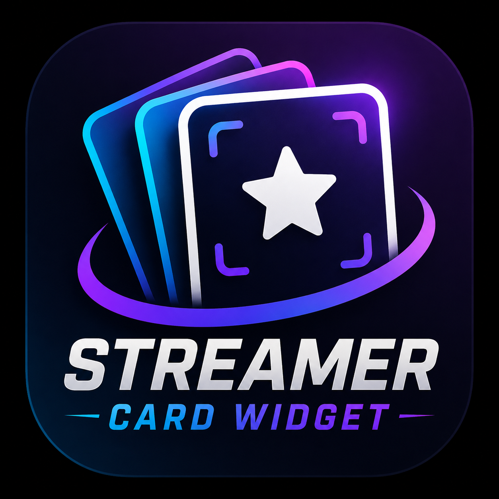
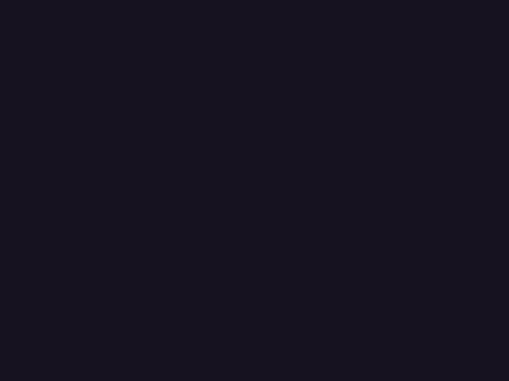
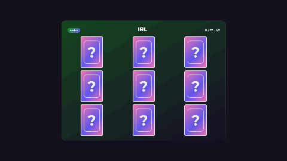
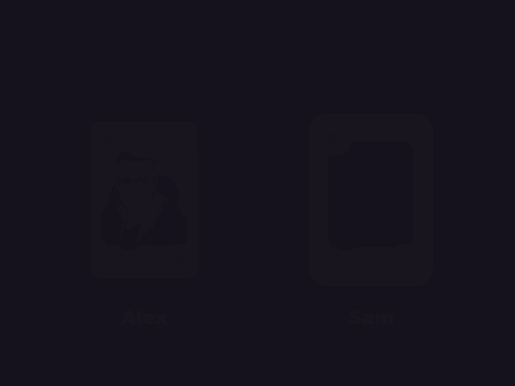
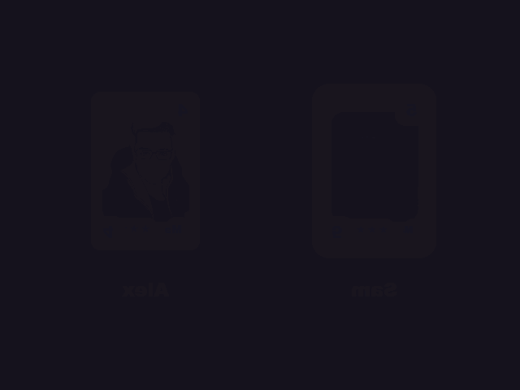
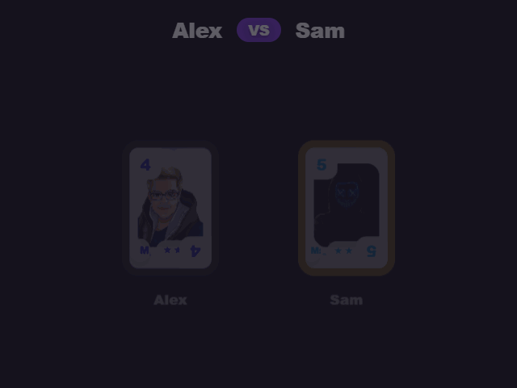
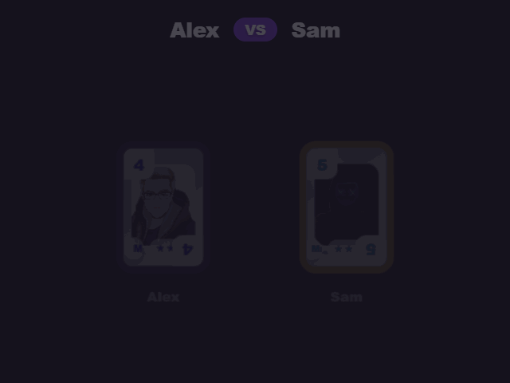
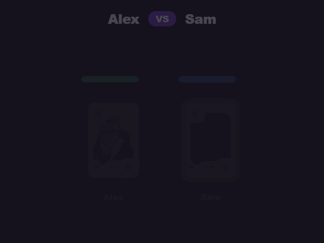
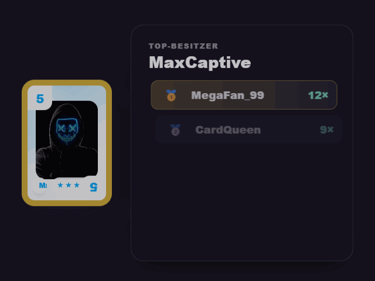

<p align="center">
  
</p>

# 🃏 Streamer Card Widget

Lokale Windows-App für Twitch-Sammelkarten – mit animiertem OBS-Overlay.
Deine Zuschauer ziehen über **Kanalpunkte** oder **Chat-Befehle** Karten aus Booster-Packs,
die live in OBS aufgehen, bauen ihre eigene **Sammlung** auf, können Karten untereinander
**tauschen** und sogar gegeneinander **Kartenduelle** austragen.

### Wie es funktioniert (in Kürze)

1. Du legst **Booster** (Karten-Packs) und **Karten** an – ein paar Beispiele sind schon dabei,
   du kannst also sofort loslegen.
2. Du verbindest **Twitch** (für Kanalpunkte/Chat) und **OBS** (für das Overlay).
3. Ein Zuschauer löst eine Belohnung ein oder tippt z. B. `!pack` in den Chat → die App zieht
   zufällig eine Karte und spielt die Animation in OBS ab.
4. Jede gezogene Karte landet in der **Sammlung** des Zuschauers. Über `!collection` kann er sie
   zeigen, über `!trade` mit anderen tauschen.

> **Du brauchst:** Windows 10/11 und OBS Studio. Die WebView2-Runtime (für die Bedienoberfläche)
> ist auf aktuellen Windows-Versionen vorinstalliert. Eine eigene Twitch-Entwickler-App ist
> **nicht** nötig.

---

## Inhalt

- [Schnellstart](#schnellstart)
- [Twitch verbinden](#twitch-verbinden)
- [Bot-Account für Chat](#bot-account-für-chat)
- [OBS einrichten](#obs-einrichten)
- [Booster anlegen](#booster-anlegen)
- [Sub-exklusive Booster](#sub-exklusive-booster)
- [Karten anlegen](#karten-anlegen)
- [Seltenheiten & Gewichtung](#seltenheiten--gewichtung)
- [Kanalpunkte-Belohnungen](#kanalpunkte-belohnungen)
- [Sammlungs-Showcase](#sammlungs-showcase)
- [Chat-Befehle](#chat-befehle)
- [Verschenken (Gift)](#verschenken-gift)
- [Tauschsystem](#tauschsystem)
- [Tausch-Animation](#tausch-animation)
- [Kartenduell (Kampf)](#kartenduell-kampf)
- [Turnier-Modus](#turnier-modus)
- [Team-Kampf](#team-kampf)
- [Ranking](#ranking)
- [Live-Ticker](#live-ticker)
- [Community-Ziel](#community-ziel)
- [Nutzung Befehle](#nutzung-befehle)
- [Queue](#queue)
- [Karten-Themes](#karten-themes)
- [Darstellung & Sounds](#darstellung--sounds)
- [Nutzer verwalten](#nutzer-verwalten)
- [Daten & Updates](#daten--updates)
- [Aus dem Quellcode bauen](#aus-dem-quellcode-bauen)
- [Lizenz](#lizenz)

---

## Schnellstart

1. Aktuelle Version von der [Releases-Seite](https://github.com/Bittersweet1987/StreamerCardWidget/releases/latest) herunterladen.
2. Das ZIP **komplett entpacken** (nicht direkt im ZIP starten) und `CardPackWidget.exe` ausführen.
   Es öffnet sich ein Fenster mit der kompletten Verwaltung – links die Navigation.
3. Empfohlene Reihenfolge fürs erste Einrichten:
   **Verbindung → Booster → Karten → Kanalpunkte / Chat Befehle**.
4. Zum Ausprobieren: Im Tab **Übersicht** auf **Demo zufällig ausführen** klicken – das spielt eine
   Pack-Animation ab (das OBS-Overlay oder die Datei `overlay.html` muss dafür geöffnet sein).

> **Tipp:** Beispiel-Booster und -Karten sind bereits enthalten – du kannst die Animation also
> testen, bevor du eigene Inhalte anlegst.
>
> Falls du Fragen hast, gibt es in der App unter **Übersicht** einen Button, der direkt zu dieser
> Anleitung führt.

> Der Ordner `data\` enthält deine Karten, Booster und Sammlungen. Bei einem manuellen Update
> immer behalten – nur `public\`, die DLLs und die exe überschreiben (siehe [Daten & Updates](#daten--updates)).

---

## Twitch verbinden

1. In **Verbindung** auf **Mit Twitch anmelden** klicken – der Login öffnet sich im Standardbrowser.
2. Nach der Freigabe aktualisiert sich der Status automatisch (grün = verbunden).

Es muss **keine eigene Twitch-Developer-App** angelegt werden. Die nötigen Berechtigungen
(`channel:read:redemptions`, `channel:manage:redemptions` sowie `user:read:chat`,
`user:write:chat` für die Chat-Befehle) werden automatisch angefragt.
Mit **Abmelden** wird das lokal gespeicherte Token gelöscht.

> **Wenn du die App von einer älteren Version aktualisierst:** Melde den Hauptaccount einmal
> **neu an**, damit er die zusätzlichen Chat-Rechte erhält – sonst funktionieren die Chat-Befehle
> nicht (das Log weist darauf hin).

---

## Bot-Account für Chat

Die Chat-Befehle (`!pack`, `!collection`, `!trade` …) liest und beantwortet die App über einen
Twitch-Account. Standardmäßig wird dafür der **Hauptaccount** verwendet.

Optional kannst du unter **Verbindung → Bot-Verbindung (Chat)** einen **separaten Bot-Account**
anmelden, der dann statt des Hauptaccounts im Chat liest und schreibt. Ist kein Bot verbunden,
greift automatisch der Hauptaccount als Fallback.

> Der lesende Account (Haupt oder Bot) muss im Kanal mitlesen dürfen – ist es nicht der
> Broadcaster selbst, sollte der Bot-Account **Moderator** im Kanal sein.

---

## OBS einrichten

Die App spricht direkt mit dem **OBS WebSocket** (Standard-Port `4455`).

1. In OBS: **Werkzeuge → WebSocket-Servereinstellungen** → *WebSocket-Server aktivieren*.
   Port und Passwort findest du dort unter *Verbindungsinformationen anzeigen*.
   (In der App gibt es bei **Verbindung → OBS** denselben Hinweis per „Hilfe anzeigen".)
2. Host (meist `127.0.0.1`), Port und Passwort in **Verbindung → OBS → WebSocket** eintragen.
3. Szenen- und Quellennamen im Abschnitt **Verbindung → OBS → Szene & Quellen** festlegen und auf
   **OBS Szene / Quellen erstellen / aktualisieren** klicken – die App legt Szene und
   Browserquellen automatisch an bzw. aktualisiert sie.

---

## Meld Studio einrichten

Alternativ zu OBS lässt sich die App auch mit **Meld Studio** verbinden (Standard-Port `13376`).
Meld Studios API kann Szenen und Quellen anders als OBS **nicht automatisch erstellen** – sie
müssen einmalig manuell in Meld Studio angelegt werden; die App aktualisiert danach nur noch
deren Browser-URL und wechselt zur passenden Szene.

1. In Meld Studio: **Einstellungen → Erweitert** → WebSocket-Server aktivieren (Standard-Port `13376`).
2. In Meld Studio manuell eine Szene sowie je eine Browser-Quelle pro Animation anlegen – mit
   genau den Namen, die auch im Abschnitt **Verbindung → OBS → Szene & Quellen** eingetragen sind
   (diese Namen gelten für OBS *und* Meld Studio gemeinsam).
3. Host und Port in **Verbindung → Meld Studio** eintragen, mit **Meld testen** die Verbindung prüfen.
4. Auf **Meld Szene / Quellen aktualisieren** klicken – die App trägt bei den vorhandenen
   Meld-Quellen die richtige Browser-URL ein und wechselt zur konfigurierten Szene.

---

## Booster anlegen

Ein **Booster** ist ein Karten-Pack mit einer eigenen Kanalpunkte-Belohnung.

1. Tab **Booster** öffnen → **Booster hinzufügen**.
2. Felder ausfüllen:
   - **Titel** & **Untertitel** – stehen auf dem Pack im Overlay.
   - **Bild** – optionales Pack-Motiv.
   - **Akzentfarbe** – Farbe des Packs.
   - **Score (Gewichtung)** – wie häufig dieser Booster gezogen wird, wenn die Belohnung
     mehreren Boostern zugeordnet ist (höher = häufiger).
3. **Karten zuordnen**: In der Booster-Ansicht die gewünschten Karten anhaken (max. **100** pro Booster).
   Bereits einem anderen Booster zugeordnete Karten werden ausgeblendet – jede Karte gehört zu genau einem Booster.
4. Speichern nicht vergessen (Button **Speichern** oben rechts).

### Booster exportieren & importieren

Über **Booster exportieren** (in der Booster-Ansicht) wird der ausgewählte Booster als
JSON-Datei gespeichert – **inklusive aller zugeordneten Karten samt Bildern**. Die Datei kann
auf einem anderen PC über **Booster importieren** eingelesen werden: Booster und Karten werden
dort neu angelegt und die **Zuordnung der Karten zum Booster bleibt erhalten**.
Twitch-spezifische Verknüpfungen (Belohnungs-IDs) werden beim Import bewusst nicht übernommen,
da sie nur im Kanal des Exportierenden gültig sind.

---

## Sub-exklusive Booster

Ein Booster lässt sich als **„Sub-exklusiv"** markieren (Booster-Ansicht) – solche Booster sind
über Kanalpunkte und `!pack` **nicht** erreichbar. Stattdessen vergibt die App bei jedem neuen
**Sub, Resub oder verschenkten Sub** automatisch eine Karte aus einem zufälligen sub-exklusiven
Booster, einstellbar unter **Einstellungen → Sub-Belohnungen**. So lassen sich exklusive Karten
als Abo-Bonus reservieren, ohne dass sie im normalen Ziehungspool auftauchen.

---

## Karten anlegen

1. Tab **Karten** öffnen → **Karte hinzufügen**.
2. Felder ausfüllen:
   - **Titel** – Name der Karte (z. B. ein Spielername).
   - **Seltenheit** – siehe [unten](#seltenheiten--gewichtung). Bestimmt Sternzahl, Rahmenfarbe und Effekt.
   - **Akzentfarbe** – Grundfarbe der Karte.
   - **Bild** – das Kartenmotiv (wird passend zugeschnitten).
   - **Aktiviert** – nur aktive Karten können gezogen werden.
3. **Wichtig:** Neue oder duplizierte Karten haben **keine** Booster-Zuordnung.
   Ordne sie anschließend im Tab **Booster** einem Pack zu, sonst werden sie nie gezogen.

> Die **Sternzahl ergibt sich automatisch aus der Seltenheit** – sie wird nicht pro Karte gesetzt.

### Karten exportieren & importieren

Jede Karte hat einen **Exportieren**-Button: die Karte wird als JSON-Datei gespeichert –
**inklusive Bild**, sodass sie z. B. auf einem anderen PC von einem anderen Nutzer über
**Karte importieren** (oben im Tab) eingelesen werden kann. Eine Booster-Zuordnung wird dabei
bewusst **nicht** übernommen – die importierte Karte muss wie eine neue Karte einem Booster
zugeordnet werden.

---

## Seltenheiten & Gewichtung

Es gibt **6 Stufen** mit fester Sternzahl:

| Seltenheit   | Sterne | Standard-Effekt |
|--------------|:------:|-----------------|
| Gewöhnlich   | 1      | weißer Rahmen |
| Ungewöhnlich | 2      | türkis |
| Selten       | 3      | blau |
| Episch       | 4      | dunkles Lila |
| Legendär     | 5      | goldener Glow (folgt der Rahmenfarbe) |
| **Holo**     | 1 ✨   | Regenbogen-Glitzer über der ganzen Karte, schillernder Perlmutt-Stern |

Unter **Einstellungen** lassen sich pro Seltenheit anpassen:

- **Rahmenfarbe je Seltenheit** (der Legendär-Glow passt sich automatisch an).
- **Gewichtung je Seltenheit** – höhere Werte werden häufiger gezogen.

---

## Kanalpunkte-Belohnungen

Pro Booster wird eine Twitch-Kanalpunkte-Belohnung verwaltet (Tab **Verbindung**, Bereich *Channel Points*):

- **Channelpoints laden** zeigt vorhandene Belohnungen; **Neu** legt eine neue an.
- Einstellbar: **Titel, Kosten, Beschreibung, Hintergrundfarbe, Max pro Stream,
  Max pro Nutzer/Stream, globaler Cooldown, Pausiert, Aktiviert**.
- **Speichern / aktualisieren** erstellt bzw. aktualisiert die Belohnung direkt auf Twitch und
  ordnet sie dem aktuell gewählten Booster zu.

Löst ein Zuschauer die Belohnung ein, zieht die App serverseitig genau **einen** zufälligen
Booster (gewichtet nach Score) und **eine** Karte (gewichtet nach Seltenheit) und spielt die
Pack-Animation im Overlay ab.

<p align="center"></p>

Optional kannst du (unter der Beschreibung) per Checkbox eine **Chat-Nachricht nach dem Ziehen**
aktivieren – sie wird gesendet, sobald die Animation fertig ist, und kann die gezogene Karte
benennen. Standard: `@userName hat [Kartenname] aus [Boostername] gezogen.` Die Variablen
`@userName`, `[Kartenname]` und `[Boostername]` fügst du per Klick ein.

---

## Sammlungs-Showcase

Zeigt einem Zuschauer seine komplette Sammlung als Overlay – ebenfalls über Kanalpunkte.

1. **Einstellungen → Sammlungs-Showcase** → *aktivieren*.
2. **Belohnung** „Sammlung zeigen" speichern (Titel, Kosten, Cooldown, Farbe).
3. **Sekunden pro Booster** festlegen (gilt für alle Booster gleich).
4. **OBS-Quellenname** wählen und **Sammlungs-Quelle in OBS einrichten** klicken –
   es entsteht eine zweite Browserquelle in derselben Szene.

Beim Einlösen sliden nacheinander alle aktiven Booster mit den Karten dieses Zuschauers durch:
**gezogene Karten sichtbar, noch nicht gezogene bleiben unbekannt**.

<p align="center"></p>

---

## Chat-Befehle

Zusätzlich zu den Kanalpunkten können Zuschauer Aktionen per **Chat-Befehl** auslösen
(Tab **Chat Befehle**). Jeder Befehl hat ein eigenes **Präfix** und **Befehlswort** und einen
eigenen **Aktiviert**-Schalter – es gibt keinen globalen Hauptschalter mehr.

- **Pack-Befehl** (Standard `!pack`) – entspricht der Kartenpack-Belohnung. Einstellbar:
  - **Max. Nutzungen pro Viewer** und ein **Auto-Reset** des Kontingents (Minuten / Stunden / Tage;
    bei „Tage" immer um lokal 00:01, sommerzeit-korrekt).
  - **Cooldown pro Viewer** (Sekunden, gilt strikt pro Nutzer).
  - Anpassbare Chat-Nachrichten für **Einlösung**, **erreichtes Limit** und **aktiven Cooldown**.
    Die Einlösungs-Nachricht kommt **nach der Animation** und kann die Karte benennen
    (Standard `@userName hat [Kartenname] aus [Boostername] gezogen.`).
- **Sammlung-Befehl** (Standard `!collection`) – entspricht dem Sammlungs-Showcase.
  Ohne Limit, ohne Cooldown, ohne Zählung. Zusätzlich (per Schalter „Kartennamen zusätzlich im
  Chat auflisten", standardmäßig an) listet der Befehl alle eigenen Kartennamen direkt im Chat
  auf (mit Anzahl bei Mehrfachbesitz, z. B. „Card A x3"). Wird die Liste zu lang für eine
  einzelne Twitch-Chat-Nachricht, teilt die App sie automatisch auf mehrere Nachrichten auf
  (nummeriert „(1/2)" usw.).

Alle Nachrichten lassen sich frei bearbeiten. Die verfügbaren **Variablen** (z. B. `@userName`,
`[Kartenname]`, `[Boostername]`, `[Uhrzeit]`, `[Restzeit]`) stehen als anklickbare Chips über dem
jeweiligen Textfeld und werden per Klick eingefügt.

---

## Verschenken (Gift)

Mit **`!gift @Empfänger Kartenname`** (Präfix/Befehlswort einstellbar) verschenkt ein Zuschauer
eine Karte **einseitig** an einen anderen – ohne Bestätigung durch den Empfänger. Die Karte wird
direkt aus der eigenen Sammlung des Schenkenden entfernt und dem Empfänger gutgeschrieben.

Geprüft wird: Empfänger existiert, Kartenname stimmt (bei Tippfehlern kommt ein
**„Meintest du …?"**-Vorschlag), die Karte wird tatsächlich besessen, und man sich nicht selbst
beschenkt. Alle Chat-Nachrichten (Erfolg, unbekannter Empfänger, unbekannte Karte, nicht besessen,
Selbst-Geschenk, falsche Nutzung) sind frei anpassbar.

Optional läuft dazu eine eigene **Geschenk-Animation** in OBS (Einstellungen → Geschenk-Animation,
eigene Browserquelle) – über dieselbe Queue wie alle anderen Animationen, damit sich nichts
überlagert.

---

## Tauschsystem

Zuschauer können untereinander Karten tauschen (drei Befehle im Tab **Chat Befehle**, jeweils
einzeln aktivierbar mit eigenem Präfix/Befehlswort):

1. **`!trade [Username] [Kartenname]`** – User A bietet User B eine Karte an (über den
   **Kartennamen**, nicht die ID). Geprüft wird, ob der Partner existiert, ob der Kartenname
   stimmt (bei Tippfehlern kommt ein **„Meintest du …?"**-Vorschlag) und ob der Anbieter die
   Karte besitzt. Eigene Einstellungen: **Cooldown** pro Viewer, **Limit** pro Reset
   (Minuten/Stunden/Tage) und wie lange eine Anfrage **offen bleibt** (Standard 120 s).
2. **`!tradeyes [Kartenname]`** – User B nimmt an und nennt die Karte, die er im Gegenzug gibt.
   Nach Prüfung des Besitzes wird der Tausch vollzogen: die Kartenbestände beider werden
   angepasst, beiden wird eine Tauschanfrage abgezogen und der Cooldown gesetzt.
3. **`!tradeno`** – User B lehnt ab. Dem Anfragenden wird eine Anfrage abgezogen und der
   Cooldown gesetzt; B bleibt unbelastet.

Antwortet B nicht rechtzeitig, läuft die Anfrage ab (kein Kontingent verbraucht, aber Cooldown).
Es ist immer nur **ein Tausch gleichzeitig** möglich – weitere `!trade` erhalten einen Hinweis.
Sämtliche Chat-Ausgaben (Angebot, Erfolg, Ablehnung, Timeout, Cooldown, Limit, „läuft bereits",
Karte/Nutzer nicht gefunden …) sind anpassbar, Variablen wieder per Klick einfügbar.

---

## Tausch-Animation

Kommt ein Tausch erfolgreich zustande, kann eine eigene **Tausch-Animation** in OBS abgespielt
werden – in einer **separaten Browserquelle** (neben Pack und Sammlung).

1. **Einstellungen → Tausch-Animation** → *aktivieren*.
2. **Stil** wählen: *Karten-Swap* (Karten kreuzen), *Übergabe-Bogen* oder *Versus-Flip*.
3. **Dauer** wählen (kurz / mittel / lang) und optional einen eigenen **Tausch-Sound** hochladen
   (Tab Einstellungen → Sounds).
4. **Verbindung → Quellenname Tausch-Animation** vergeben und auf **OBS Szene aktualisieren**
   klicken – die Quelle wird automatisch angelegt.

In der Animation werden beide getauschten Karten gezeigt; unter jeder Karte steht zuerst der
bisherige, nach dem Tausch der neue Besitzer. Mit der Option **„Erfolgsmeldung im Chat senden"**
legst du fest, ob zusätzlich die Chat-Nachricht kommt oder nur die Animation laufen soll.

<p align="center">
  
  
  
</p>
<p align="center"><sub>Karten-Swap · Übergabe-Bogen · Versus-Flip</sub></p>

Über **„Test starten"** spielst du die Animation einmal in OBS ab – mit zwei zufälligen Namen und
Karten. Das funktioniert auch, wenn die Animation noch nicht aktiviert ist, ideal zum Ausprobieren
von Stil und Timing.

---

## Kartenduell (Kampf)

Zuschauer können ihre Karten gegeneinander antreten lassen (drei Befehle im Tab **Chat Befehle**,
jeweils einzeln aktivierbar mit eigenem Präfix/Befehlswort):

1. **`!battle [Username]`** – fordert einen anderen Zuschauer heraus. Geprüft wird, ob der Gegner
   existiert, man sich nicht selbst herausfordert und **beide** mindestens **N verschiedene
   Kartentypen** besitzen (N ist einstellbar, Standard 3). Eigene Einstellungen: **Karten pro
   Seite**, **Cooldown**, **Limit** pro Reset (Minuten/Stunden/Tage) und wie lange die Anfrage
   **offen bleibt** (Standard 120 s).
2. **`!battleyes`** – der Gegner nimmt an. Beide Seiten bekommen automatisch **N zufällige,
   verschiedene Karten** aus ihrer Sammlung als Aufstellung. Der Gesamtsieger erhält **eine
   zufällige Karte aus der Aufstellung des Verlierers** (nur diese eine Karte wechselt den
   Besitzer). Beiden Spielern wird danach eine Nutzung abgezogen und der Cooldown gesetzt.
3. **`!battleno`** – der Gegner lehnt ab, keine Karten wechseln den Besitzer.

Antwortet der Gegner nicht rechtzeitig, läuft die Anfrage ab. Es ist immer nur **ein Duell
gleichzeitig** möglich. Kartenstärke ergibt sich aus der **Seltenheit** (eigene, anpassbare Tabelle
unter Einstellungen – unabhängig von den Ziehungs-Gewichten, da hier stärkere Karten auch stärker
im Kampf sein sollen) plus einem Zufallsfaktor pro Runde.

Die **Kampf-Animation** läuft wie die Tausch-Animation in einer eigenen OBS-Browserquelle, mit drei
wählbaren Kampfstilen:

- **Nahkampf-Clash** – beide Karten stürmen zur Mitte und prallen aufeinander.
- **Fernkampf-Projektile** – die Karten bleiben stehen und schießen Energie-Geschosse aufeinander.
- **HP-Leisten-Duell** – jede Karte hat eine eigene Lebensenergie-Leiste und kämpft nacheinander
  gegen die Aufstellung der Gegenseite (Pokémon-artig): die Rest-HP einer siegreichen Karte bleibt
  für die nächste Begegnung erhalten, bis eine Seite komplett besiegt ist.

Dauer, eigener Kampf-Sound und die Option „Ergebnis-Nachricht zusätzlich im Chat senden" sind wie
bei der Tausch-Animation einstellbar, inklusive **„Test starten"**-Button für eine Vorschau.
Die Ergebnis-Nachricht im Chat kommt bewusst **erst, nachdem die Animation durchgelaufen ist** –
so verrät der Chat nicht vorab, wer gewinnt.

<p align="center">
  
  
  
</p>
<p align="center"><sub>Nahkampf-Clash · Fernkampf-Projektile · HP-Leisten-Duell</sub></p>

---

## Turnier-Modus

Ein **Ausscheidungsturnier** für Kartenduelle – Zuschauer treten während einer Anmeldephase per
Chat-Befehl bei (Befehlswort unter **Chat-Befehle → Turnier-Beitritt** einstellbar), danach
werden alle Runden **automatisch nacheinander** über die normale Kampf-Animation ausgetragen,
**ohne Risiko** für die eigenen Karten (anders als beim normalen `!battle`-Duell wechselt hier
keine Karte den Besitzer). Der Turniersieger bekommt stattdessen eine konfigurierbare Anzahl
**Kartenpack-Ziehungen**.

Startbar über **Kanalpunkte-Belohnung** (Tab Verbindung → Channel Points), per **Chat-Befehl**
(„Turnier-Start", Standard `!turnierstart`) oder per Knopf direkt unter **Einstellungen →
Turnier-Modus**. Dort auch einstellbar: Mindest-Teilnehmerzahl, Anmeldezeit, Kartenanzahl pro
Aufstellung, sowie ob **auch Runden-Gewinner** (nicht nur der Champion) eine Bonus-Ziehung
bekommen. Bei ungerader Teilnehmerzahl bekommt einer pro Runde ein **Freilos**.

---

## Team-Kampf

Die **Community gegen den Streamer**: eine konfigurierbare **Mindest-Kartenanzahl** (die
tatsächliche Aufstellungsgröße wird pro Kampf leicht zufällig variiert) tritt gegen alle
Zuschauer an, die sich während einer Anmeldephase per Chat-Befehl (Standard `!teamkampf`)
angemeldet haben – jeder Teilnehmer wird automatisch mit einer zufälligen eigenen Karte
vertreten.

Während der Anmeldephase läuft im Overlay ein **Countdown mit Live-Teilnehmerliste**
(Profilbild + Name, aktualisiert sich bei jedem neuen Beitritt) sowie die Anzahl der Karten, die
es zu besiegen gilt – die Karten selbst bleiben bewusst **verdeckt** (keine Vorschau auf Motiv
oder Seltenheit), damit die Community nicht taktisch vorplanen kann.

Der eigentliche Kampf läuft als **HP-Leisten-Duell** (siehe Kartenduell-Kampfstile). Gewinnt die
Community, bekommt jeder Teilnehmer eine konfigurierbare Anzahl Kartenpack-Ziehungen, und wer den
**entscheidenden letzten Schlag** gelandet hat, bekommt zusätzlich einen einstellbaren
Finisher-Bonus (eigene Chat-Nachricht dafür). Optional (Schalter „Bei Niederlage verliert jeder
Teilnehmer die eingesetzte Karte") verlieren bei einer Niederlage alle Teilnehmer ihre
eingesetzte Karte – dafür gibt es eine eigene, ein-/ausschaltbare Chat-Nachricht pro verlorener
Karte.

Startbar über **Kanalpunkte-Belohnung** oder per Knopf unter **Einstellungen → Team-Kampf**.

---

## Ranking

Über den **Ranking-Befehl** (Standard `!ranking`, Präfix/Befehlswort im Tab **Chat Befehle**
anpassbar) können Zuschauer Bestenlisten in einer **eigenen OBS-Browserquelle** anzeigen lassen
(Verbindung → *Quellenname Ranking*, wird über **OBS Szene aktualisieren** automatisch angelegt).
Es erfolgt **bewusst keine Chat-Ausgabe** – das Ergebnis erscheint nur im Overlay.

- **`!ranking [Kartenname]`** – zeigt links die Karte und rechts die **Top 5 Besitzer** dieser
  Karte (absteigend nach Anzahl, mit Platzierungssymbolen 🥇🥈🥉).
- **`!ranking battle`** – zeigt nacheinander vier Bestenlisten aus den Kartenduellen:
  **meiste Kämpfe → meiste Siege → meiste Niederlagen → beste Siegquote** (je Top 5).
  Die Kampf-Statistik wird ab dem ersten Duell dauerhaft mitgeführt (`data/battle-stats.json`)
  und ist unabhängig von den zurücksetzbaren Nutzungszählern.
- **`!ranking tausch`** – zeigt die **Top 5 Nutzer mit den meisten abgeschlossenen Tauschen**.
  Ebenfalls dauerhaft mitgeführt (`data/trade-stats.json`), unabhängig vom zurücksetzbaren
  Tausch-Kontingent.

Die **Anzeigedauer** pro Ansicht ist beim Befehl einstellbar (Standard 8 Sekunden). Unbekannte
Kartennamen werden stillschweigend ignoriert.

<p align="center"></p>

---

## Live-Ticker

Ein durchlaufendes **Laufschrift-Banner** (wie ein Newsticker) in einer eigenen OBS-Quelle, das
die letzten Ereignisse aller Zuschauer in einer Endlosschleife von rechts nach links zeigt –
unabhängig von der Kartenpack-Animation, läuft also nicht gedrosselt durch deren Warteschlange.
Gezeigt werden **Kartenziehungen, Kartenduelle, Turniersiege und Team-Kampf-Ergebnisse**; die
Texte für alle vier Ereignis-Arten sind unter **Einstellungen → Live-Ticker → Texte** frei
anpassbar (Variablen wie `@userName`, `[Kartenname]` etc. per Klick einfügbar).

Die letzten **8 Ereignisse** werden dauerhaft gespeichert, damit der Ticker beim nächsten
App-Start sofort wieder Inhalt zeigt statt leer zu starten. Einstellbar sind außerdem
Umlauf-Anzahl und Scroll-Geschwindigkeit.

---

## Community-Ziel

Ein **gemeinsamer Fortschrittsbalken** über alle Zuschauer hinweg – jede Ziehung (egal ob per
Kanalpunkte oder Chat-Befehl) zählt +1. Wird das Ziel erreicht, postet der Bot eine
**Feier-Nachricht** im Chat, die OBS-Quelle zeigt eine **Feier-Animation**, und jeder, der
mitgezogen hat, bekommt automatisch einen **Bonus-Booster**. Einstellbar unter **Einstellungen →
Community-Ziel**, inklusive manuellem Zurücksetzen des Fortschritts.

---

## Nutzung Befehle

Der Tab **Nutzung Befehle** listet pro Zuschauer, wie oft er **`!pack`**, **`!trade`** und
**`!battle`** genutzt hat, samt **verbleibender Nutzungen** bis zum nächsten Reset. Oben stehen die
nächsten Reset-Zeiten. Du kannst nach Nutzern suchen, einzelne Nutzer oder **alle** zurücksetzen.

---

## Queue

Alle ausgelösten Aktionen – Kanalpunkt-Einlösungen, Chat-Befehle **und Ranking-Anzeigen** – laufen
über eine gemeinsame **Warteschlange** (Tab **Queue**) und werden streng nacheinander abgearbeitet,
mit kurzer Pause zwischen den Einträgen. So überlagern sich auch bei vielen gleichzeitigen
Auslösern keine Animationen. Der Tab zeigt live alle offenen Einträge (wer, was, wann) und das gerade
laufende. Du kannst die **Queue pausieren** (sammelt dann nur), **einzelne Einträge entfernen**
oder **alle löschen**.

---

## Karten-Themes

Im Tab **Themes** wählst du per Klick das **Aussehen aller Karten** – die Auswahl gilt sofort für
Overlay, Sammlung, Tausch-Animation und alle Vorschauen. Mitgeliefert sind mehrere Presets
(z. B. *Klassik*, *Onyx*, *Carbon*, *Prisma*, *Gold*, *Sunset*, *Mint*, *Ozean*, *Rosé*, *Wald*).
*Klassik* ist der Standard.

Oben lässt sich per Dropdown die **Vorschaukarte** wählen, damit du siehst, wie ein Theme mit einer
bestimmten Karte wirkt.

Darunter gibt es einen **Theme-Editor** für ein **eigenes** Design: Hintergrund (2–3 Farben +
Verlaufswinkel), Glanz und Bildrahmen (Farbe + Deckkraft) frei einstellbar, mit Live-Vorschau.
Diese Einstellungen wirken **nur auf die Karte** – nichts anderes in App oder Overlay ändert sich.

---

## Darstellung & Sounds

Im Tab **Einstellungen**:

- **Schriftart** & **Akzentfarbe** (Schrift wirkt nur auf das Widget, nicht auf die App-UI).
- **Vorschau** mit Karten-Auswahl.
- **Sammlungsleiste** und **Kartenrahmen** ein-/ausblenden.
- **Position Einlöser-Name** im Overlay: Unten / Mitte / Oben.
- **Sounds** für Öffnen, Reveal, Tausch und Kampf + **Lautstärke**.
- **Timing**: Karte sichtbar (Sek.), Cooldown, verdeckte Karten vor dem Reveal.

Sprache (**DE / EN**) und Modus (**Hell ☀ / Dunkel 🌙**) schaltest du jederzeit über die beiden
Schalter unten links in der Navigation um.

---

## Nutzer verwalten

Im Tab **User** siehst du jede Sammlung pro Zuschauer – nach Booster gruppiert und nach Karte
sortiert. Kartenanzahl lässt sich direkt bearbeiten, Nutzer löschen, und verwaiste
Sammlungen einem Booster neu zuordnen.

---

## Daten & Updates

Alles liegt updatesicher im Ordner `data\`:

- `settings.json` – Einstellungen (Look, Timing, Showcase, Chat-Befehle)
- `cards.json` – deine Karten
- `boosters.json` – deine Booster
- `collections.json` – Sammlungen je Zuschauer
- `command-usage.json` – Nutzungszähler & Cooldowns der Chat-Befehle (Pack, Tausch & Kampf)
- `battle-stats.json` – dauerhafte Kampf-Statistik (Kämpfe/Siege/Niederlagen) fürs Ranking
- `trade-stats.json` – dauerhafte Tausch-Statistik (Anzahl abgeschlossener Tausche) fürs Ranking
- `tournament-stats.json` – dauerhafte Turnier-Statistik (Turniersiege)
- `community-goal.json` – Fortschritt des aktuellen Community-Ziels
- `liveticker-history.json` – die letzten 8 Live-Ticker-Einträge, damit der Ticker beim App-Start
  sofort wieder Inhalt zeigt
- `stats-install-id.txt` – zufällige, stabile ID für die anonyme Community-Statistik (nur zum
  Zählen „wie viele Karten/Booster gibt es insgesamt über alle Installationen" – keinerlei
  Bezug zu deinem Twitch-Account)
- `twitch.json` / `twitch-bot.json` / `obs.json` – Zugangsdaten (getrennt gespeichert)

> Der Ereignis-Log (Tab **Log**) ist nur eine Live-Diagnose und wird bei **jedem App-Start
> geleert**.

Updates ersetzen nur `public\` und die exe – `data\` bleibt unberührt, neue Seltenheiten oder
Funktionen überschreiben angelegte Karten/Booster also nie. Updates lassen sich im Tab **Update**
direkt aus der App installieren.

---

## Aus dem Quellcode bauen

Es gibt kein `.csproj`/`.sln` – `src/CardPackWidgetApp.cs` wird direkt mit `csc.exe`
(.NET Framework) kompiliert. Zusätzlich werden die WebView2-Redistributable-DLLs benötigt
(`Microsoft.Web.WebView2.Core.dll`, `Microsoft.Web.WebView2.WinForms.dll`,
`Microsoft.Web.WebView2.Wpf.dll`, `WebView2Loader.dll`, z. B. aus dem
[Microsoft.Web.WebView2 NuGet-Paket](https://www.nuget.org/packages/Microsoft.Web.WebView2/)).
`public/`, `data/` und `defaults/` müssen neben der exe liegen.

---

## Lizenz

Dieses Projekt steht unter der **GNU General Public License v3.0** – siehe [LICENSE](LICENSE).

```
Streamer Card Widget – Twitch-Sammelkarten-Overlay
Copyright (C) 2026 Bittersweet1987

Dieses Programm ist freie Software: Sie können es unter den Bedingungen der
GNU General Public License, wie von der Free Software Foundation veröffentlicht,
weitergeben und/oder modifizieren – entweder Version 3 der Lizenz oder (nach Ihrer
Wahl) jeder späteren Version.

Dieses Programm wird in der Hoffnung verteilt, dass es nützlich sein wird, jedoch
OHNE JEDE GEWÄHRLEISTUNG. Siehe die GNU General Public License für weitere Details.
```
